### 一 数据科学领域概述

#### 1.1 数据如何驱动运营给企业带来价值

- 原始收集数据
  - 数据埋点 收集用户在网页端，APP，小程序等终端的各种数据 
  - 业务数据
  - 外部数据
- 数据加工处理
  - 将收集的数据转换成可理解、可量化、可观察的业务指标
  - 单纯的数据没有意义，只有和业务结合才能发挥价值
- 数据可视化
  - 有了数据指标，必须管理好指标
  - 建立指标体系

- 数据决策和执行
  - 从数据中得到相关信息，需要把这些信息转换成策略
  - 包括策略制定，并持续优化和改进策略
- 数据产品
  - 将策略制作成数据应用和产品
  - 开始自动化和系统化运营
- 数据战略
  - 积累了大量数据，大量模型，大量数据应用
  - 不只是数据分析，可以将数据变现

#### 1.2 数据科学落地架构

- 三类岗位

  - 业务线  数据分析
  - 研发线  数据仓库 
  - 算法线  数据挖掘

- 关键词说明

  - ETL 清洗 转换 加载
  - DW 数据仓库
  - CRM 客户关系管理
  - CMS:Content Management System "内容管理系统" 

- 不同岗位对业务知识的要求

  |                | 了解基本概念 | 知道指标含义 | 熟悉分析套路 | 掌握分析思维 | 独立处理问题 |
  | :------------: | ------------ | :----------: | :----------: | :----------: | :----------: |
  |   业务分析师   |              |              |              |              |      √       |
  |    数据运营    |              |              |              |              |      √       |
  |   数据分析师   |              |              |              |      √       |              |
  | 数据挖掘工程师 |              |              |              |      √       |              |
  |   算法工程师   |              |              |              |      √       |              |
  |   数仓工程师   |              |      √       |              |              |              |

  

### 二 什么是业务

#### 2.1 理解业务从理解商业模式开始

- 商业模式（怎么挣钱）
  - B2C
  - B2B
  - B2B2C
  - B2VC：
- 不同类型企业分类

- 理解商业模式的关键问题
  - 业务模式    
  - 四大角色
    - 产品    卖的是什么服务
    - 渠道    以何种方式联系到客户
    - 用户   最终消费者 直接使用者
    - 运营   营销、服务、风控手段
  - 部门   自己要面试/服务的对象
  - KPI  （Key Performance Indicator）

- 数据科学在商业行为中的角色：解决产品 销售 运营 营销等数据问题，驱动达成商业目标

### 三 数据分析工作需求

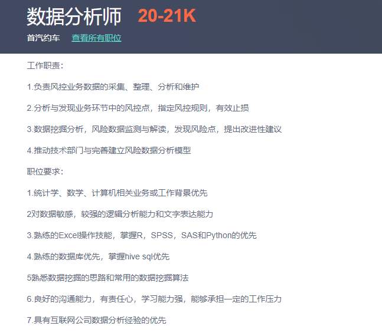

-  数据分析需要掌握的技能
  - 业务知识，业务思维
  - Excel
  - 数据可视化（PowerBI）
  - SQL
  - 统计学（机器学习模型）
  - Python 

**今日课程目标：知道各种指标极其含义，掌握常用数据分析方法**

### 四 指标体系

#### 4.1 数据指标概念

- 场景，描述刚上线社区产品最近表现
  - a 日活每天都在涨，新增用户也很多
  - b 日活按IMEI是在涨，但是注册用户没有很多=> 新增注册转化 只有20%，说明没有促使用户注册的动机
- 场景2，产品上线一段时间，领导想知道是否要推广产品
  - a 最近日活平稳，新增用户最初没那么多了
  - b 虽然日活平稳，但是用户活跃程度很高（人均发帖，好友关系）比上个月增长了30%，新用户次日留存提升 
- 主要内容
  - 数据指标
    - 什么是数据指标
    - 常用的数据指标如何定义
    - 日常工作指标相关问题踩坑
  - 如何选择数据指标
  - 指标体系的重要性
    - 既是对业务本身的描述，也是做数据分析的基础
    - 只有构建的指标体系，才知道那些数据需要被记录，采集

#### 4.2 数据指标定义及常用数据指标

- 啥是数据指标，对当前业务有参考价值的统计数据

  - 当前业务有价值 
  - 可统计

- 常用的数据指标

  - 用户数据   谁
  - 行为数据    干了什么
  - 业务数据     产生了什么结果

- 用户数据

  - 存量     DAU、MAU
  - 增量     新增用户
  - 健康程度  留存率
  - 从哪儿来   渠道来源   
    - 搜索引擎推广  
    - rom  
    - app商店（自然流量 也可以推广） 
    - 手机厂商预装   
    - 其它产品挂下载链接
    - 扫码

- 行为数据

  - 次数、频率             PV UV 访问深度
  - 关键路径走了多远          转化率
  - 行为做了多久                  时长
  - 质量                           弹出率

- 业务数据

  - 总量                           GMV                                                                                                             访问时长

  - 人均                           ARPU AverageRevenuePerUser每用户平均收入                                    人均访问时长

    ​								ARPPU Average Revenue Per Paying User每付费用户平均收益

  - 人数                          付费人数                                                                                                      播放人数

  - 健康程度                 付费率 付费频次                                                                                           观看率

  - 被消费对象             SKU                                                                                                                被消费内容

- 如何定义上述指标，没有对错，只是达成一致

#### 4.3 数据指标详解

- DAU、MAU定义

  - Daily

    - 如何理解Daily
    - 出海产品跨时区

  - Monthly

    - 例子：（1）DAU= 10  （2） DAU= 8  （3）DAU=5   ..... （30）DAU= 7

    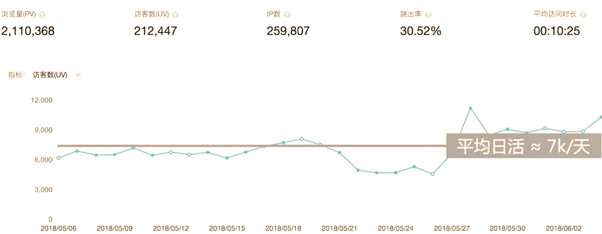

  - 活跃

    - ① 数据统计系统的定义

      - 基于事件上报：有事件上报=>该用户活跃

      - 预制报表的统计系统（友盟....)都是基于事件上报进行统计

        - web端 页面加载成功
        - app 端  按钮点击

        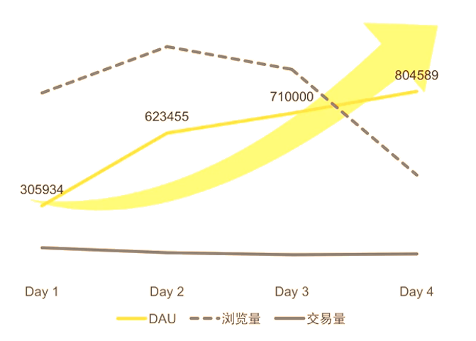

      - 为了优化推送转化率，统计PUSH的下发/送达率 技术通过友盟上报一个收到事件 

      - 特点，活跃增加，其它数值没明显变化

    - ②业务定义， 用户执行了关键事件

      - 日活事件列表

        访问首页/访问商品详情页/访问抽奖页

      - 存在维护成本

      - 存在沟通成本

  - 用户

    - 用户通过多台设备访问产品
    - 认人
      - 给每位注册用户一个UID
      - 只适合强登录/注册产品，未登录用户会被漏掉
    - 认设备
      - IMEI  Cookie中随机字符串
      - 无法对应设备背后的用户
    - 产品是否强制登录
      - 人+单独指标记录设备
    - 不登录用户是否有价值
      - 没价值 人+单独指标记录设备
      - 有价值 设备

- 新增用户

  - 如何理解 新增用户

    - 渠道商  点了下载就算
    - 运营      下载成功才算，一个用户一天最多算一次
    - 产品      按启动量算，没打开不算
    - 研发      注册了才叫新增用户，表里得能查到

  - 选择合适的节点定义增

    - 哪个节点算钱一定先谈清楚

    

    |              | 优势           | 劣势                 | 使用场景                          |
    | ------------ | -------------- | -------------------- | --------------------------------- |
    | 点击渠道连接 | 统计简单       | 离最终目标远转化不好 | 量级不大/免费渠道、不需要精细结算 |
    | 下载         | 反映了用户意愿 | 可能有刷量情况       | 渠道依赖应用商店，没有更好渠道    |
    | 安装启动     | 离激活很近     | 渠道不一定配合、刷量 | 强势产品，可给渠道定制统计规则    |
    | 激活         | 最真实数据     | 渠道费用高，统计复杂 | 对用户品质要求高产品ARPU高        |

  - 用适当的方法判别新

    - 基于设备 android IOS web
    - 基于账号关联 与后台已有账号对比匹配

- 用户留存

  - 7日留存算法    （1）DAU= 10  （2） DAU= 8  （3）DAU=3 ....  (7)DAU=4
  - 算法1 第七天/第一天 *100%   7日日留存
  - 算法2 第二天~第七天去重/第一天*100%  7日内留存
  - 算法3  第七天/第0天 *100%

- 为什么要看留存

  - 了解某个渠道的质量，日留存

    以天为单位，衡量这个渠道来的用户当下&接下来的表现

    用第一种算法比较准确可以避免其他天数据的干扰

  - 有些产品周期性强，一周一个周期，访问比较集中，只看Day7来评价不能反映真实情况

    第二种算法比较靠谱 更能描述渠道质量

    适用于有固定使用周期，且周期较长的业务

  - 第三种算法，分子分母星期相同，某种程度可以抵消星期级别的波动

  - 观察整个大盘 周留存/月留存

    - 以周/月为单位，衡量产品的健康状况，观察用户在平台上的粘性
    - 务必去重

  - 7日日留存/30日日留存

    第七天/第一天 日活  

  - 次周周留存  下周周活跃用户/当周周活跃用户 * 100%

- 行为相关的数据指标

  - 场景描述
    - 10个用户来到了博学谷官网，访问了20次首页
    - 20次首页访问中，有8次会点开课程详情
    - 最后有3个用户注册了会员
    - 这3个人中有1个用户购买了课程
  - 业务相关问题
    - 来了多少用户，访问情况如何       来了10个，访问20次，人均2次
    - 首页转化效果如何                           有8/20 = 40%的人进入了课程详情       
    - 有多少人注册                                    3个人注册 来了10个 占30%
    - 注册了有多少当时付费的                  3个人1个付费 33%
  - 问题，有的用人数计算，有的用次数计算
    - PV   次数   pv/pv 
    - UV   人数   uv/uv  转化
    - pv/uv 人均行为次数
  - 访问深度
    - 算法一 用户对某些关键行为的访问次数
    - 算法二 将网站内容/功能分成几个层级，以用户本次访问过最深的一级计算

- 访问时长

  - 如何统计访问时长
  - web时代
    - 页面打开时长
  - APP时代
    - 前台驻留时长
  - 通过瞳孔、眼动
  - 问题，不精确
  - 把如何统计 转而考虑为何统计，通过统计特殊事件，支持业务需求
    - 统计视频被消费程度
    - 评价内容质量 记录暂停/关闭页面后 播放器中进度条当前的位置

- 弹出率

  - 用户来了只访问了一个页面就走了
  - 如果产品只有一个页面 弹出率？
  - 页面弹出率/网站弹出率
  - 弹出率基于一次访问

- 业务相关数据指标

  - 问题
    - 一共卖了多少钱
    - 消费水平怎么样
    - 来了多少人
    - 有多少人买东西了，多少人是老顾客
    - 我们的商品好不好卖

  | 直接付费         | 适用场景   | 解决问题                 | 非直接付费     |
  | ---------------- | ---------- | ------------------------ | -------------- |
  | GMV              | 总量       | 描述交易的金额总规模     | 目标完成数     |
  | ARPU、ARPPU      | 人均       | 单个用户的贡献程度       | 人均访问时长   |
  | 付费人数         | 人数       | 愿意为服务付费的人数规模 | 完成人数       |
  | 付费率，付费频次 | 健康程度   | 总体上的用户付费意愿     | 完成率         |
  | SKU角度          | 被消费对象 | 分析消费品本身的运营情况 | 被消费内容视角 |

#### 4.3 如何选择指标

- 最终目的出发梳理业务模块 -> 判断业务模块类型->根据业务模块类型选择数据指标

- 如何梳理业务模块

  - 目的
  - 实现目的的方法
  - 方法需要的工具
  - 实现方法的途径
  - 头条：自媒体高效创作**资讯**换取**广告收入**
  - 社区带货：社区创作软文**卖货**
  - 教育：为学员提供便捷的学习系统高效学习课程和分为良好的社群服务换取学费

- 业务模块

  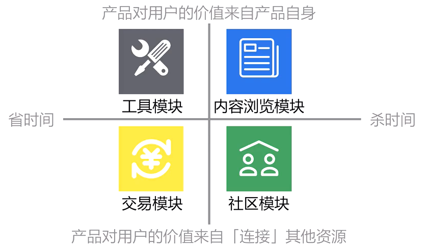

- 根据业务模块选择数据指标

  - 工具模块：效率
  - 内容浏览模块：质和量
  - 交易模块：转化率
  - 社区模块：活跃

- 工具类模块关心的指标

  |            | 反映维度             | 场景       | 结果         |
  | ---------- | -------------------- | ---------- | ------------ |
  | 使用量     | 累积量，用户投入程度 | 拍照，笔记 | 用户粘性强   |
  | 目标达成率 | 是否正常运转         | 支付，搜索 | 满意度高     |
  | 频次       | 用户是否养成习惯     | 闹钟       | 养成固定习惯 |

  - 案例 app store 各种市场
    - 使用量                      下载APP的人数 分发出的APP数量
    - 目标达成率               点击安装->使用APP
    - 频次
  - 案例 QQ音乐的歌词海报功能
    - 使用量                      进入歌词创建环节的数量
    - 目标达成率               海报生成数量
    - 频次                            功能使用频次

- 交易类模块

  |              | 指标反映维度     | 场景           | 结果     |
  | ------------ | ---------------- | -------------- | -------- |
  | 详情页转化率 | 核心场景转化效率 | 电商           | 更容易卖 |
  | 金额         | 总交易规模       | 电商，知识付费 | 卖更多   |
  | 客单价       | 单个用户价值     | 奢侈品海淘     | 卖更高价 |
  | 复购率       | 收入的持久程度   | 订阅式购物     | 卖更多次 |

- 内容浏览类模块关心的指标

  |          | 指标反映维度     | 场景             | 结果             |
  | -------- | ---------------- | ---------------- | ---------------- |
  | 浏览数   | 累积量           | 头条类           | 有多少人阅读     |
  | 浏览广度 | 覆盖内容库存情况 | 视频网站多个频道 | 库存利用率高     |
  | 浏览时长 | 占据用户多少时间 | 快手，抖音       | 减少竞品使用时间 |
  | 内容互动 | 用户对内容反映   | AB站             | 提高用户粘性     |

  - 案例 微信看一看模块
    - 浏览数                                   浏览数
    - 浏览广度                              覆盖的媒体数量
    - 浏览时长                            浏览时长
    - 内容互动                            点赞/评论/转发数量

- 社区/社交类模块

  |          | 指标反映维度             | 场景 | 结果           |
  | -------- | ------------------------ | ---- | -------------- |
  | 发布量   | 用户创作内容的数量       | 贴吧 | 更多的话题源头 |
  | 互动量   | 用户与用户之间互动的次数 | 微博 | 社区更有活力   |
  | 关系密度 | 用户与用户之间的关系     | 微信 | 更可能长期留存 |

  - 案例 脉脉 职言板块
    - 发布量    发布的职言数量
    - 互动量     点赞评论转发数量
    - 关系密度  发布的职言涉及到的公司数量

- 回到之前案例  社区带货：社区创作软文**卖货**

  - 交易模块
    - 每篇文章的转化率
    - 金额= 客单价*订单量
    - 复购率
  - 内容模块
    - 浏览量
    - 浏览深度，广度
  - 工具模块
  - 社区模块

- 案例 咸鱼数据指标选取

  - 目的 C2C交易

  - C2C两端 卖家买家

  - 买家  各种商品信息浏览方式

    内容浏览：分类

    社区：鱼塘

  - 卖家    方便的商品发布工具和商品分发方式

    - 工具 易用的快速发布工具
    - 社区 鱼塘用来分发

  - 内容浏览模块：分类

    - 商品浏览量

  - 社区模块：鱼塘

    - 商品 内容日发布量
    - 商品 内容被查看量
    - 商品 内容被询问量

  - 工具模块：发布工具

    - 成功发布率

### 五 数据分析方法

- 数据分析的价值

  - 新购的这一批视频到底有没有价值
  - 浏览到消费的转化率一直不超过1%，产品到底该优化哪儿
  - 上个预装渠道进来的量，表现如何？
  - 按销售额来看这个月绩效该怎么分配
  - 精准广告投放该怎么选择对象人群
  - 该引入哪些新的商品品种

- 数据分析方法

  - 对比分析 多维拆解  漏斗 分布情况 
  - 用户留存 用户画像
  - 归因查找  路径挖掘   行为序列

#### 5.1 对比分析

- 如何进行对比分析

  - 新增用户 +/- 500

  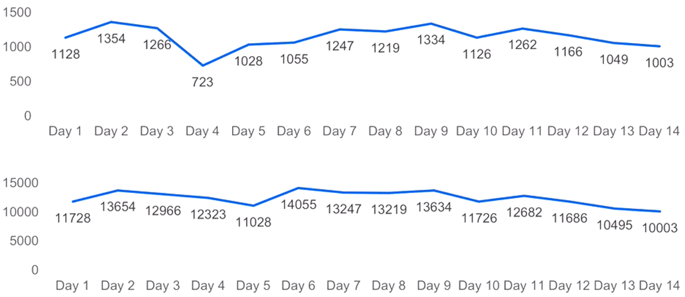

  - 交易量下跌500

  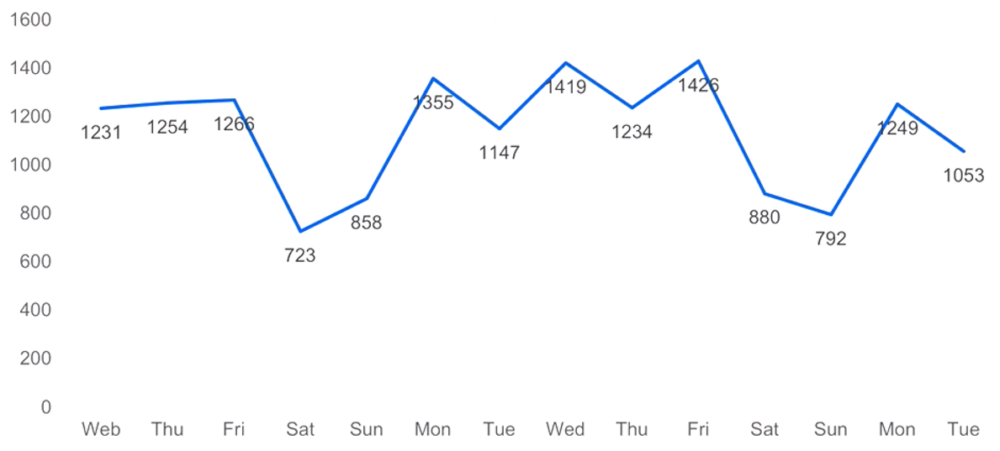

  - 对比分析比什么
    - 绝对值
      - 本身具备价值的数字
      - 销售金额
      - 阅读数
    - 比例值
      - 在具体环境中看比例，才具备对比价值
      - 活跃占比
      - 注册转化率
    - 问题：绝对值，不易得知内在问题，比例值，易收到极端值影响  2%~4%
  - 怎么比
    - 环比 7号 6号 5号  7月 6月 5月
      - 对短期内具备连续性的数据进行分析
    - 同比   今年国庆销售额 去年国庆销售额
      - 观察更为长期的数据集
      - 观察的时间周期里有较多干扰，希望某种程度上消除这些干扰
  - 和谁比
    - 和自己比
      - 从时间维度
      - 从不同业务线
    - 和同行业比
      - 是自身因素还是行业趋势

#### 5.2 多维拆解

- 多维拆解

  - 公司做了微博大V推广，想看情况，数据怎么样

  - 回答 有XX人启动过APP 关键功能使用率 XXX% 日活和留存是

  - 回答2 APP启动 按设备 iPhone 美图手机比较多 符合产品定位

    APP启动 按来源 用户因PUSH下发进入APP比较多

    APP启动 按城市等级查看 发现一线城市用户比较多 运营能力有限只有北上广深有推送，因此打开几率大

    APP启动 按新老用户查看 日活量整体变化不大，老用户占比下降，新用户占比上升，留不住用户

    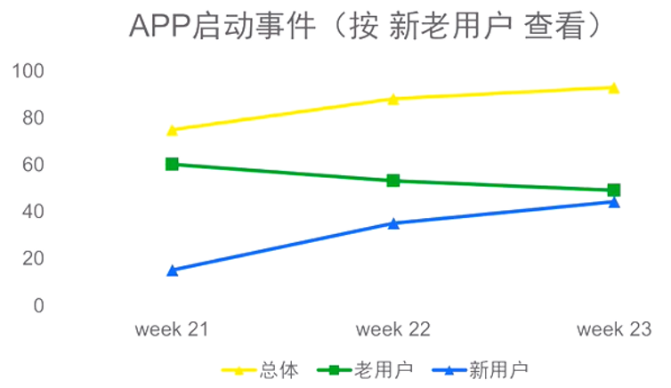

    结论：目前推广群体没问题，因为用户打开APP的来自推送，而运营力量不足，只在北上广深有运营，进行推送，其它城市没有，但微博大V推广是全国覆盖，其它城市流量被浪费了

  - 数据分析本质，用不同的视角去拆分、观察同样一个数据指标

  - 支付流程拆解

    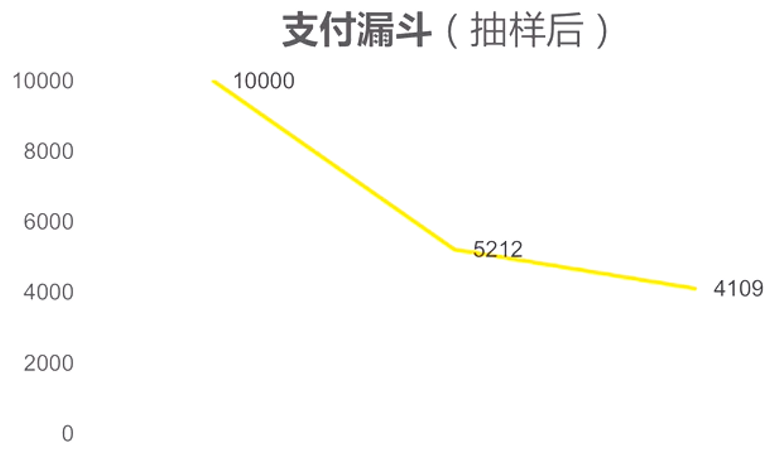

    ​                                                注册                                         下单                                                  支付

    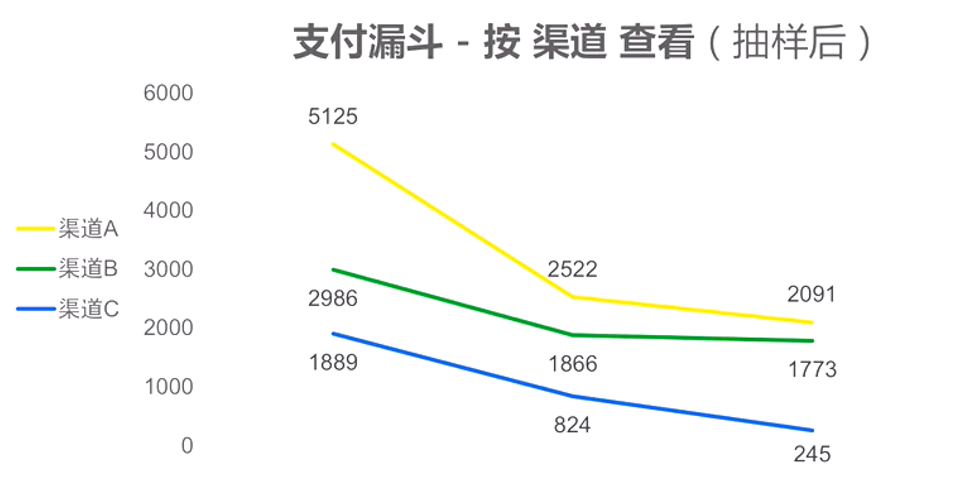

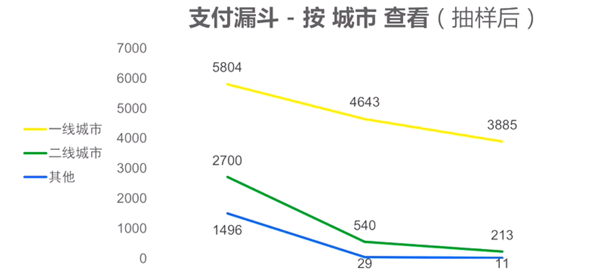

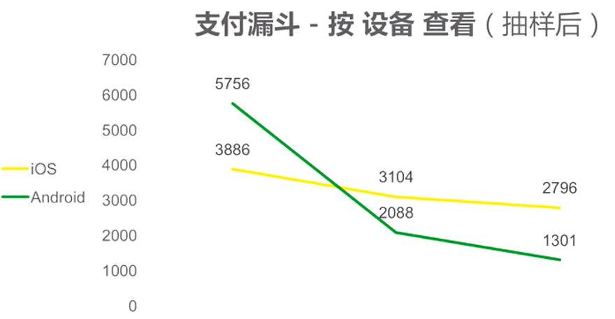

- 多维度使用场景

  - 分析单一指标的构成
    - 分栏目的播放量
    - 新老用户比例
  - 针对流程进行拆解分析
    - 不同渠道的浏览，购买转换率
    - 不同省份的活动参与漏斗
  - 需要还原行为发生场景
    - 打赏主播的
    - 等级，性别，频道

- 案例 流量异常增长

  - 8月30 ~9月3日
  - 表现按渠道看 未知渠道
  - 流量按城市看  北京
  - 流量按设备看  网页
  - 流量按浏览器看 safari 版本未知

#### 5.3 漏斗分析

- 漏斗观察

- 运作原理

  - 通过一连串向后影响的用户行为来观察目标
  - 适用场景
    - 适用： 有明确的业务流程和业务目标
    - 不太适用：没有明确的流程，跳转关系复杂
  - 漏斗一定是有时间窗口的
    - 按天 对用户的影响较短 短期活动
    - 按周 业务本身复杂 决策成本高 多日完成  理财
    - 按月 决策周期更长 买房
    - 周期太长：包含了太多无关信息
    - 周期太短，扔掉了很多有用的信息
  - 漏斗一定有严格顺序
    - 首页 搜索 商品详情 支付 支付成功  
    - 不能跳 首页 详情 支付 
  - 漏斗计数单位可以基于用户 也可以基于事件
    - 基于用户  关心整个业务流程推动
    - 基于事件  关心某一步具体的转化率 
    - 800人进入首页 600人选课页面  400人支付课程
    - 1000次                               900次                 400次
  - 结果指标不符合预期
    - 上面案例 实际450人支付
    - 是否只有这一个漏斗能够到达最终目标

- 渠道质量评估

  - 常见渠道划分方式

    - 具体的流量实体： 百度，头条，线下
    - 媒介： SEM  自然搜索 
    - 其他参数：营销活动名称 广告关键词

  - 渠道质量跟踪

    - 目标用户
    - 选取反映你产品目标人群会做的行为数据
      - （电商）购买 （社区）发帖  可衡量各渠道来的用户是否是目标用户
      - 门槛太高/流程太深，转化率低，无区分度
      - 门槛太低，同样缺乏区分度

  - 查看产生关键事件的用户来源是哪儿

    

- 分布情况

  - 一个事件不仅只有累计数量这么一个可以观察的指标，还可以从该事件在不同维度中的分布来观察

    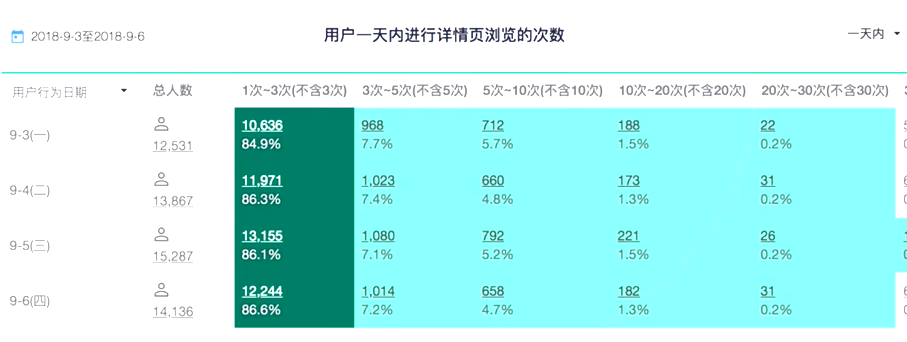

  - 分布情况分析群体划分

    - 事件频率   一天内的时间分布  消费金额的区间

  - 运作原理

    - 从事件在不同维度中的分布来观察，以便理解该事件除了累计数量和频次外，更多维度的信息

  - 适用场景

    - 一群用户已经完成了指定事件，但需要对用户群体进行细分，按不同的维度和价值将他们划为不同群体，分别进行后续的维护和分析
    - 已经知道单个事件的完成次数，希望知道这些次数拆分到不同维度上后的分布情况，一遍清晰地了解该时间的完成情况

#### 5.4留存分析

- 用户留存

  - 验证产品长期价值可以看月留存
  - 一般的计算方式 看大盘可能不准
    - 产品 运营 技术 市场每个环节可能都会对留存造成影响
  - 精准留存
    - 过滤进行过指定行为的用户ID，再计算
      - 小说应用，看过某小说的用户留存比大盘留存高
    - 将用户分为不同的群体后，观察之前留存的区别
      - 游戏产品
      - 服务器 分区 不同区的留存不同
  - 适用场景
    - 评估产品功能粘性
    - 验证产品长期价值

###  六 数据分析日常工作介绍

#### 6.1 日、周、月报

- 日报 （每天必须要看）：
  - 各种数据源整理，了解业务现状
  - 数据波动监控解释
  - 长期观测数据可以培养数据敏感性
- 周报 （短期复盘）
  - 短期趋势
    - 一般公司发版频率 1~2周
  - 版本迭代分析
    - 微博 单周发版
  - 为其它内容做积累
- 月报 （决策）
  - 每个月都会例会
  - 业务梳理
    - 最近一个月 KPI比较好，因为活动效果比较好
    - 分析原因，同步到各个部门
  - 部分建议
  - 目标评估及战略决策

#### 6.2 临时数据 数据需求

- 管理层要数据
- 业务执行人员需求
  - 永无止境，不要立刻就做
  - 为何要这样做
  - 如何落地
- 案例
  - 某APP最近上线了一个线下餐饮优惠券功能，产品经理需要快速知道优惠券的使用人数，你怎么做？
    - plan A 先分析一下字段口径，在哪个是日志中提取，写SQL跑出数来
      - 光看使用人数不行，还要看优惠券下发人数
      - 不同优惠券的消费频次，和优惠券的使用金额
    - 不做提数机器，针对业务单点问题，先追根溯源，建立该类业务的分析框架，由点到面，彻底解决该类问题；同时，在这个过程中，要不断的利用互惠原理和社交技巧，只给业务方做核心的需求，其他的延伸需求让业务方自己动手完成
    - PlanB 找到靠谱的核心的产品经理，了解需求，发现他们的需求时我们的优惠券目前使用情况怎么样，接下来该怎么优化
      - 各类优惠券使用人数
      - 各类优惠券下发人数
      - 各类优惠券使用比例
      - 各类优惠券用户使用时的消费金额
      - 各类优惠券用户的使用频次

- 常规工作优化

  - python日报框架 定期发日报
  - 目标建立
  - 寻找领导帮助

#### 6.3 数据异常分析

- 业务理解 指标口径 数据来源都要清楚

- 数据异常排查要形成自己的套路
  - 别人从其它渠道看到的DAU与你提供的不一致
  - 数据口径  
    - 移动端 PC端
    - IMEI 手机号
  - 业务理解
    - 数据如何定义 比如DAU
  - 数据产生的过程
    - 数据从哪张表里提取出来的
- 具体套路
  - 验真假 是否真的异常
  - 常见原因，概率降序排列，依次核对
  - 找到原因后 后期要验证
- 判断是否异常套路
  - 问清楚数据咋来的，亲自验证
  - 不要只看近期数据，要看相对长期数据（一个季度）
  - 某指标异常，要看关联指标是否有异常
  - 找人问
- 指标异常常见原因
  - 热点事件
  - 活动影响
  - 政策影响
  - 放假
  - 内部系统问题: 新发版有bug，数据处理过程，传输过程问题
    - 查表中数据量大小
  - 统计口径： 业务变更，指标计算方式变化
- 原因确定后的后期验证
  - 持续跟踪数据情况
  - 要有记录，完善文档
  - 发邮件：整个过程分析清楚了再发邮件，描述主要影响和结论

- **异常排查案例**   日活突然暴涨

#### 6.4 专题分析

- 举例活动专题分析
  - 需求解读

    - 大于20%的时间分配在沟通需求上，一定要当面沟通 
    - 举例，原始需求，负责活动的几个事业群同学，希望看到活动的效果数据
      - 了解需求：属于拉活活动，目前活动对日活的帮助，以及出现的问题有哪些
      - 本质需求，活动的拉新促活怎么样，活动带来的用户粘性是否高，哪些活动做得好，哪些活动做得不好，如何优化

  - 建立分析逻辑框架

    - 活动运营分析

      - 活动前

        - 流量 活动前每天流量效果，流量波动原因拆解
        - 收入

      - 活动中

        - 流量  *DAU*(Daily Active User)日活跃用户数量\MAU（即monthly active users） 提升
          - 新用户进入
          - 不活跃老用户唤醒
          - 活动期间连续访问情况 用户粘性
          - 各类活动效果对比
        - 收入

      - 活动后

        - 流量 新用户的沉淀

          ​         唤醒老用户后续活跃量

          ​		客服数据，活动复盘

        - 收入

  - SQL提数及分析

    - 提数
    - 分析
      - 组成部分   （流量组成部分）
      - 数量比较
      - 有何变化
      - 各项分布
      - 各项相关性
      - 其他深层次挖掘

  - 撰写报告

    - 图 文并茂 大部分是图（90%） 少部分是文
    - 先给结论 标题比较重要
    - 阐述的逻辑性要强

- 如何做好专题分析
  - 专题分析要抓住要点，*KPI*(Key Performance Indicator,关键绩效指标) 
  - 周期 2~3周输出完整报告
  - 报告内容通俗易懂，能落地，可执行性强

- 案例：新用户留存专项

  - 背景描述

    - 某产品用户次留，7留与竞品均低5%
    - 新用户流失速度高于竞品
    - 希望通过数据分析，找到原因优化产品运营，提升用户留存

  - ① 用户留存整体分析

    - 摸清基本数据情况，看看哪些数据有问题，找到优化点

    - 关键点，不要拘泥于细节，出活快

      

  - ② 找到优化点（1~2个）

    - 关键操作路径数据发现曝光PV到点击PV的CTR很低
      - 应该给新用户看什么，什么时候给，放在什么位置
    - 某个量大的二级渠道次日留存率比其它渠道明显偏低
      - 找原因，渠道质量问题，用户是否安装竞品
      - 产品与渠道是否不匹配，对比高留存渠道找差距
    - 给出产品运营建议后，配合AB测试看效果

  - ③ 不断重复前面两个阶段，寻找其他切入点

    - 竞品分析，营销活动分析，用户流失分析
    - 换个角度，跳出当前项目
    - 输出的报告一定得有能落地的东西

#### 6.5 小公司日常工作解析

- 靠谱的数据团队：
  - 数仓组
  - 数据产品组（BI开发，日常支持）
  - 数据建模组（模型开发）
  - 专题分析组（临时取数需求，专题报告）
  - 数据管理组（数据口径，数据埋点）
- 实际工作中
  - 横向上，埋点，数据口径，体系指标建立，报表统计，数据清洗，平台研发，专题报告，数据培训
  - 纵向上，对接产品，运营，市场，财务，销售
  - 研发埋点：字段格式，字段名称，字段取值，打点日志，文档沉淀
  - 口径和指标体系梳理：DAU、MAU的定义和计算方法，产品的核心指标及具体业务性指标
  - 平台研发：开发内部大数据平台，数仓，参数开发或者参与数据清洗

#### 6.6 数据分析整体流程

- 干活有套路，不能只提数
  - 明确问题：知道问题的上下文
  - 搭建框架：思考问题套路，一 二 三 。。。。
  - 数据提取：mysql hive为主
  - 数据处理： Excel R Python为主
  - 数据分析：数据分析的常用套路
  - 数据展示：Tebleau excel R Python
  - 撰写报告：文笔功底，整体逻辑性
  - 报告演讲：沟通，表达，报告之前有问题需要提前沟通
  - 报告落地：最有含金量的部分

#### Test 面试业务常问问题

- 流量波动
  - 某外卖近期订单量下降5%，解释并建议
    - 小白： 是不是口径问题，是不是。。。。问题  （单点分析）
    - 下降5%属于什么水平，影响范围多大，对营收影响大不大
    - 常识判断，竞品数据 外部事件 产品变化 用户行为 数据问题
    - 流量异常有可能有外部刷量
- 商业模式
  - CPM 千次曝光 Cost per Thousand Impressions
  
  - CPC,这一种推广模式全称为：Cost Per Click
  
  - 能不能举例一款工具产品，说说是如何商业化的
    
    
    
    - 墨迹天气
      
      - 天气button是主流量入口，广告，带量
      - 时景
      - 会员
    - 我的
      
    - 产品商业化主要收入来自哪里，各自的CPM大概多少钱
      
      
      
      - 时景button的旅游推荐，CPM在6元
    
  - 当前产品商业化提升痛点是什么，之前做过哪些优化方案，效果咋样
    - 工具类产品，用户停留时长短
    - 天气类APP周末效应明显 和旅游景点和做 线下场景推荐
  
- 活跃，留存，流失，渠道
  
  - 有多少个渠道 ，每一个渠道大概留存多少

### 七 不同类型产品举例

#### 7.1电商类APP

- 首页模块，用户视角
  - 搜索 流量的最大入口
  - 广告banner 各种活动宣传
  - 导航：十宫格
  - 淘宝主要坑位
  - Feed流 电商+内容
  - 个性化推荐
  - 底部button
- 三个问题
  - 引流： 首页作为最大的带量位，分发效率怎么评估 （整体）
  - 漏斗：交易额是核心指标，如何理解数字转化的过程  （路径）
  - 用户：拉新  （痛点）
- 整体 分发效率评估
  - 日活，留存 渗透率
  - 需要能找到反映产品问题的指标 比如 CTR  人均访问页面数：总访问页面数（PV）/总访问 UV
  - CTR突然低了  究竟是那个部分导致的CTR降低 
- 人均访问页面数
  - 首页中搜索分发能力最强，活动中主要影响的是搜索，把资源向这里投

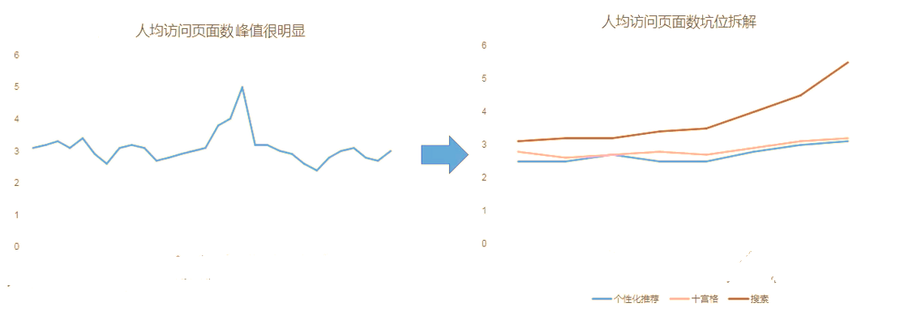

- 基于日活，留存，渗透，分发效率，基本上就能够对APP的整体数据有个大概了解

- 不要给自己设置业务边界，了解这你数据，找到自己负责的部分跟大盘的关系

- 找到业务功能与产品核心指标的关联性

- 电商类应用，交易额最重要，跟交易额相关最紧密的是转化率，任何一个坑位都离不开漏斗模型

  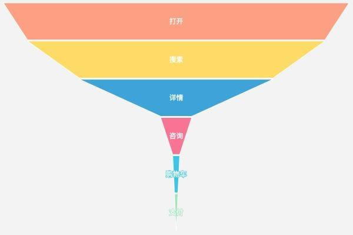

  - 引流渠道 桌面图标打开进入还是其他方式进入
  - 搜索框搜索，热点搜索，语音搜索
  - 客服 评论 店铺设计 商品属性
  - 尺寸 颜色 数量
  - 物流 是否7天无理由退货 发票 运费 支付方式多样性，冲动消费，界面异常，其他打断

新用户与老用户相比，由于对APP不熟悉，在漏斗环节可能有几个特征

- 用户行为比较离散化
- 在某个环节转化率会比老用户低很多
- 新用户当天逛，过一段时间可能再下单

对于一款电商APP， 分发效率是非常重要的一个产品指标

漏斗模型很重要

新用户分析

#### 7.2互联网金融toC授信

- 互联网金融的本质是风控，数据分析师角色
  - 风控分析，一定的模型理解能力，大量的行业和法律法规经验
  - 数据建模，算法要求高，行业经验要求一般
- 产品对象 toB 和 toC
  - toB 定量打分卡 定性行业经验
  - toC 个人信用分
  - 央行征信报告
- 信用分构成
  - 身份特质 稳定性 
    - 所在公司，职业类型，消费稳定度，近一年内使用手机号码数，手机号码稳定天数，地址稳定天数
  - 履约能力
    - 是否有车，是否有房，近一个月流动资产日均值，近三个月流动资产日均值，近六个月流动资产日均值，近一年流动资产日均值，近一个月理财产品总收益，近三个月理财产品总收益，近六个月理财产品总收益，近一年理财产品总收益，历史理财产品总收益，近一个月支付总金额，近三个月支付总金额，近六个月支付总金额，近一个月消费总金额，近三个月消费总金额，近六个月消费总金额，
  - 信用历史
    - 近一个月主动查询金融机构次数，近三个月主动查询金融机构数，近六个月主动查询金融机构数，近一个月信贷类还款总金额，近三个月信贷类还款总金额，近六个月信贷类还款总金额，近一年信贷类还款总金额，近一年信贷类还款月份数，近一年M1状态，近一年M3状态，近一年M6状态，近两年M1状态，近两年M3状态，近两年M6状态，近五年M1状态，近五年M3状态，近五年M6状态
  - 人脉关系
    - 近1年人脉圈稳定度，社交影响力指数，信用环境指数
  - 行为偏好
    - 消费区域个数，近一年支付活跃场景数，近一年母婴消费总金额，近一年母婴消费总笔数，近一年游戏消费总金额，近一年游戏消费总笔数，近三个月家居建材消费总金额，进三个月家具建材消费总笔数，近一年汽车消费总金额，近一年汽车消费总笔数，近一年航旅度假消费总金额，近一年航旅度假消费总笔数
- 数据变量分原始变量和衍生变量
  - 原始变量：直接保存到数据库里的基础变量，如每笔开销
  - 衍生变量：对原始变量进行加工转化
    - 时间维度衍生
    - 函数衍生
    - 比例衍生
  - 选择变量，基于RFM原则，最近（时间），频次，钱，
- 数据处理
  - 缺失值和合理性检验，剃除无效字段
  - 数值类型字段的相关性验证 如果两列数据具有相关性，建模的时候只保留一列
  - 字符串类型字段的离散化处理
- 数据标准化
  - 将所有变量的取值区间都落到[0,1]范围内
- 数据建模
  - 5个模块不同时期可能权重不一样，每个模块单独建模
  - 建模前理清业务，利用5个模块的综合分数，给用户提供其他服务，借钱，免押，目的保证不违约
  - 根据用户数据算出违约概率，这个概率可以转化为用户的分数
- 举例  P = 1/(1+e^-(a * 1 +b * 2+c *3))
- 某用户 计算个模块概率 身份特质，履约能力，信用历史，人脉关系，行为偏好分别算出的概率是0.1 0.2 0.3 0.4 0.5 , 信用历史和履约能力两个模块比较重要，权重影响是0.35 其它都是0.1 那么该用户违约概率是 P= 0.1 * 0.1 +0 35 * 0.2 +0.35 * 0.3 + 0.1* 0.4+0.1 * 0.5 = 0.275  （1-p）* A +B = score  [300,900] 
- AUC  0.6以上
- 坏账率 
- 模型落地  联招好期贷
- 数据源 数据处理 数据标准化，建模，模型落地，模型优化

