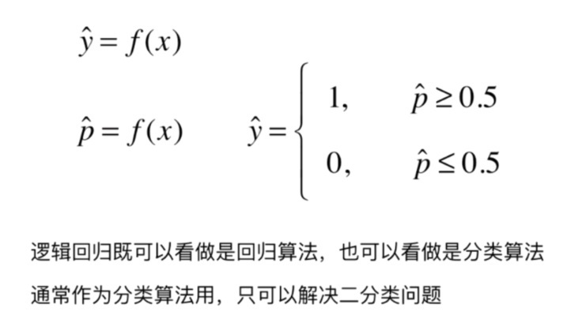
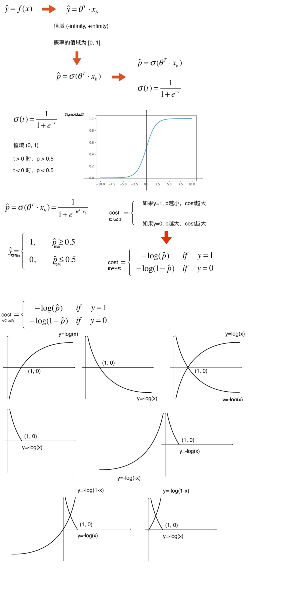
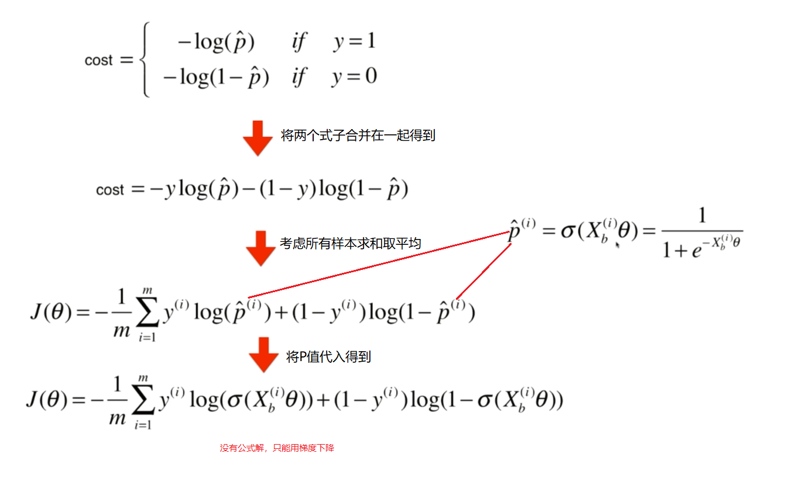
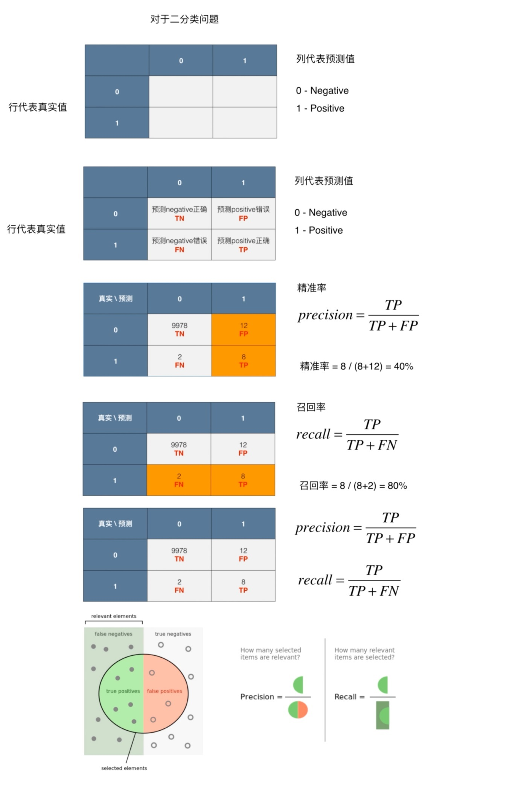

##评分卡与集成学习

- 建立逻辑回归模型
- 对模型进行评分映射

### 逻辑回归回顾

- 公式



- 推导







### 逻辑回归构建评分卡

In [1]:

```python
import pandas as pd
from sklearn.metrics import roc_auc_score,roc_curve,auc
from sklearn.model_selection import train_test_split
from sklearn import metrics
from sklearn.linear_model import LogisticRegression
import numpy as np
import random
import math
```

In [2]:

```python
data = pd.read_csv('Bcard.txt')
data.head()
```

Out[2]:

|      |    obs_mth | bad_ind |       uid | td_score | jxl_score | mj_score | rh_score | zzc_score | zcx_score | person_info | finance_info | credit_info | act_info |
| ---: | ---------: | ------: | --------: | -------: | --------: | -------: | -------: | --------: | --------: | ----------: | -----------: | ----------: | -------: |
|    0 | 2018-10-31 |     0.0 | A10000005 | 0.675349 |  0.144072 | 0.186899 | 0.483640 |  0.928328 |  0.369644 |   -0.322581 |     0.023810 |        0.00 | 0.217949 |
|    1 | 2018-07-31 |     0.0 |  A1000002 | 0.825269 |  0.398688 | 0.139396 | 0.843725 |  0.605194 |  0.406122 |   -0.128677 |     0.023810 |        0.00 | 0.423077 |
|    2 | 2018-09-30 |     0.0 |  A1000011 | 0.315406 |  0.629745 | 0.535854 | 0.197392 |  0.614416 |  0.320731 |    0.062660 |     0.023810 |        0.10 | 0.448718 |
|    3 | 2018-07-31 |     0.0 | A10000481 | 0.002386 |  0.609360 | 0.366081 | 0.342243 |  0.870006 |  0.288692 |    0.078853 |     0.071429 |        0.05 | 0.179487 |
|    4 | 2018-07-31 |     0.0 |  A1000069 | 0.406310 |  0.405352 | 0.783015 | 0.563953 |  0.715454 |  0.512554 |   -0.261014 |     0.023810 |        0.00 | 0.423077 |

In [3]:

```python
#看一下月份分布，我们用最后一个月做为跨时间验证集合
data.obs_mth.unique()
```

Out[3]:

```
array(['2018-10-31', '2018-07-31', '2018-09-30', '2018-06-30',
       '2018-11-30'], dtype=object)
```

In [4]:

```python
train = data[data.obs_mth != '2018-11-30'].reset_index().copy()
val = data[data.obs_mth == '2018-11-30'].reset_index().copy()
```

In [5]:

```python
#这是我们全部的变量，info结尾的是自己做的无监督系统输出的个人表现，score结尾的是收费的外部征信数据
feature_lst = ['person_info','finance_info','credit_info','act_info','td_score','jxl_score','mj_score','rh_score']
```

In [6]:

```python
x = train[feature_lst]
y = train['bad_ind']

val_x =  val[feature_lst]
val_y = val['bad_ind']

lr_model = LogisticRegression(C=0.1)
lr_model.fit(x,y)
```

Out[6]:

```
LogisticRegression(C=0.1, class_weight=None, dual=False, fit_intercept=True,
          intercept_scaling=1, max_iter=100, multi_class='ovr', n_jobs=1,
          penalty='l2', random_state=None, solver='liblinear', tol=0.0001,
          verbose=0, warm_start=False)
```

#### 模型评价

- KS值
- ROC曲线

描绘的是不同的截断点时，并以FPR和TPR为横纵坐标轴，描述随着截断点的变小，TPR随着FPR的变化。
纵轴：TPR=正例分对的概率 = TP/(TP+FN)，其实就是查全率 召回
横轴：FPR=负例分错的概率 = FP/(FP+TN)    本来是0 咱们预测是1的样本在所有本来是0的样本中的概率

作图步骤：

根据学习器的预测结果（注意，是正例的概率值，非0/1变量）对样本进行排序（从大到小）-----这就是截断点依次选取的顺序 按顺序选取截断点，并计算TPR和FPR---也可以只选取n个截断点，分别在1/n，2/n，3/n等位置 连接所有的点（TPR，FPR）即为ROC图

#### KS值

作图步骤：

根据学习器的预测结果（注意，是正例的概率值，非0/1变量）对样本进行排序（从大到小）-----这就是截断点依次选取的顺序
按顺序选取截断点，并计算TPR和FPR ---也可以只选取n个截断点，分别在1/n，2/n，3/n等位置
横轴为样本的占比百分比（最大100%），纵轴分别为TPR和FPR，可以得到KS曲线
TPR和FPR曲线分隔最开的位置就是最好的”截断点“，最大间隔距离就是KS值，通常>0.2即可认为模型有比较好偶的预测准确性

In [7]:

```python
y_pred = lr_model.predict_proba(x)[:,1] #取出训练集预测值
fpr_lr_train,tpr_lr_train,_ = roc_curve(y,y_pred) #计算TPR和FPR
train_ks = abs(fpr_lr_train - tpr_lr_train).max() #计算训练集KS
print('train_ks : ',train_ks)

y_pred = lr_model.predict_proba(val_x)[:,1] #计算验证集预测值
fpr_lr,tpr_lr,_ = roc_curve(val_y,y_pred)   #计算验证集预测值
val_ks = abs(fpr_lr - tpr_lr).max()         #计算验证集KS值
print('val_ks : ',val_ks)

from matplotlib import pyplot as plt
plt.plot(fpr_lr_train,tpr_lr_train,label = 'train LR') #绘制训练集ROC
plt.plot(fpr_lr,tpr_lr,label = 'evl LR')               #绘制验证集ROC
plt.plot([0,1],[0,1],'k--')
plt.xlabel('False positive rate')
plt.ylabel('True positive rate')
plt.title('ROC Curve')
plt.legend(loc = 'best')
plt.show()
'''
train_ks :  0.4482453222991063
val_ks :  0.4198642457760936
'''
```


![img](data:image/png;base64,iVBORw0KGgoAAAANSUhEUgAAAYIAAAERCAYAAAB2CKBkAAAABHNCSVQICAgIfAhkiAAAAAlwSFlzAAALEgAACxIB0t1+/AAAIABJREFUeJzs3Xd4VEUXwOHfpBdCSUhCDb0kEOkgSAlNxBoBsSAIUhXFrqAUEQSlCB8ICIigIqIioFTpXUR6772EhIT0np3vjxuqkCyQzSa7530enr17d+7ds4h79s6dOaO01gghhLBfDtYOQAghhHVJIhBCCDsniUAIIeycJAIhhLBzkgiEEMLOSSIQQgg7J4lA2Byl1KdKqXilVLhS6oJS6r2bXuuplLqklApTSvW9aX8tpdQBpdRFpdTnZrzHPbUXIi+TRCBs1ddaaz/gEeAjpVQNpVQV4EugGdAIGKaUClRKOQHzgI+BskBLpdSjdzvxvbYXIq+TRCBsmtb6NLAVqAI8CfyltT6qtT4JLAeeABoDSVrrP7TWqcBCoGUWp73X9kLkaZIIhE1TSgUAdYEjQHngzE0vn8X4RV898/VrZgJTszjtHdsrpUKUUutueu9ZSqmuN22/ppT6Til1LHNfkFJq+03tBymlPs7crq+U2pXZvTVNKaXu8aMLYTZJBMJWvaGUCgeOAaO11nsANyDlpjapgDtQGIi/tlNrfTnziuFu7rX9NQOAzUCDzOMOAm5KKb/M19sC85RSLsBPQFcgACgHhJpxfiHuiyQCYau+xvi1Hw8sydyXiJEMrnHN3JeWuQ2AUqqZUurlLM5tbvvbf8Uv1VrP0FpH3bRvPvCYUsobcNNaH8XoxioL/AWcBuoAQVnEI8QDkUQgbJbWOhH4Dng9c9dJjC/Ya8oAp4DjGN1G1zQBHsri1Oa2L3nb8613aDMP40rgUYx7DWAkkONa62Ja62JACWB8FvEI8UAkEQhbNwnorJTyBBYDjyqlqiilKgBtMK4WVgLllFItlVIFgOeAtVmc827tY4FSyhCMMTopS1rrvRjJ6UmMpABwGPBQSjVRSjkAPwI97vWDC2EuJ2sHIIQlaa1PK6U2AJ201tOUUh8A6zB+BH2stT4CoJR6HJgO+AHfaq2XZXHO2Du1z7yhuw/jPsBJbvzCz85a4KnMewZorVOVUs8D3wD+wCpgyj1+dCHMpmQ9AiGEsG/SNSSEEHZOEoEQQtg5SQRCCGHnJBEIIYSdyxejhooWLarLli1r7TCEECJf2bFjxxWttW927fJFIihbtizbt2/PvqEQQojrlFJnsm8lXUNCCGH3JBEIIYSdk0QghBB2Ll/cI7iTtLQ0zp8/T3JysrVDyfPc3NwoVaoUzs7O1g5FCJEH5dtEcP78eby8vChbtiyyZsfdaa2JjIzk/PnzlCtXztrhCCHyoHzbNZScnIyPj48kgWwopfDx8ZErJyHEXVkkESil/JVSG7N43VkptVgptUUp9eoDvM/9HmpX5O9JCJGVHO8aUkoVAb4HPLNo9iawXWv9qVJqqVLqN611XE7HIoQQ1mYyaSLiU27ZpzWcuBRJwT3TSUuKJzXd9J/j0tMzuHgllsAmTxHcrJ1FY7TEPYIM4HngjyzahAD9M7c3YCwufstCIEqpXkAvgICAgBwPMifs3r0bgJo1a97X8W+//Tbjx9/bwlOffvopFStW5OWXb6yM2LVrV/bs2XP9pvCcOXPkxrAQFhQTn8CxrUu4GpdIdGIqaRkak9aExSRzJioBd2cnYpPT0EB6xn+/5B3QjHD+Fl8VC4BJ33rVvutSBq8tSiQ8QfNjIVfIb4lAax0L2XZHeAIXMrejMBbfuP0804BpAHXr1s2TiyY8aCK41ySQlYkTJ9K4cWO6devGqlWraNu2bY6dWwh7kGHS7D4XzbmoRACcEy8TuHMoKampJKVloDXEJafhoBRB+jh1VczdT5YGOGZuO969WULlZ0l+6ht8vIyltJOTkxk6dCijvxtN0aK+TJ41mRbtLJsEwHqjhuIBdyAGKJD5/L4NXXSAgxdjcyKu64JKFGTIU9Xu+vqAAQNYsGABAD/++COrV68GICQkhHr16rF3717++usv4uPj6dChAwkJCVSsWJGZM2deP0dISAjr1q0DjF/6aWlpbNq0iZiYGJYvX06xYsXuKWatNfHx8bi4uNzjpxUin4o5D3t+BtN/f3Vfo9HEJaeTkm4iISUdgNQME5eik4hKSOVSbDIZGRqTNpLBNe86GyuHhuNNnJM3SkERF0jP0KS5FSPKuy5OzQfg5ebEfd2Gc3TF0y8Qz5sODg0N5a+//qJbt26MHTuWIkWK3MeJ7521EsEOoDHGGq01uPOi3nnayJEjqVKlCmB0zVyzdetW+vXrx+jRowG4dOkSb775Jq1ateKxxx7j8uXL+Pv/5wIIgOPHj7N+/Xo+++wz1qxZw0svvWR2PG+++SZRUVE89dRTtGjR4v4/mBB5WVoSxIdDfDhpCZE4/fIiSt89CQAooGDm9s3V1yrf3OjasJnbfr1rt0L49T+F3wMFnbW4uDicnZ1xc3Ojf//+vPfee7Ru3dqC7/hfFk8ESqkWQJDW+uubdn8PLFVKNQGCgH8e5D2y+uWe26pXr067my7lnJ2d+fbbb5k5cyZRUVEkJSXd9dguXboAxj2R1NTUe3rfiRMnsmnTJlxdXWWUkMj/Io7A2s/JSE8jLT6KuMgLFEiLwt2UcL3JzXfByiXPvr7t4+GCr5cryWkZ1CnjjaMDODs6ULtMEbw9XfByM44s4uFM+aIFsgzD0v8v/fXXX/Tq1YuXX36Zzz//nJCQEIu+391YLBForUMyH9cAa2577YxSqjXGVcFgrXWGpeKwJHd3dyIjIwGjW0YpRYECt/7DmjFjBh06dKBjx440a9Ysy/N5emY10Cp7vXv3pkmTJvTr1w9Hxyw6JoWworQMEynpJmKS0ohOTCU2KZ19F6K5tnx62OUwXjv8Cj6mSI6aShGLBxG6JBE6CKdCxTB5+KG8/HDzKkphT1dc/SrwZ9Hi+Hq54lPABWfHvD89KioqinfffZfvv/+eqlWr8sQTT1g1HqvNLNZaXwR+tdb754TWrVvTsWNHfvrpJ0aOHEnTpk3v2Ob111/nm2++AeDChQs86NoKgwcPvn6j+eZuqSJFitCiRQt+//13Onbs+EDvIURO2XLiCluOR7LnfDQHLsYSl5xGWobxre9KKo86bOcz51kk4YIJB0qpKwDsdavHkhoTcXNypIJfAV4JLo6DQ/6/2l29ejWdOnUiMjKSTz75hIEDB+Lm5mbVmJTWeXJAzi3q1q2rb1+P4NChQwQGBlopovxH/r6EpaWkZ3AiPIHDYbFsORFJWoaJ05GJ7D1v/Nr3cnOisIczrQOLUbKACS9HE4/t6EnBmMMAmHwDMRWviQIc/arCI29xf3dh87Z9+/bRq1cvpkyZct8jDs2llNqhta6bXbt8W2tICGFdEXEp/Lj1DGciEzh8KY4TEfGkm279YRlcshBdG5Xlg5ASeByYC+nJcPVPWH9j9ByeftB5Pg7+1XGwwS9+rTXff/89O3fuZMKECQQHB7Nly5Y8dS9PEoEQIkvRiamsOHiZbaeiuJg55PJw2I1CAG7ODjSqUJSWgX4EFi9IYHEv/Au64ZURC5f3AREwoTWkJdx64oZvgH91qN4enGxzyPOpU6fo3bs3K1eupEmTJiQlJeHu7p6nkgBIIhBC3CY5LYMTEfHM2nya33acRym4uQe5XtkitAr0p6C7E68+Uo5qJQre+sV27l9YNBkOzL/1xM4e8P5RcHAy/jja7uz3jIwMJk2axIABA3BwcGDy5Mn07t0bB4e8eSNbEoEQdiw2OY0vlx2mgKtT5vN0ft52FjC656uVKEghd2eeqVmCFlX98fVyvfvJEiJh7y/w1wDjuU9FKFoFGr1hPC9eA1webGRcfnHlyhUGDx5Ms2bN+Oabb/JsmZxrJBEIYaPSMkysOxLBmciE6333x8Pj2XnmKievJPynvZuzA65OjtQv502Lqn50qFOKogWy+OK/5uJu+PlFiLt4Y1/VJ+GFn3Lqo+QLaWlp/PTTT3Tp0gV/f3927txJuXLl8lw30J1IIsglN5eTuBMpJidygtaaC9FJzNx8miV7LxEW+991KGoFFObZWiWJTkylbllvgkoUpHmVe5g7azLBioGQEA6JUXDCKK+CexGo2QlCBoBr1hO1bM2OHTt49dVX2bt3L8WLF6dNmzaUL1/e2mGZTRJBHifF5ERWUtNNnIlMYM/5GMatPMqlmCSuDdypUbow77epQlDxgpQranTJKAVuzvc52TA9FfbMgdWfQaIxkRLv8sav/4Z9oXQDcLCviYxJSUkMHTqUMWPG4Ofnx4IFC2jTpo21w7pntpEIlvWHsH05e85iwdD2i7u+nJiYSJcuXQgPDyc4OJhJkyYxYsQIgoKCCA0N5YsvvqB8+fI5MrFLiskJML7095yP5nBYHIMW7sfLzYm45PTrr7s6OfB8vdJU9veikp8Xj1S8jxX84i5D1Mn/7k+OgZ+fv3XfwAibHe1jrtDQUFasWEGPHj0YPXo0hQsXtnZI98U2EoEVTJs2jerVq/Ppp5/Srl079u7dS4cOHRg7diyhoaGsX7+eN99884HfR4rJ2S+TSXPkchz/W3WMQ2GxnIlMvOX1uOR03m5ViQyTpmEFH2oHFLm/X/smE5xYAztmwpFlkFXFF99A6DzfGPvvaJ9fH7Gxsbi4uODm5sbHH3/Mhx9+SMuWLa0d1gOxjf+SWfxyt5QjR46wZcsW1q1bR3R0NBcuXKBt27ZcuHCB2NhYChUq9MC1g0CKydmbpNQMDoXFsv10FAt3XeTgpRvl1R8N8qdkEXc61ClFZX+v+6+pc3E3nMus85hwBfbOheiz4FHUGOFTrhmoO5zbxRNK1bPJ2b7mWrp0KX369OHll19mxIgR2dYPyy9sIxFYQZUqVahfvz7dunVj8eLF14eH1a9fn/Hjx/P000/n2HtJMTnblJCSzp97LrJ470Ui41OJT0nn/NUb1WkdHRQDnwikVaA/ZYvm0LDLFYNgy4Rb95VrBq2GGn39dt7VczdXrlzhnXfeYfbs2QQFBeXo/995gSSC+9SzZ0+6devGzJkzKViwIHPmzAGgQ4cONG7cmDNnztzzOaWYnG1LTTex/UwUBy7EsvH4FbaeiCQ1cxnDBuW8CfD2oGoxLx4PLk4RDxeaVfbNmSJrJhNsHAOXD8DBhca+9jOgQgtjYpdbwayPt3MrV66kU6dOXL16lcGDB/Pxxx/j6mrGsNp8RIrO2Qn5+7Ke4+HxzN95nsnrTlzfV66oJy2r+tEi0I96Zb0fvHTyhR1wYed/96clwcpBN57X6QathhhDPYVZ9u/fT58+fZgyZQrBwcHWDueeSNE5IazkSnwKP/x9hl1nr3L+ahKnMidv+Xm50qdZBZ6pWQIfcyZqZSU+HLZNg8NLQDlm1vTJQkAjeG4meN3b8qf2SGvNjBkz2LVrF5MmTaJ69eps3LjRpu/R5etEcG0xGJG1/HDVl9+ZTJo5284ydcMJzkUZ/fxBxQsSVKIgtQIKE1qzJE0r+2Zzlixc+2+oTbB2hNHVc02VJ6BwAAR3gLJN/nuso5NcAZjp5MmT9OzZkzVr1hASEpJni8TltHybCNzc3IiMjMTH5z7GStsRrTWRkZFWX/jCVkUlpPL2L7uv9/d7uTrRqIIPQ5+uRiV/rwc7uckE0adh8Ttwct1/X6/TzZjIVbTSg72PICMjgwkTJvDJJ5/g5OTE1KlT6dGjR54tEpfT8m0iKFWqFOfPnyciIsLaoeR510pUiJxzJT6F1YcuM/qvI0QlpPJ8vQBCqvjSOtD/vzd4E65AzHlj+/ASOLYi+zcwZRgTu24u3RySWczN0QXqdAUP7xz5LMIYFTR06FBatmzJlClT7O7/l3ybCJydnSlXrpy1wxB2QmtNcpqJZfsvserQZZbuCwPAxdGBIU9V45VGZf970LbpxkidHTNv3V+krFGVMytKQdlHwC8I/KsZdfud5aouJ6WmpjJ79my6du2Kv78/u3fvpkyZMnbZw5BvE4EQuWHv+Wg+nLeX8LgUohJSb3nts2eq0a52qeslnMlIhzXDYPP4W0/iVhjKh8BDz4OTqzFu305n5eYV//77L6+++ir79++nVKlSPProow+8lnh+Jv8ahbiDAxdjeGHqVuJSbtTyeatlJaoU86JBOW+KeLjc6AJaPcwo0RBz3qjICVC7C3gVhxovgrdcueYViYmJDB48mHHjxlG8eHH+/PNPHn30UWuHZXWSCIS4ydxtZ5n77zl2n4vGyUHRpFJRPvPfQDl1GVLXwlmMP9ekxsOen43tiq2gVH1o0Bvc82fxMVv3zDPPsGrVKnr16sWoUaMoVKiQtUPKE/LthDIhcsr5q4nsOHOVpfsu8deBywDMKrGQZjF/oDJSbjR0v8PNWZ1hlGd+5mtj+KbIc2JiYnB1dcXNzY0NGzaQkZFB8+bNrR1WrpAJZUJk4WJ0EiOXHWb/oUO4pUUz0Gk2PVUaA31cKemaiEPUCWON3YbvgrO7sdC6i4e1wxb3aPHixfTp04fOnTszcuRImjZtau2Q8iRJBMJuaK3ZcTKMiCWfExYeTlt1lYmO2yBzkm+GS0Ec/WsDPlCoFDw5DnwqWDVmcX8iIiJ46623+PnnnwkODqZdu3bWDilPk0QgbJbWmr9PRjJp7XH8HGLxCf+bd5Mm4aFSwAnSHT3A5AiN34FSdXGs2FpG89iAFStW0KlTJ2JiYhg6dCj9+/eXRZ2yIf/qhc3RWrP2SDifLTrI6chEnnbYzHDnb/FUKaDAVLAkDm/8i5NLDpV2FnlKyZIlCQwMZMqUKVSrVs3a4eQLkgiETdl59ipvzd1FRFQ0bZ13Mc1/B5VjNhsv9lgD7oVxKFxGfvnbEJPJxLfffsuuXbuuf/lv2LDB2mHlK/J/g7AJp64ksPvcVT5ZsJ866btZ6zYKJzJAl4RGb0JwRyj+kLXDFDns+PHj9OzZk3Xr1tG8efPrReLEvZFEIPK1+JR0xq08yoxNpwAo46X40WGk8eILP0Plx8BOCofZk4yMDMaPH8+gQYNwdnZm+vTpdO/e3S7LQ+QESQQi3zp2OY7QSZtJSM3g0SB/Xm9WhpozKxovFg6Aqo9bN0BhMVeuXGH48OG0bt2ayZMnU7JkSWuHlK9ZJBEopWYAgcBSrfXwO7xeBPgJ8AN2aK17WyIOYZtmbDrFjI0nuRiTDEDvpuUZ8HggrPvSaODkBn02WTFCYQkpKSn88MMPdO/e/XqRuICAALkKyAE5fs2slGoHOGqtGwHllVJ3KpbeGfgpc8ZbAaVUtjPfhEhMTeftubsYtvggiWkZNCjnzaaPmhtJYPtMWDfCaPjeEXCT0gG25J9//qFOnTr06tWLVatWAdhtpVBLsMQVQQjwa+b2CqAxcOy2NpFAdaVUYaA0t1ZvAUAp1QvoBRAQEGCBMEV+EZucxrT1J/l67XEAvNyc+LnnwwQWLwjxEbDg3Rv1fpp+IHV+bEhCQgKDBg1i/PjxlCxZkiVLlkiROAuwRCLwBC5kbkcBte/QZhPwBNAPOAxcvb2B1noaMA2MWkMWiFPkcekZJn7Zfo6hiw6Smm7C0UEx7vmaPPVQcVRiJKwYBP9+ayzQXrOTUeyteA1rhy1yUGhoKKtWreK1117jiy++oGDBgtYOySZZIhHEA9fGbxXgzt1PQ4A+WutYpdS7QDcyv/SF/dJas+LgZXafi+bY5TjWHA7HpKG0tzsv1AugV9PyOKdEw+qh8M80SEuE4Oeg2YeyXKMNiY6OxtXVFXd3dwYPHsygQYOkRpCFWSIR7MDoDtoK1ACO3KFNESBYKbUVaACsskAcIp+IiEth5cHLLNx1gW2no67vf/nhAOqV9ebpGiVQSVdh3efwzzeQmgDV20Gzj8A3m5W+RL7y559/8tprr9G5c2e++OILmjRpYu2Q7IIlEsFCYKNSqgTQFnhBKTVcaz3wpjYjgZlAGeBv4GcLxCHysPNXE5m/8wK/7TjHuagkAHy9XOnSsAxdGpahXNECODooSLoKa0cYCSAlFoJCIaQ/+AVa+ROInBQeHk6/fv345ZdfeOihh+jQQUp656YcTwSZ3T0hQGtglNY6DNhzW5ttgBQBsTNaazYdv8KUdSfYciISgDI+HjxUqhDvPVqFxhWLGl/+AMkxsHUK/D0ZUmIg8GkjAfjLPxtbs3z5cjp16kR8fDzDhg3jo48+wtnZ2dph2RWLzCPQWl/lxsghITgeHsdj4zeSbtL4ernyZouKPFWjBJX9vW5tmBwL/0yFvycayaDqk0YCKBZsncCFxZUuXZrg4GAmT55MUFCQtcOxSzKzWFhczx+2s+rQZdydHQko5Mayt5rg6uR4a6OUONg2DbZMNLqDqjxuJAAZBWRzTCYTU6dOZffu3UydOpVq1aqxbt06a4dl1yQRCIs5dSWBPj/u4MjlOHy9XPnr7aZ4e95WFz4lHv6dDpsnQFIUVGpjJICSdxp1LPK7o0eP0qNHDzZu3Ejr1q1JTk7Gzc3N2mHZPUkEIscdDotlzF9Hrg//fKhUIeb0fJgCrjf9c0tNNOYAbP4fJF4xFn4P+RhK1bFe4MJi0tPTGTt2LEOGDMHd3Z2ZM2fyyiuvyMzgPEISgcgRWmt2njXKQB8OiwOgd7PydKxbmgq+BW40TEuC7d/BpnGQEAEVWkDIAChd30qRi9wQGRnJl19+yeOPP86kSZMoXry4tUMSN5FEIB5IQko6E1YfY83hcI6FxwPQvnYp2tcpSaMKRW80TEuGHbNg01cQfxnKNYPmH0PAw9YJXFhcSkoKs2bNomfPnvj7+7Nnzx5Kly5t7bDEHUgiEPftcFgsb/28myOX4yjs4cyw0Oo8Xr0YPgVcbzRKT4GdP8DGsRB3Cco2gQ4zoewj1gtcWNzff/9N9+7dOXToEBUqVKBVq1aSBPIwSQTivszcfIqhiw4C0KFOKUZ3eMjo79Uazm0zZv9eOQabx0PsBSjzCLSbDuVkpqgti4+PZ+DAgUyYMIHSpUuzfPlyWrVqZe2wRDYkEYh7kpCSzsQ1x/lm/QlKFHJj0ZuNb70CWP8lrBt543nphyF0stEVJDcGbV5oaCirV6/mjTfeYMSIEXh5eWV/kLA6pXXeL+xZt25dvX37dmuHYddS0jP4auVRZmw8RbpJU7+sN9O71KWQx20zQKc2g0u74fnZUKQs+FeXBGDjrl69ipubG+7u7mzaZCwI1LhxYytHJQCUUjsy133JUrZXBMoY3/UE4A8cBM5orS8+eIgiv9h7Ppr+v+/j4KVY/Au6Mu75mrfeCL7m32+NJND8Ewh8KvcDFblu/vz59O3bly5duvDll19KAsinzOka+gU4BzQB3gFmAy0sGZTIG5LTMqg6aDlgLAbzVccatKtd6u4HrB9lPNbslAvRCWsKCwvjjTfe4Pfff6dmzZq88MIL1g5JPABzEoGv1rqjUmqN1nqzUirHl7cUeU94XDKtxq4HoLCHM+veD6Gwh8vdD7i4G+LDjdpAhWQhcVu2bNkyOnXqRGJiIiNGjOD999+XInH5nDmJ4JhS6juguFJqCHDUwjEJKwuLSab1uPXEJadT3teTNe+F3LlhYhTs/x12/wQXd4GLF7T5PFdjFbmvTJky1KpVi0mTJlG1alVrhyNygFk3i5VSzwBVMBaZ+VPn8h1muVmceyLjU+jwzd+cupLA9C51aR3kf2uDjHQ4vsr48j+yDExp4B8MNV8yVgsr4GudwIXFmEwmJk+ezJ49e5g+fbq1wxH3ICdvFvtorf+46XlHpMS0zUlOy6DH99vZdPwKAB+0qfLfJBAXBmMzVwTzKAr1e0KNF6H4Q7kcrcgtR44coXv37mzevJk2bdpIkTgbZU7X0G/cenO4L5IIbMrx8Hj6/byLg5diebF+AG2q+dOscuYv+9QECNtvbH/Xxngs/TB0XQyO0i9sq9LS0hgzZgxDhw7Fw8ODWbNm0aVLFykSZ6PumgiUUs2AEKCsUmpw5m5P4GouxCVygcmkr08Oc3N24NsudWl1+1XAnOfh9MYbzwuVhleXy9wAG3f16lVGjx7NU089xcSJEylWrJi1QxIWlNUVwWlgHRAKrM/clwTssmxIwtK01hwOi2PInwfYdiqKckU9mdvrYfwL3nbJHx9xIwm8PN/48i9ZV5KAjUpOTua7776jT58++Pn5sXfvXkqVymK4sLAZd00EWuszwBml1Eyt9fq7tRP5R4ZJM2/HOcasOEpEXAoeLo50rFuKEc8G4+R4h1HBm8YZj/V7Q8WWuRusyFWbNm2ie/fuHD16lMqVK9OqVStJAnbEnHsEk5RS9QD3zOcltdY/WzAmYQFhMck8PHL19ec9m5Tj9ZCKFLl9xbBrEq7Arh+NGkGPj8qlKEVui4uLY8CAAUyaNImyZcuyYsUKKRJnh8xJBPOAOKAccBEoAkgiyCcSU9P5btMppq4/CUCAtwdr3w/B0SGb7p0NoyE1Hh4fnQtRCmsJDQ1l7dq1vPXWWwwfPpwCBQpkf5CwOeYkgqJAB+BXrfXzSqmN2R0grC813cQv/57lf6uPcyU+hVaB/nzQpgpVimVTDTL6HCzqByfWQJ2u4FslV+IVuScqKgo3Nzc8PDwYNmwYSikaNmxo7bCEFZmTCM4CHYEUpdQAoKBlQxIPwmTSLNp7kbErjnI2KpH6Zb2Z2rk2dcp4Z39wYhSMr25suxWGFoMsG6zIdfPmzaNv37688sorjBo1ikaNGlk7JJEHmJMIOgM+wDKgHUZSEHmM1pp1RyMYtfwIhy7FUrWYFzO71iOkim/WY7+1hi0TYOXgG/sqtoKOP4CLp+UDF7ni0qVL9O3blwULFlCnTh06dZLCgOKGbBOB1toERGQ+/c6y4Yj7sePMVUYtP8w/p6Io7e3O/16oyVMPlcAhq/sAJhOs+Qz2z4foM8a+4OeM9QPq9wIXj9wJXljckiVLePnll0lOTubLL7/k3XffxclJ1qQSN5hTYmK31rpmbgQj7s3Ry3GM/usIKw9epmgBFz57phov1AvAxSmbArEp8fBhjB9IAAAgAElEQVR7dzi6HAIaQbVQeORt8DCj+0jkO+XLl6devXp8/fXXVK5c2drhiDzInJ8Fs5RS/bTWEywejTBLTGIaw5YcZP7O83i6OPFe68q82rgcnq5m/spbO8JIAoFPQccfZYKYjcnIyODrr79m7969zJgxg8DAQFasWGHtsEQeZs43xzMYJahfwphZrLXWsjCNlRy7HEfopM0kpGbQo3E5Xm9eEe+7zQW4k3PbYOskY/upCZIEbMzBgwfp0aMHf//9N48//rgUiRNmMeceQfPcCERk79M/DzBry2kABj4RSI8m5e/9JGuGG48tBkpXkA1JTU1l1KhRDBs2DC8vL2bPns1LL70kReKEWeSOUT6x4kDY9SQws2s9mlf1M//g9FQ4sMBYR+DUelAO0Pg9ywQqrCI6Oppx48bx7LPPMmHCBPz87uHfh7B7FkkESqkZQCCwVGs9PIt2k4FlWutFlojDVqw9Es5bc3cDsPHD5pT2vocRPUlXYfxDkBJrPH/oBWjyLjjIiqP5XVJSEjNmzOD111/Hz8+Pffv2UaJECWuHJfKhHE8ESql2gKPWupFS6julVCWt9bE7tGsCFJMkkLVJa4/z1cqjVPH3YkbXuhQv5J79QSYTnNsKBxYaK4mlxoNvVeixGlylhIAt2LBhAz169ODYsWMEBgbSsmVLSQLivlniiiCEGwvXrAAaA7ckAqWUMzAdWKqUeubmFdBuatML6AUQEBBggTDzvo8X7GPOP2epU6YIs7rVw8vNjIVg4i7D2Mwhgo6uUKm1sYxk1ScsG6zIFbGxsfTv358pU6ZQrlw5Vq1aRcuWUhlWPBhLJAJP4ELmdhRQ+w5tugAHgVHAm0qpAK31xJsbaK2nAdPAWLPYAnHmaeevJrJ4z0UAZndvgLuLo3kHLuhlPAZ3hCe/AtdsaguJfCU0NJR169bxzjvvMGzYMDw9Zfa3eHDmTChTwBOAP8aX9xmt9cUsDonnRsnqAsCdOqNrAdO01mFKqdnA58DEO7SzS5dikgidtAWApf2amJ8E0pLh4i7w9IV202RoqI24cuUKHh4eeHh48Pnnn6OU4uGHH7Z2WMKGmHPH8BegOdA7s/3sbNrvwOgOAqiBsdLZ7Y4D18Y+1gXOmBGH3WgxZj1X4lP4rms9gkrcQ42/vydCcgy0/1aSgA3QWjN37lwCAwMZMmQIAA0bNpQkIHKcOYnAV2v9HhCvtd5sxjELgc5Kqa8wCtQdUErdPnJoBtBcKbUBeB0Yc49x26yft50lKS0DpaBuWTPG+aenQNQp48/fk419ZZtaNkhhcRcuXCA0NJQXX3yRcuXK0aVLF2uHJGyYOfcIjimlvsOYXTwEOJpVY611rFIqBGgNjNJahwF7bmsTBzx3fyHbrqOX4xgwfx9ebk78PSCbG4CJUfDPN7D+y1v31+8lQ0PzucWLF9OpUyfS0tIYM2YMb7/9No6OZnYPCnEfzJlZ3Esp9QxwGDgCfGbGMVe5MXJImGnCamNw1cQXa1Egu7pBO2bdSAI+laDJe8ZEsUqtLRuksLiKFSvSqFEjJk6cSMWKFa0djrAD5twsfh+Yd6chniLnrD0SzuK9l+jTrAIhVcyYFXpqvfH4yWVwlloy+VlGRgYTJkxgz549zJo1i6pVq7Js2TJrhyXsiDl9COeAIUqpxUqp/kop+YmSw7TWvPPLbhwUvNnCjL9ekwku7YGgZyQJ5HMHDhzgkUce4d133+XKlSskJydbOyRhh7JNBFrrX7TW3YDnAWdgm8WjsiMmk2bqhpNEJ6bxRotK5pWSDj9olI6o3NbyAQqLSE1N5bPPPqNWrVqcOHGCOXPmsGjRIqkUKqzCnK6htzBmC6cAi4FyFo7JrvSfv5dft5+nYXkf+javkP0BKXGw9ANju1Q9ywYnLCY6OpoJEybw3HPPMX78eHx9fa0dkrBj5owaCgc6a63jLR2MvdlzLppft5+nWWVfZnatl/XSkgCpiTA2EFLjjOdFylg+SJFjEhMTmT59Om+88cb1InHFixe3dlhCmNU19LMkgZyXYdK88fNOAEa2C84+CYBxXyA1Dmp1hte2gKMZtYdEnrB27VqCg4N5++23WbduHYAkAZFnyIBzK7gQnUTXmds4F5XEh49VoURhMyqKAoTtNR7rdgP/apYLUOSYmJgYevfuTYsWLVBKsXbtWikSJ/Kcu3YNKaW+0lq/q5RaC1wr+qaQpSofiNaavj/tZPe5aLo3Lsdrzcy4LwAQexGWfWhsF3vIcgGKHBUaGsqGDRv44IMP+PTTT/HwuIe1JITIJXdNBFrrdzMfZanKHDRz82l2n4umd9PyDHg80PwDl/c3Hmt1li6hPC4iIgJPT088PDwYOXIkjo6O1KsnN/ZF3iVdQ7koPiWdyeuOA/B+myrZH2DKgIQr8O+3cDBzPt9TEywYoXgQWmvmzJlzS5G4hx9+WJKAyPPMGT7qo7WOvOl5R621lI+4Dy3GrCMyIZXZ3Rvg7GhGDv5fTYg5a2y7FYan/id1hPKo8+fP89prr7F48WIaNGhA165drR2SEGYz51vlt9ue97VEILZuy/ErhMelUNDNmcaVimZ/QFryjSTwzGR47zBUC7VskOK+/PnnnwQFBbFmzRrGjRvH5s2bqVZNbuaL/COrm8XNMCaSlVVKDc7c7QlczYW4bMrJiHg+/N0Y8fNH30fMO+j0JuPxhZ+h6uMWikzkhMqVK9O4cWO+/vprypcvn/0BQuQxWXUNnQbWAaGZjwpIAnZZOihbsvrQZbp/vx0fTxf+fOMRyhY1c2nBNcPAtRBUlKGGeU16ejrjx49n7969/PDDD1StWpWlS5daOywh7ttdu4a01me01uuBmVrrDVrr9VrrbVrrtFyML1/752Qk3b/fTiF3Z37s3oCHShXO/qCkaJjRBi7thmLVwcnV8oEKs+3du5eGDRvywQcfEBsbK0XihE0wZ2axDFO5DxkmzZA/DwAw//VG5i05mRwD37aEC9uh2rPGkpMiT0hJSWHIkCHUqVOHs2fP8uuvv7JgwQIpEidsgjm1hsQ90lrT4ZstHA6Lo1WgHxV8C5h34E8dIfI4tP4MHnnLskGKexIbG8vkyZN58cUXGTduHD4+PtYOSYgcIzOLLeCb9SfZdTaaFlX9mN6lrnkHrR4G57ZC6Qbw8OuWDVCYJSEhgWnTptGvXz98fX3Zv38//v7+1g5LiBwnM4tzWFhMMl8uPwzAuOdropQZxeSWD4CtmQvPPzdLZg7nAatXr6Znz56cOnWKGjVq0KJFC0kCwmbJ7KQc1nT0WgBGd3iIQu5mfKFfPWMkAXdv+OAEFCxh4QhFVqKjo+nRowetWrXCycmJ9evX06KFXAAL22bOzGIvoBAQB7QDVmmtz1k6sPxoy4krpKabCCxekOfqls66cfhhY5Wx758ynj86DDzNmGgmLOrZZ59l48aNfPTRRwwZMgR3dzMrwwqRj5lzs3g+MBzoClwEegKNLBhTvpSYms5L0/8B4KceDbJufHYrfNfmph0KqsikMWu5fPkyBQoUwNPTky+++AInJyfq1Klj7bCEyDXmdA05Z84nKK61/gQwWTimfCl00mYA+retirenS9aNd/5oPIYMgFcWwSeXwMPbwhGK22mt+fHHHwkKCrpeJK5BgwaSBITdMScRnFNK7QKWK6U6Y1wViJukpGdw9LKxiFvvptmUGIg+B7tnG9uPvAXlmoKzdD/ktrNnz/LEE0/QpUsXqlSpQvfu3a0dkhBWk23XkNa6s1LKW2sdpZQqCfycC3HlKzM2nQJgzHM17j5KSGtY9wWs/8J43naUJAAr+eOPP3j55ZfRWjNhwgRef/11HB0drR2WEFZjzs3iQsD7SqlA4AAwGoixdGD5ydxtxr3zdrVK3r3R2b9vJIHCAVD7lVyITNxMa41SiqpVqxISEsLEiRMpW7astcMSwurM6Rr6ATgM9AeOZT4XmS5EJ3E2KpFna5W8+wL0V8/AzLbG9hs74O194CylCXJLeno6X375JZ07dwagSpUqLFq0SJKAEJnMSQRFtNY/aK2PaK2/B4pYOqj8QmtN52//wUHBmy0q3r3hhJrGY+thUDSLdiLH7dmzhwYNGtC/f38SExOlSJwQd2BOItitlJqqlHpVKTUN2G3poPKLBbsucPJKAqG1SlL+bvWETm0AbYJS9eGRfrkboB1LTk5m4MCB1K1blwsXLjBv3jzmz58vReKEuANzqo/2A/4EfICFmc8F8O6vewAY8WzwnRtEnrhpwtjwXIpKAMTFxTF16lQ6derEwYMHad++vbVDEiLPyjYRKKUcABcgHZChFZm2nYoCwMvNCTfnO/y1XNwNE2sb24FPQUA2k8zEA4uPj2fMmDFkZGTg6+vLwYMHmTVrFt7eMkdDiKyY0zU0F2gBJACPK6XmZHeAUmqGUmqLUmpgNu38M+co5DtT1h0HYNNHd6hDk5EG05oZ2y/MgXbTczEy+7RixQqqV6/Ohx9+yIYNGwDw9fW1clRC5A/mJAI/rfWbWutpWuvXgOJZNVZKtQMctdaNgPJKqUpZNB8D5LvB9Ccj4ll7JIIq/l7/LSyXngIHFhrbpepD1SdkvoAFRUVF0a1bN9q0aYObmxsbN26keXMpmCvEvTCn1lCiUqo/sAOoD8QopZpqrTfcpX0I8Gvm9gqgMcaw01sopa5dZYTd6SRKqV5AL4CAgAAzwsw9fecYFzH9H6/63xcnNYCrxgQznpmUi1HZp2effZbNmzfz8ccfM2jQILkZLMR9MCcR/AO4cqPQ3C6ML/u7JQJP4ELmdhRQ+/YGSikXYDAQCiy800m01tOAaQB169bVd2pjDfvOx3DoUiwNy/vQvIrfrS/GR9xIAq8sBt/KuR+gHQgLC8PLywtPT09Gjx6Ni4sLNWvWtHZYQuRb5pSYGHqP54znRndPAe7c/dQfmKS1jjZr4ZY8ZM62MwCM6Vjjvy+u/dx4bD8DyjXJxajsg9aa77//nnfffZdu3boxduxY6tevb+2whMj3LLEwzQ6M7iCAGsDpO7RpBfRVSq0Daiql8sUq7VEJqfy87RyPBvlTsvBt/f6RJ2DHTChZF4I7WCdAG3b69Gkee+wxunXrRrVq1ejVq5e1QxLCZlhi8fqFwEalVAmgLfCCUmq41vr6CCKtddNr20qpdVrrHhaII8c9O9koNR16e00hrW8MFa0vX1A5bcGCBXTu3BmlFF9//TWvvfYaDg6yuJ4QOSXHE4HWOlYpFQK0BkZprcOAPVm0D8npGCzhcFgsZyITaVe7JI8H3zRwauVg2H3TiNoaz+d+cDbqWpG4atWq0apVK/73v/9RpkwZa4clhM2xyM8qrfVVrfWvmUnAJoxfaQx8GtA28MbO2Iuw+X+QmggBjaCfVN/ICWlpaYwYMYJOnToBULlyZRYuXChJQAgLMSsRKKWqK6XaKKUClVJ3Kapju/aej2b5gTCerVUSXy/XGy+c2WI8PjYSXl0G3uWsE6AN2blzJ/Xr1+eTTz4hIyODlJQUa4ckhM0zp8TERGAoMBIoD2Q7s9jWrDx4GYAPH6ty6wv/TDUeS/5nhKy4R0lJSQwYMID69esTFhbGggUL+OWXX3B1dc3+YCHEAzHniiBYa90eiNZaLwEKWTimPGfejvM0KOdN8UK3jRRKjIQyjaHYXYrOCbMlJCQwY8YMXnnlFQ4ePEhoaKi1QxLCbpiTCCKUUoOBIkqpV7jLTGBblZZh4lJMMuV9PW99IT0Vok5ACZnIdL/i4uIYNWoUGRkZFC1alIMHDzJjxgyKFJElL4TITeYkgi4YS1P+jXE10NWSAeU1/2ZWGa1arOCtL1xbdtKtcC5HZBuWL19O9erV6d+/Pxs3bgSgaNGiVo5KCPtkTiJ4DriKUWoiOvO53fhp21kA2tcpdWNnRjpsHGtsN3rDClHlX5GRkbzyyiu0bdsWT09PNm/eTEhIiLXDEsKumZMIVOYfd6Ad0DTr5rYjPcPEkr2XqF/WmwKumVMu4sJgmI+xXb2DVBa9R+3atWPOnDkMGjSIXbt20bBhQ2uHJITdM6fW0Pc3Pf1GKTXZgvHkKf3n7wOgXrnMPuszf8PMx4ztSm0gdIqVIstfLl26hJeXFwUKFGDMmDG4uLhQo8YdajUJIazCnOGjTW/60x4IyoW4rM5k0szbcR6A91pXMRabuZYEarwEnX4FJxcrRpj3aa357rvvCAwMZPDgwQDUq1dPkoAQeYw5JSZuXuUjFehroVjylPXHIgBoUqkoDg4KThp1hvAoCs/KlUB2Tp48Se/evVm1ahVNmzalT58+1g5JCHEXlihDbRO+3XgSJwfFNy/XMXYcWW48vrbFekHlE/Pnz6dz5844OjoyZcoUevXqJUXihMjDzOkaWpYbgeQ1m49HEli8IJ7XbhIfXmI8FvC7+0F2Tmtj/aDg4GAee+wxDhw4QJ8+fSQJCJHHmfN/6D6l1DMWjyQPORERD8BDpTInUR9ZBjFnQTlCPltIJzekpqYyfPhwXnrpJbTWVKpUid9//53SpUtbOzQhhBnMSQT1gLlKqW1KqbVKqTWWDsqaMkyalmPXA9C3eUVj54EFxuOrf1kpqrxr+/bt1KtXj0GDBgFGUhBC5C/m3CNonl0bW7LyoFFBI8DbgxKF3SHqFOz9BTz9oHQ9K0eXdyQlJTFkyBDGjh1LsWLF+OOPP3j66aetHZYQ4j7c9YrA3rqDrll5MNx4fDdz3txvrxiPFVpYKaK8KSEhgVmzZtG9e3cOHDggSUCIfCyrrqG3ci2KPOJKfAq/7zzPi/VL4+roABvGwKU9UKg0PPuNtcOzutjYWL744ovrReIOHTrEtGnTKFxY6i0JkZ9l1TX0sFLq6G37FKC11pUtGJPVDPnzAACPVisGWybAmmHGC09PtPubxEuWLKFPnz5cvHiRhx9+mJCQEHx8fKwdlhAiB2R1RfCP1rrybX8q2WoSMJk0S/ZeAqBZRR9jLWKAfruggl3dJrlFREQEnTp14sknn6RQoUJs2bJFisQJYWOyuiKYl2tR5AGrDhmrkHV7pCwOWycZOyu2Bu/yVozK+tq3b8/WrVv59NNPGTBgAC4uUlZDCFtz10SgtZ6Um4FYW68fdwDw6kPuMNMYCknH77M4wnZduHCBQoUKUaBAAcaNG4erqyvVq1e3dlhCCAuRKZ/A2chEAEoWdqd02kljZ8jH4OKZxVG2R2vN9OnTCQoKul4krk6dOpIEhLBxkgiAZfuNewPDQ6vDxq+MnbVetmJEue/EiRO0bNmSXr16UadOHfr2tYvagkIIJBEAsOtsNA4KmhUKhzOZVUa9ils3qFw0b948goOD2bFjB9OmTWP16tVUqFDB2mEJIXKJOWWobVp6honlB8JoX7sUDtsy5wq88DPYQaE0rTVKKWrUqMETTzzBuHHjKFWqVPYHCiFsiu1/22Vj9WFjJnFFl0jY9aOxs1JrK0ZkeampqQwdOpQXXnjhepG43377TZKAEHbK7hPB7K1nAOjqstbYUb8XODpbMSLL2rZtG3Xq1OHTTz/FyclJisQJIew7EZhMmn9PR1GikBvuezOHirYdZd2gLCQxMZH333+fhg0bcvXqVRYtWsRPP/2Eq6urtUMTQliZXSeCOdvOkpxmonfTcpCWDN4VbLaURFJSErNnz6ZXr14cPHiQJ5980tohCSHyCLu+Wbzq0GVcSeXlLY9BRgpUfdzaIeWomJgYvv76az766CN8fHw4dOgQRYoUsXZYQog8xiJXBEqpGUqpLUqpgXd5vZBSaplSaqVSaoFSKtfrFqSkZ7DuSATPFL2EY8JlCHwa6vXM7TAsZtGiRdcnhm3atAlAkoAQ4o5yPBEopdoBjlrrRkB5pVSlOzTrBHyltW4NhAGP5XQc2Zm23phB3I+fjR0NekORMrkdRo6LiIjgxRdf5Omnn8bHx4d//vlHisQJIbJkia6hEODXzO0VQGPg2M0NtNaTb3rqC4TffhKlVC+gF0BAQECOBzl25VEaOhygVPxeY0fZxjn+HtZwrUjcZ599xkcffSRF4oQQ2bJEIvAELmRuRwG179ZQKdUQKKK13nr7a1rracA0gLp16+qcDPB4uLE4/Yduf4AJ6PBdTp4+150/f57ChQtToEABxo8fj6urK9WqVbN2WEKIfMIS9wjiAffM7QJ3ew+llDcwEXjVAjFk6Zv1JwAI8CsMTu5QvX1uh5AjTCYTU6dOJSgo6Pri8bVr15YkIIS4J5ZIBDswuoMAagCnb2+QeXP4V2CA1vqMBWLI0rwd5ymlwvEJ2wTlm+X22+eIY8eO0aJFC/r06UP9+vV58803rR2SECKfskQiWAh0Vkp9BXQEDiilht/WpjtQB/hEKbVOKfW8BeK4o/iUdAD6e/1l7MiH9wZ+++03HnroIXbv3s2MGTNYuXIl5cvb9wI6Qoj7l+P3CLTWsUqpEKA1MEprHQbsua3NFGBKTr+3OTYfvwJAoL8HnAMeft0aYdyXa0XiatWqxTPPPMNXX31FiRIlrB2WECKfs8g8Aq31Va31r5lJIE85cCEGgBKO0eBfHRwcrRxR9lJSUhg8eDAdO3ZEa03FihWZO3euJAEhRI6wuxITEfEpALhFHwffKlaOJntbt26ldu3aDBs2DHd3dykSJ4TIcXaXCPZfiKVFeU9U9BkomncTQUJCAu+88w6NGjUiLi6OpUuX8sMPP0iROCFEjrOrRJCeYWLfhRhaexw3dji7Z32AFSUnJzN37lxef/11Dhw4QNu2ba0dkhDCRtlV0blTVxJwJp0Xj79n7PDPW+Pto6OjmThxIgMGDLheJK5w4cLWDksIYePs6opg/dEI1ru+bTwp/TBUbGndgG6ycOFCgoKCGDp0KFu2bAGQJCCEyBV2lQiuhp2hhIoynnRZaN1gMl2+fJmOHTvy7LPP4ufnxz///EPTpk2tHZYQwo7YVdfQySP7jI1nJuWZ+wMdOnRg27ZtDB8+nA8//BBnZ9tdJlMIkTfZVSLwSToJzoBvoFXjOHv2LEWKFMHLy4sJEybg6upKUFCQVWMSQtgvu+kaiklM4yFlrEFAkbJWicFkMjFp0iSqVavG4MGDAahVq5YkASGEVdlNIjgblUhlh/PGE0+fXH//I0eO0KxZM9544w0aNmzIW2+9lesxCCHEndhNIpi77Qw1HU6Q4F8v19/7119/pUaNGuzfv5+ZM2fy119/UbZs2VyPQwgh7sRuEoHP0bkAeBTyzrX31NpYT6dOnTq0a9eOQ4cO0bVrV5RSuRaDEEJkx24SQa3EzQCoNiMt/l7Jycl88skndOjQAa01FSpUYM6cORQrVszi7y2EEPfKLhLB1dh4mjvsJsXBA3wqWPS9tmzZQq1atRgxYgReXl5SJE4IkefZRSIIO3sUgPAAy9XriY+Pp1+/fjRu3JjExESWL1/OrFmzpEicECLPs4tEcOnQ3wCklW5ksfdITU1l3rx59O3bl/3799OmTRuLvZcQQuQku5hQ5hm+E4BiVR7O0fNGRUUxYcIEBg4ciLe3N4cOHaJQoUI5+h5CCGFpdnFF0CBiHgAeparn2Dl///13goKCGD58+PUicZIEhBD5ke0ngswhnEnKLUdOd+nSJdq3b0+HDh0oUaIE27dvlyJxQoh8zfYTQYYxameBe4ccOV3Hjh1ZsmQJX3zxBdu2baNmzZo5cl4hhLAW279HkJ4MgJNbgfs+xZkzZ/D29sbLy4uJEyfi7u5OlSp5d5lLIYS4FzZ/RZAQfhoAP497n81rMpmYOHEi1apVY9CgQQDUrFlTkoAQwqbYfCII3/YbABn+93aj+PDhwzRt2pR+/frRpEkT3nnnHUuEJ4QQVmfziSAp7BgApWs/ZvYxc+fOpUaNGhw6dIgffviBpUuXUqZMGUuFKIQQVmXziSAm3bgNUqF49qWnTSYTAPXq1eO5557j4MGDdO7cWYrECSFsms0nggqx27isi+DocPcv86SkJPr370/79u2vF4mbPXs2/v7+uRipEEJYh80nAj9TOOkOLnd9fePGjdSsWZMvv/wSHx8f0tLScjE6IYSwPptPBLHagzgXv//sj4uLo2/fvjRt2pS0tDRWrlzJt99+i4vL3ZOGEELYIptOBIkpaRRUiVxxL/+f19LS0li4cCFvv/02+/bto1WrVlaIUAghrM+mE0FEdCwAhQp4ABAZGcngwYNJT0/H29ubw4cPM27cODw9Pa0ZphBCWJVNJ4LoK5cAcPXy4bfffiMoKIiRI0fy999GWWovLy9rhieEEHmCRRKBUmqGUmqLUmrgg7R5UE5Rx7kYZ+L1/y2lY8eOlC5dmu3bt9OkSRNLvaUQQuQ7OZ4IlFLtAEetdSOgvFKq0v20yQmxxzbT8bckNu08yKhRo9i6dSs1atSwxFsJIUS+ZYmicyHAr5nbK4DGwLF7baOU6gX0AggICLivQIoEt6HPiweo+fIIqgdLlVAhhLgTSyQCT+BC5nYUUPt+2mitpwHTAOrWravvJ5Cq9VpRtZ6MBhJCiKxY4h5BPOCeuV3gLu9hThshhBC5wBJfwDswunoAagCn77ONEEKIXGCJrqGFwEalVAmgLfCCUmq41npgFm1ydlV5IYQQZsvxKwKtdSzGzeCtQHOt9Z7bksCd2sTkdBxCCCHMY5GlKrXWV7kxKui+2wghhLA8uUkrhBB2ThKBEELYOUkEQghh55TW9zVXK1cppSKAM/d5eFHgSg6Gkx/IZ7YP8pntw4N85jJaa9/sGuWLRPAglFLbtdZ1rR1HbpLPbB/kM9uH3PjM0jUkhBB2ThKBEELYOXtIBNOsHYAVyGe2D/KZ7YPFP7PN3yMQQgiRNXu4IhBCCJEFSQRCCGHnbCYR5JV1knNTdp9HKVVIKbVMKbVSKbVAKeWS2zHmNHP/Gyql/JVSu3IrLku6h888WSn1VG7FZUlm/NsuopRaqpTarpSamtvxWULmv9mNWfcQIuUAAAVmSURBVLzurJRanPn38mpOvrdNJIK8tE5ybjHz83QCvtJatwbCgMdyM8acdo//DcdwY/GjfMvcz6yUagIU01ovytUALcDMz9wZ+ClzfH0BpVS+nluglCoCfI+xeuPdvAlsz/x76aCU8sqp97eJRMCd10C+nzb5SQjZfB6t9WSt9crMp75AeO6EZjEhmPHfUCnVAkjASH75XQjZfGb1//bOL8SKOorjny+rULK1upGlIkovQpRl1KaBuYX9I2NhK7Z6iKIII7Oth1KKkrKXglgTe8hAIYmofSkTLDOuq1tJ/2hZsyhCjMAIqTZIQvL08PuJl5tz793bzszdO+cDl5nf756Z8z0zMGd+v2HOSFOBzcAhST3ZSUuNbmqf56PARZKmA3OBw9lIS41/gD5grIpNN6eOyxAwYcmvVRJB5TeQz2vQZjJRdzySlgAzzOzTLISlSM2Y4/TX08CaDHWlST3n+W7gG+AFoEvSwxlpS4t6Yt4HzANWA98Cv2UjLR3MbKyO77Kkdg1rlURQxO8k1xWPpE5gIzChc4o5UU/Ma4BNZvZ7ZqrSpZ6YFwGvmtkRYBtwTUba0qKemJ8BVprZs4REcG9G2vIktWvYZL8YnqSI30muGU+8O34LWGtmjRbtaybqOYfLgYcklYBLJb2WjbTUqCfmH4AL4vrlNF6gsVmoJ+YZwMWS2oArgSK8EJXeNczMJv0POBv4GngJOBgP0voaNh15684g5gcJQ+ZS/PXlrTvtmCvsS3lrzug8nwW8TZg3/gSYk7fuDGLuAg4Q7pJ3Ae15656g2EtxeS2wquK/eTHmDcBnhAfqE+K3Zd4sjk/drwOGLAyRG7KZTLRaPPXgMXvMRUbSbMKo4H2bwG+9t0wicBzHcRqjVZ4ROI7jOA3iicBxHKfgeCJwHMcpOJ4InNyRtE7SQUml+FtVw76UkbSaSBqoaM+X1F3LLguStDhOJVPyFuA4kefNbFveIsaLmfVXdM0nlAIo1bDLgtNqcZxKfETgNCWS2iXtlLRX0pYqdmfGioxDscLqFEnTJA3Gvk1Vtl0Xq7PuifZTYv/G6Hd7rHIpSa/H/e2W1FG2j1LZ+iPAAHBPHNmcm2B3l6T+uH6HpMejj81lWtqq6C5JelTSSGy3SXpD0rCkd2KVyv9oGY8Pp1h4InCahSfjBeuV2J5FKI2xHJgvKamuyoXACTO7GthCePX+AWA09s2StLCK371mtgz4BeiRtAI4w8yWAoPAE0AnsBBYBjwHdJxuR2a2AegHtppZt5n9muBzO6fKQNwY/fQAU6OWw8DNVTTPCu7sZFznADuivjHgsgQt4/HhFAifGnKahcqpoePA/YQaMp0kl5T+EhiV9AHwPbATWABcFefHpwNzgJGE7b+IyxHCVEobsD/27Qd6zeyopK1x30cIF9iGMbM/Jf0tqR2YaWY/SrodWBJHDu2EN2qT+AN4uax9HFgB3AbMJPlYLRiHD6dA+IjAaVbuI9wp30koKZ3EJcCwmV1PqD+zFPgOGDCzbuApqpco7orLRYSaPQeAxbFvMXBA0lzgqJndQKj+2Ftlf8eAaQCSVMXuPeAxQhVNouY3o+Z+QjXRJP4ysxNl7V5gNC5/Luuv1DIeH06B8ETgNCu7gLXAR7E9J8HuELBa0sfA+cDnhNr8N0kaAlYCP1Xxc0W8Q54ObDezHcAxhS9F3Qq8SBgF3CJpmFAD5sMq+/sKWBC376ti9y4hEQyWtWdL2gOsZ3yF44ajr32E0dPJY1Wp5f/4cFoYLzHhFBZJ6whFvko5S3GcXPFE4DiOU3B8ashxHKfgeCJwHMcpOJ4IHMdxCo4nAsdxnILjicBxHKfg/Ast4AQN3UI/VAAAAABJRU5ErkJggg==)

In [8]:

```python
#再做特征筛选  计算VIF值 方差膨胀系数
from statsmodels.stats.outliers_influence import variance_inflation_factor
X = np.array(x)
for i in range(X.shape[1]):
    print(variance_inflation_factor(X,i))
1.3021397545577489
1.9579535743186598
1.2899442089163669
2.9681708673324287
3.2871099722760166
3.2864932840089116
3.3175087980337827
3.2910065791107583
```

In [9]:

```python
#使用lightgbm进行特征筛选
import lightgbm as lgb
from sklearn.model_selection import train_test_split
train_x,test_x,train_y,test_y = train_test_split(x,y,random_state=0,test_size=0.2)
def  lgb_test(train_x,train_y,test_x,test_y):
    clf =lgb.LGBMClassifier(boosting_type = 'gbdt',
                           objective = 'binary',
                           metric = 'auc',
                           learning_rate = 0.1,
                           n_estimators = 24,
                           max_depth = 5,
                           num_leaves = 20,
                           max_bin = 45,
                           min_data_in_leaf = 6,
                           bagging_fraction = 0.6,
                           bagging_freq = 0,
                           feature_fraction = 0.8,
                           )
    clf.fit(train_x,train_y,eval_set = [(train_x,train_y),(test_x,test_y)],eval_metric = 'auc')
    return clf,clf.best_score_['valid_1']['auc'],
lgb_model , lgb_auc  = lgb_test(train_x,train_y,test_x,test_y)
feature_importance = pd.DataFrame({'name':lgb_model.booster_.feature_name(),
                                   'importance':lgb_model.feature_importances_}).sort_values(by=['importance'],ascending=False)
feature_importance
[1]	training's auc: 0.759467	valid_1's auc: 0.753322
[2]	training's auc: 0.809023	valid_1's auc: 0.805658
[3]	training's auc: 0.809328	valid_1's auc: 0.803858
[4]	training's auc: 0.810298	valid_1's auc: 0.801355
[5]	training's auc: 0.814873	valid_1's auc: 0.807356
[6]	training's auc: 0.816492	valid_1's auc: 0.809279
[7]	training's auc: 0.820213	valid_1's auc: 0.809208
[8]	training's auc: 0.823931	valid_1's auc: 0.812081
[9]	training's auc: 0.82696	valid_1's auc: 0.81453
[10]	training's auc: 0.827882	valid_1's auc: 0.813428
[11]	training's auc: 0.828881	valid_1's auc: 0.814226
[12]	training's auc: 0.829577	valid_1's auc: 0.813749
[13]	training's auc: 0.830406	valid_1's auc: 0.813156
[14]	training's auc: 0.830843	valid_1's auc: 0.812973
[15]	training's auc: 0.831587	valid_1's auc: 0.813501
[16]	training's auc: 0.831898	valid_1's auc: 0.813611
[17]	training's auc: 0.833751	valid_1's auc: 0.81393
[18]	training's auc: 0.834139	valid_1's auc: 0.814532
[19]	training's auc: 0.835177	valid_1's auc: 0.815209
[20]	training's auc: 0.837368	valid_1's auc: 0.815205
[21]	training's auc: 0.837946	valid_1's auc: 0.815099
[22]	training's auc: 0.839585	valid_1's auc: 0.815602
[23]	training's auc: 0.840781	valid_1's auc: 0.816105
[24]	training's auc: 0.841174	valid_1's auc: 0.816869
```

Out[9]:

|      | importance |         name |
| ---: | ---------: | -----------: |
|    2 |         98 |  credit_info |
|    3 |         62 |     act_info |
|    4 |         54 |     td_score |
|    5 |         50 |    jxl_score |
|    7 |         50 |     rh_score |
|    0 |         49 |  person_info |
|    1 |         47 | finance_info |
|    6 |         46 |     mj_score |

In [10]:

```python
#确定新的特征
feature_lst = ['person_info','finance_info','credit_info','act_info']
x = train[feature_lst]
y = train['bad_ind']

val_x =  val[feature_lst]
val_y = val['bad_ind']

lr_model = LogisticRegression(C=0.1,class_weight='balanced')
lr_model.fit(x,y)
y_pred = lr_model.predict_proba(x)[:,1]
fpr_lr_train,tpr_lr_train,_ = roc_curve(y,y_pred)
train_ks = abs(fpr_lr_train - tpr_lr_train).max()
print('train_ks : ',train_ks)

y_pred = lr_model.predict_proba(val_x)[:,1]
fpr_lr,tpr_lr,_ = roc_curve(val_y,y_pred)
val_ks = abs(fpr_lr - tpr_lr).max()
print('val_ks : ',val_ks)
from matplotlib import pyplot as plt
plt.plot(fpr_lr_train,tpr_lr_train,label = 'train LR')
plt.plot(fpr_lr,tpr_lr,label = 'evl LR')
plt.plot([0,1],[0,1],'k--')
plt.xlabel('False positive rate')
plt.ylabel('True positive rate')
plt.title('ROC Curve')
plt.legend(loc = 'best')
plt.show()
train_ks :  0.4482453222991063
val_ks :  0.4198642457760936
```

![img](data:image/png;base64,iVBORw0KGgoAAAANSUhEUgAAAYIAAAERCAYAAAB2CKBkAAAABHNCSVQICAgIfAhkiAAAAAlwSFlzAAALEgAACxIB0t1+/AAAIABJREFUeJzs3Xd4VEUXwOHfpBdCSUhCDb0kEOkgSAlNxBoBsSAIUhXFrqAUEQSlCB8ICIigIqIioFTpXUR6772EhIT0np3vjxuqkCyQzSa7530enr17d+7ds4h79s6dOaO01gghhLBfDtYOQAghhHVJIhBCCDsniUAIIeycJAIhhLBzkgiEEMLOSSIQQgg7J4lA2Byl1KdKqXilVLhS6oJS6r2bXuuplLqklApTSvW9aX8tpdQBpdRFpdTnZrzHPbUXIi+TRCBs1ddaaz/gEeAjpVQNpVQV4EugGdAIGKaUClRKOQHzgI+BskBLpdSjdzvxvbYXIq+TRCBsmtb6NLAVqAI8CfyltT6qtT4JLAeeABoDSVrrP7TWqcBCoGUWp73X9kLkaZIIhE1TSgUAdYEjQHngzE0vn8X4RV898/VrZgJTszjtHdsrpUKUUutueu9ZSqmuN22/ppT6Til1LHNfkFJq+03tBymlPs7crq+U2pXZvTVNKaXu8aMLYTZJBMJWvaGUCgeOAaO11nsANyDlpjapgDtQGIi/tlNrfTnziuFu7rX9NQOAzUCDzOMOAm5KKb/M19sC85RSLsBPQFcgACgHhJpxfiHuiyQCYau+xvi1Hw8sydyXiJEMrnHN3JeWuQ2AUqqZUurlLM5tbvvbf8Uv1VrP0FpH3bRvPvCYUsobcNNaH8XoxioL/AWcBuoAQVnEI8QDkUQgbJbWOhH4Dng9c9dJjC/Ya8oAp4DjGN1G1zQBHsri1Oa2L3nb8613aDMP40rgUYx7DWAkkONa62Ja62JACWB8FvEI8UAkEQhbNwnorJTyBBYDjyqlqiilKgBtMK4WVgLllFItlVIFgOeAtVmc827tY4FSyhCMMTopS1rrvRjJ6UmMpABwGPBQSjVRSjkAPwI97vWDC2EuJ2sHIIQlaa1PK6U2AJ201tOUUh8A6zB+BH2stT4CoJR6HJgO+AHfaq2XZXHO2Du1z7yhuw/jPsBJbvzCz85a4KnMewZorVOVUs8D3wD+wCpgyj1+dCHMpmQ9AiGEsG/SNSSEEHZOEoEQQtg5SQRCCGHnJBEIIYSdyxejhooWLarLli1r7TCEECJf2bFjxxWttW927fJFIihbtizbt2/PvqEQQojrlFJnsm8lXUNCCGH3JBEIIYSdk0QghBB2Ll/cI7iTtLQ0zp8/T3JysrVDyfPc3NwoVaoUzs7O1g5FCJEH5dtEcP78eby8vChbtiyyZsfdaa2JjIzk/PnzlCtXztrhCCHyoHzbNZScnIyPj48kgWwopfDx8ZErJyHEXVkkESil/JVSG7N43VkptVgptUUp9eoDvM/9HmpX5O9JCJGVHO8aUkoVAb4HPLNo9iawXWv9qVJqqVLqN611XE7HIoQQ1mYyaSLiU27ZpzWcuBRJwT3TSUuKJzXd9J/j0tMzuHgllsAmTxHcrJ1FY7TEPYIM4HngjyzahAD9M7c3YCwufstCIEqpXkAvgICAgBwPMifs3r0bgJo1a97X8W+//Tbjx9/bwlOffvopFStW5OWXb6yM2LVrV/bs2XP9pvCcOXPkxrAQFhQTn8CxrUu4GpdIdGIqaRkak9aExSRzJioBd2cnYpPT0EB6xn+/5B3QjHD+Fl8VC4BJ33rVvutSBq8tSiQ8QfNjIVfIb4lAax0L2XZHeAIXMrejMBbfuP0804BpAHXr1s2TiyY8aCK41ySQlYkTJ9K4cWO6devGqlWraNu2bY6dWwh7kGHS7D4XzbmoRACcEy8TuHMoKampJKVloDXEJafhoBRB+jh1VczdT5YGOGZuO969WULlZ0l+6ht8vIyltJOTkxk6dCijvxtN0aK+TJ41mRbtLJsEwHqjhuIBdyAGKJD5/L4NXXSAgxdjcyKu64JKFGTIU9Xu+vqAAQNYsGABAD/++COrV68GICQkhHr16rF3717++usv4uPj6dChAwkJCVSsWJGZM2deP0dISAjr1q0DjF/6aWlpbNq0iZiYGJYvX06xYsXuKWatNfHx8bi4uNzjpxUin4o5D3t+BtN/f3Vfo9HEJaeTkm4iISUdgNQME5eik4hKSOVSbDIZGRqTNpLBNe86GyuHhuNNnJM3SkERF0jP0KS5FSPKuy5OzQfg5ebEfd2Gc3TF0y8Qz5sODg0N5a+//qJbt26MHTuWIkWK3MeJ7521EsEOoDHGGq01uPOi3nnayJEjqVKlCmB0zVyzdetW+vXrx+jRowG4dOkSb775Jq1ateKxxx7j8uXL+Pv/5wIIgOPHj7N+/Xo+++wz1qxZw0svvWR2PG+++SZRUVE89dRTtGjR4v4/mBB5WVoSxIdDfDhpCZE4/fIiSt89CQAooGDm9s3V1yrf3OjasJnbfr1rt0L49T+F3wMFnbW4uDicnZ1xc3Ojf//+vPfee7Ru3dqC7/hfFk8ESqkWQJDW+uubdn8PLFVKNQGCgH8e5D2y+uWe26pXr067my7lnJ2d+fbbb5k5cyZRUVEkJSXd9dguXboAxj2R1NTUe3rfiRMnsmnTJlxdXWWUkMj/Io7A2s/JSE8jLT6KuMgLFEiLwt2UcL3JzXfByiXPvr7t4+GCr5cryWkZ1CnjjaMDODs6ULtMEbw9XfByM44s4uFM+aIFsgzD0v8v/fXXX/Tq1YuXX36Zzz//nJCQEIu+391YLBForUMyH9cAa2577YxSqjXGVcFgrXWGpeKwJHd3dyIjIwGjW0YpRYECt/7DmjFjBh06dKBjx440a9Ysy/N5emY10Cp7vXv3pkmTJvTr1w9Hxyw6JoWworQMEynpJmKS0ohOTCU2KZ19F6K5tnx62OUwXjv8Cj6mSI6aShGLBxG6JBE6CKdCxTB5+KG8/HDzKkphT1dc/SrwZ9Hi+Hq54lPABWfHvD89KioqinfffZfvv/+eqlWr8sQTT1g1HqvNLNZaXwR+tdb754TWrVvTsWNHfvrpJ0aOHEnTpk3v2Ob111/nm2++AeDChQs86NoKgwcPvn6j+eZuqSJFitCiRQt+//13Onbs+EDvIURO2XLiCluOR7LnfDQHLsYSl5xGWobxre9KKo86bOcz51kk4YIJB0qpKwDsdavHkhoTcXNypIJfAV4JLo6DQ/6/2l29ejWdOnUiMjKSTz75hIEDB+Lm5mbVmJTWeXJAzi3q1q2rb1+P4NChQwQGBlopovxH/r6EpaWkZ3AiPIHDYbFsORFJWoaJ05GJ7D1v/Nr3cnOisIczrQOLUbKACS9HE4/t6EnBmMMAmHwDMRWviQIc/arCI29xf3dh87Z9+/bRq1cvpkyZct8jDs2llNqhta6bXbt8W2tICGFdEXEp/Lj1DGciEzh8KY4TEfGkm279YRlcshBdG5Xlg5ASeByYC+nJcPVPWH9j9ByeftB5Pg7+1XGwwS9+rTXff/89O3fuZMKECQQHB7Nly5Y8dS9PEoEQIkvRiamsOHiZbaeiuJg55PJw2I1CAG7ODjSqUJSWgX4EFi9IYHEv/Au64ZURC5f3AREwoTWkJdx64oZvgH91qN4enGxzyPOpU6fo3bs3K1eupEmTJiQlJeHu7p6nkgBIIhBC3CY5LYMTEfHM2nya33acRym4uQe5XtkitAr0p6C7E68+Uo5qJQre+sV27l9YNBkOzL/1xM4e8P5RcHAy/jja7uz3jIwMJk2axIABA3BwcGDy5Mn07t0bB4e8eSNbEoEQdiw2OY0vlx2mgKtT5vN0ft52FjC656uVKEghd2eeqVmCFlX98fVyvfvJEiJh7y/w1wDjuU9FKFoFGr1hPC9eA1webGRcfnHlyhUGDx5Ms2bN+Oabb/JsmZxrJBEIYaPSMkysOxLBmciE6333x8Pj2XnmKievJPynvZuzA65OjtQv502Lqn50qFOKogWy+OK/5uJu+PlFiLt4Y1/VJ+GFn3Lqo+QLaWlp/PTTT3Tp0gV/f3927txJuXLl8lw30J1IIsglN5eTuBMpJidygtaaC9FJzNx8miV7LxEW+991KGoFFObZWiWJTkylbllvgkoUpHmVe5g7azLBioGQEA6JUXDCKK+CexGo2QlCBoBr1hO1bM2OHTt49dVX2bt3L8WLF6dNmzaUL1/e2mGZTRJBHifF5ERWUtNNnIlMYM/5GMatPMqlmCSuDdypUbow77epQlDxgpQranTJKAVuzvc52TA9FfbMgdWfQaIxkRLv8sav/4Z9oXQDcLCviYxJSUkMHTqUMWPG4Ofnx4IFC2jTpo21w7pntpEIlvWHsH05e85iwdD2i7u+nJiYSJcuXQgPDyc4OJhJkyYxYsQIgoKCCA0N5YsvvqB8+fI5MrFLiskJML7095yP5nBYHIMW7sfLzYm45PTrr7s6OfB8vdJU9veikp8Xj1S8jxX84i5D1Mn/7k+OgZ+fv3XfwAibHe1jrtDQUFasWEGPHj0YPXo0hQsXtnZI98U2EoEVTJs2jerVq/Ppp5/Srl079u7dS4cOHRg7diyhoaGsX7+eN99884HfR4rJ2S+TSXPkchz/W3WMQ2GxnIlMvOX1uOR03m5ViQyTpmEFH2oHFLm/X/smE5xYAztmwpFlkFXFF99A6DzfGPvvaJ9fH7Gxsbi4uODm5sbHH3/Mhx9+SMuWLa0d1gOxjf+SWfxyt5QjR46wZcsW1q1bR3R0NBcuXKBt27ZcuHCB2NhYChUq9MC1g0CKydmbpNQMDoXFsv10FAt3XeTgpRvl1R8N8qdkEXc61ClFZX+v+6+pc3E3nMus85hwBfbOheiz4FHUGOFTrhmoO5zbxRNK1bPJ2b7mWrp0KX369OHll19mxIgR2dYPyy9sIxFYQZUqVahfvz7dunVj8eLF14eH1a9fn/Hjx/P000/n2HtJMTnblJCSzp97LrJ470Ui41OJT0nn/NUb1WkdHRQDnwikVaA/ZYvm0LDLFYNgy4Rb95VrBq2GGn39dt7VczdXrlzhnXfeYfbs2QQFBeXo/995gSSC+9SzZ0+6devGzJkzKViwIHPmzAGgQ4cONG7cmDNnztzzOaWYnG1LTTex/UwUBy7EsvH4FbaeiCQ1cxnDBuW8CfD2oGoxLx4PLk4RDxeaVfbNmSJrJhNsHAOXD8DBhca+9jOgQgtjYpdbwayPt3MrV66kU6dOXL16lcGDB/Pxxx/j6mrGsNp8RIrO2Qn5+7Ke4+HxzN95nsnrTlzfV66oJy2r+tEi0I96Zb0fvHTyhR1wYed/96clwcpBN57X6QathhhDPYVZ9u/fT58+fZgyZQrBwcHWDueeSNE5IazkSnwKP/x9hl1nr3L+ahKnMidv+Xm50qdZBZ6pWQIfcyZqZSU+HLZNg8NLQDlm1vTJQkAjeG4meN3b8qf2SGvNjBkz2LVrF5MmTaJ69eps3LjRpu/R5etEcG0xGJG1/HDVl9+ZTJo5284ydcMJzkUZ/fxBxQsSVKIgtQIKE1qzJE0r+2Zzlixc+2+oTbB2hNHVc02VJ6BwAAR3gLJN/nuso5NcAZjp5MmT9OzZkzVr1hASEpJni8TltHybCNzc3IiMjMTH5z7GStsRrTWRkZFWX/jCVkUlpPL2L7uv9/d7uTrRqIIPQ5+uRiV/rwc7uckE0adh8Ttwct1/X6/TzZjIVbTSg72PICMjgwkTJvDJJ5/g5OTE1KlT6dGjR54tEpfT8m0iKFWqFOfPnyciIsLaoeR510pUiJxzJT6F1YcuM/qvI0QlpPJ8vQBCqvjSOtD/vzd4E65AzHlj+/ASOLYi+zcwZRgTu24u3RySWczN0QXqdAUP7xz5LMIYFTR06FBatmzJlClT7O7/l3ybCJydnSlXrpy1wxB2QmtNcpqJZfsvserQZZbuCwPAxdGBIU9V45VGZf970LbpxkidHTNv3V+krFGVMytKQdlHwC8I/KsZdfud5aouJ6WmpjJ79my6du2Kv78/u3fvpkyZMnbZw5BvE4EQuWHv+Wg+nLeX8LgUohJSb3nts2eq0a52qeslnMlIhzXDYPP4W0/iVhjKh8BDz4OTqzFu305n5eYV//77L6+++ir79++nVKlSPProow+8lnh+Jv8ahbiDAxdjeGHqVuJSbtTyeatlJaoU86JBOW+KeLjc6AJaPcwo0RBz3qjICVC7C3gVhxovgrdcueYViYmJDB48mHHjxlG8eHH+/PNPHn30UWuHZXWSCIS4ydxtZ5n77zl2n4vGyUHRpFJRPvPfQDl1GVLXwlmMP9ekxsOen43tiq2gVH1o0Bvc82fxMVv3zDPPsGrVKnr16sWoUaMoVKiQtUPKE/LthDIhcsr5q4nsOHOVpfsu8deBywDMKrGQZjF/oDJSbjR0v8PNWZ1hlGd+5mtj+KbIc2JiYnB1dcXNzY0NGzaQkZFB8+bNrR1WrpAJZUJk4WJ0EiOXHWb/oUO4pUUz0Gk2PVUaA31cKemaiEPUCWON3YbvgrO7sdC6i4e1wxb3aPHixfTp04fOnTszcuRImjZtau2Q8iRJBMJuaK3ZcTKMiCWfExYeTlt1lYmO2yBzkm+GS0Ec/WsDPlCoFDw5DnwqWDVmcX8iIiJ46623+PnnnwkODqZdu3bWDilPk0QgbJbWmr9PRjJp7XH8HGLxCf+bd5Mm4aFSwAnSHT3A5AiN34FSdXGs2FpG89iAFStW0KlTJ2JiYhg6dCj9+/eXRZ2yIf/qhc3RWrP2SDifLTrI6chEnnbYzHDnb/FUKaDAVLAkDm/8i5NLDpV2FnlKyZIlCQwMZMqUKVSrVs3a4eQLkgiETdl59ipvzd1FRFQ0bZ13Mc1/B5VjNhsv9lgD7oVxKFxGfvnbEJPJxLfffsuuXbuuf/lv2LDB2mHlK/J/g7AJp64ksPvcVT5ZsJ866btZ6zYKJzJAl4RGb0JwRyj+kLXDFDns+PHj9OzZk3Xr1tG8efPrReLEvZFEIPK1+JR0xq08yoxNpwAo46X40WGk8eILP0Plx8BOCofZk4yMDMaPH8+gQYNwdnZm+vTpdO/e3S7LQ+QESQQi3zp2OY7QSZtJSM3g0SB/Xm9WhpozKxovFg6Aqo9bN0BhMVeuXGH48OG0bt2ayZMnU7JkSWuHlK9ZJBEopWYAgcBSrfXwO7xeBPgJ8AN2aK17WyIOYZtmbDrFjI0nuRiTDEDvpuUZ8HggrPvSaODkBn02WTFCYQkpKSn88MMPdO/e/XqRuICAALkKyAE5fs2slGoHOGqtGwHllVJ3KpbeGfgpc8ZbAaVUtjPfhEhMTeftubsYtvggiWkZNCjnzaaPmhtJYPtMWDfCaPjeEXCT0gG25J9//qFOnTr06tWLVatWAdhtpVBLsMQVQQjwa+b2CqAxcOy2NpFAdaVUYaA0t1ZvAUAp1QvoBRAQEGCBMEV+EZucxrT1J/l67XEAvNyc+LnnwwQWLwjxEbDg3Rv1fpp+IHV+bEhCQgKDBg1i/PjxlCxZkiVLlkiROAuwRCLwBC5kbkcBte/QZhPwBNAPOAxcvb2B1noaMA2MWkMWiFPkcekZJn7Zfo6hiw6Smm7C0UEx7vmaPPVQcVRiJKwYBP9+ayzQXrOTUeyteA1rhy1yUGhoKKtWreK1117jiy++oGDBgtYOySZZIhHEA9fGbxXgzt1PQ4A+WutYpdS7QDcyv/SF/dJas+LgZXafi+bY5TjWHA7HpKG0tzsv1AugV9PyOKdEw+qh8M80SEuE4Oeg2YeyXKMNiY6OxtXVFXd3dwYPHsygQYOkRpCFWSIR7MDoDtoK1ACO3KFNESBYKbUVaACsskAcIp+IiEth5cHLLNx1gW2no67vf/nhAOqV9ebpGiVQSVdh3efwzzeQmgDV20Gzj8A3m5W+RL7y559/8tprr9G5c2e++OILmjRpYu2Q7IIlEsFCYKNSqgTQFnhBKTVcaz3wpjYjgZlAGeBv4GcLxCHysPNXE5m/8wK/7TjHuagkAHy9XOnSsAxdGpahXNECODooSLoKa0cYCSAlFoJCIaQ/+AVa+ROInBQeHk6/fv345ZdfeOihh+jQQUp656YcTwSZ3T0hQGtglNY6DNhzW5ttgBQBsTNaazYdv8KUdSfYciISgDI+HjxUqhDvPVqFxhWLGl/+AMkxsHUK/D0ZUmIg8GkjAfjLPxtbs3z5cjp16kR8fDzDhg3jo48+wtnZ2dph2RWLzCPQWl/lxsghITgeHsdj4zeSbtL4ernyZouKPFWjBJX9vW5tmBwL/0yFvycayaDqk0YCKBZsncCFxZUuXZrg4GAmT55MUFCQtcOxSzKzWFhczx+2s+rQZdydHQko5Mayt5rg6uR4a6OUONg2DbZMNLqDqjxuJAAZBWRzTCYTU6dOZffu3UydOpVq1aqxbt06a4dl1yQRCIs5dSWBPj/u4MjlOHy9XPnr7aZ4e95WFz4lHv6dDpsnQFIUVGpjJICSdxp1LPK7o0eP0qNHDzZu3Ejr1q1JTk7Gzc3N2mHZPUkEIscdDotlzF9Hrg//fKhUIeb0fJgCrjf9c0tNNOYAbP4fJF4xFn4P+RhK1bFe4MJi0tPTGTt2LEOGDMHd3Z2ZM2fyyiuvyMzgPEISgcgRWmt2njXKQB8OiwOgd7PydKxbmgq+BW40TEuC7d/BpnGQEAEVWkDIAChd30qRi9wQGRnJl19+yeOPP86kSZMoXry4tUMSN5FEIB5IQko6E1YfY83hcI6FxwPQvnYp2tcpSaMKRW80TEuGHbNg01cQfxnKNYPmH0PAw9YJXFhcSkoKs2bNomfPnvj7+7Nnzx5Kly5t7bDEHUgiEPftcFgsb/28myOX4yjs4cyw0Oo8Xr0YPgVcbzRKT4GdP8DGsRB3Cco2gQ4zoewj1gtcWNzff/9N9+7dOXToEBUqVKBVq1aSBPIwSQTivszcfIqhiw4C0KFOKUZ3eMjo79Uazm0zZv9eOQabx0PsBSjzCLSbDuVkpqgti4+PZ+DAgUyYMIHSpUuzfPlyWrVqZe2wRDYkEYh7kpCSzsQ1x/lm/QlKFHJj0ZuNb70CWP8lrBt543nphyF0stEVJDcGbV5oaCirV6/mjTfeYMSIEXh5eWV/kLA6pXXeL+xZt25dvX37dmuHYddS0jP4auVRZmw8RbpJU7+sN9O71KWQx20zQKc2g0u74fnZUKQs+FeXBGDjrl69ipubG+7u7mzaZCwI1LhxYytHJQCUUjsy133JUrZXBMoY3/UE4A8cBM5orS8+eIgiv9h7Ppr+v+/j4KVY/Au6Mu75mrfeCL7m32+NJND8Ewh8KvcDFblu/vz59O3bly5duvDll19KAsinzOka+gU4BzQB3gFmAy0sGZTIG5LTMqg6aDlgLAbzVccatKtd6u4HrB9lPNbslAvRCWsKCwvjjTfe4Pfff6dmzZq88MIL1g5JPABzEoGv1rqjUmqN1nqzUirHl7cUeU94XDKtxq4HoLCHM+veD6Gwh8vdD7i4G+LDjdpAhWQhcVu2bNkyOnXqRGJiIiNGjOD999+XInH5nDmJ4JhS6juguFJqCHDUwjEJKwuLSab1uPXEJadT3teTNe+F3LlhYhTs/x12/wQXd4GLF7T5PFdjFbmvTJky1KpVi0mTJlG1alVrhyNygFk3i5VSzwBVMBaZ+VPn8h1muVmceyLjU+jwzd+cupLA9C51aR3kf2uDjHQ4vsr48j+yDExp4B8MNV8yVgsr4GudwIXFmEwmJk+ezJ49e5g+fbq1wxH3ICdvFvtorf+46XlHpMS0zUlOy6DH99vZdPwKAB+0qfLfJBAXBmMzVwTzKAr1e0KNF6H4Q7kcrcgtR44coXv37mzevJk2bdpIkTgbZU7X0G/cenO4L5IIbMrx8Hj6/byLg5diebF+AG2q+dOscuYv+9QECNtvbH/Xxngs/TB0XQyO0i9sq9LS0hgzZgxDhw7Fw8ODWbNm0aVLFykSZ6PumgiUUs2AEKCsUmpw5m5P4GouxCVygcmkr08Oc3N24NsudWl1+1XAnOfh9MYbzwuVhleXy9wAG3f16lVGjx7NU089xcSJEylWrJi1QxIWlNUVwWlgHRAKrM/clwTssmxIwtK01hwOi2PInwfYdiqKckU9mdvrYfwL3nbJHx9xIwm8PN/48i9ZV5KAjUpOTua7776jT58++Pn5sXfvXkqVymK4sLAZd00EWuszwBml1Eyt9fq7tRP5R4ZJM2/HOcasOEpEXAoeLo50rFuKEc8G4+R4h1HBm8YZj/V7Q8WWuRusyFWbNm2ie/fuHD16lMqVK9OqVStJAnbEnHsEk5RS9QD3zOcltdY/WzAmYQFhMck8PHL19ec9m5Tj9ZCKFLl9xbBrEq7Arh+NGkGPj8qlKEVui4uLY8CAAUyaNImyZcuyYsUKKRJnh8xJBPOAOKAccBEoAkgiyCcSU9P5btMppq4/CUCAtwdr3w/B0SGb7p0NoyE1Hh4fnQtRCmsJDQ1l7dq1vPXWWwwfPpwCBQpkf5CwOeYkgqJAB+BXrfXzSqmN2R0grC813cQv/57lf6uPcyU+hVaB/nzQpgpVimVTDTL6HCzqByfWQJ2u4FslV+IVuScqKgo3Nzc8PDwYNmwYSikaNmxo7bCEFZmTCM4CHYEUpdQAoKBlQxIPwmTSLNp7kbErjnI2KpH6Zb2Z2rk2dcp4Z39wYhSMr25suxWGFoMsG6zIdfPmzaNv37688sorjBo1ikaNGlk7JJEHmJMIOgM+wDKgHUZSEHmM1pp1RyMYtfwIhy7FUrWYFzO71iOkim/WY7+1hi0TYOXgG/sqtoKOP4CLp+UDF7ni0qVL9O3blwULFlCnTh06dZLCgOKGbBOB1toERGQ+/c6y4Yj7sePMVUYtP8w/p6Io7e3O/16oyVMPlcAhq/sAJhOs+Qz2z4foM8a+4OeM9QPq9wIXj9wJXljckiVLePnll0lOTubLL7/k3XffxclJ1qQSN5hTYmK31rpmbgQj7s3Ry3GM/usIKw9epmgBFz57phov1AvAxSmbArEp8fBhjB9IAAAgAElEQVR7dzi6HAIaQbVQeORt8DCj+0jkO+XLl6devXp8/fXXVK5c2drhiDzInJ8Fs5RS/bTWEywejTBLTGIaw5YcZP7O83i6OPFe68q82rgcnq5m/spbO8JIAoFPQccfZYKYjcnIyODrr79m7969zJgxg8DAQFasWGHtsEQeZs43xzMYJahfwphZrLXWsjCNlRy7HEfopM0kpGbQo3E5Xm9eEe+7zQW4k3PbYOskY/upCZIEbMzBgwfp0aMHf//9N48//rgUiRNmMeceQfPcCERk79M/DzBry2kABj4RSI8m5e/9JGuGG48tBkpXkA1JTU1l1KhRDBs2DC8vL2bPns1LL70kReKEWeSOUT6x4kDY9SQws2s9mlf1M//g9FQ4sMBYR+DUelAO0Pg9ywQqrCI6Oppx48bx7LPPMmHCBPz87uHfh7B7FkkESqkZQCCwVGs9PIt2k4FlWutFlojDVqw9Es5bc3cDsPHD5pT2vocRPUlXYfxDkBJrPH/oBWjyLjjIiqP5XVJSEjNmzOD111/Hz8+Pffv2UaJECWuHJfKhHE8ESql2gKPWupFS6julVCWt9bE7tGsCFJMkkLVJa4/z1cqjVPH3YkbXuhQv5J79QSYTnNsKBxYaK4mlxoNvVeixGlylhIAt2LBhAz169ODYsWMEBgbSsmVLSQLivlniiiCEGwvXrAAaA7ckAqWUMzAdWKqUeubmFdBuatML6AUQEBBggTDzvo8X7GPOP2epU6YIs7rVw8vNjIVg4i7D2Mwhgo6uUKm1sYxk1ScsG6zIFbGxsfTv358pU6ZQrlw5Vq1aRcuWUhlWPBhLJAJP4ELmdhRQ+w5tugAHgVHAm0qpAK31xJsbaK2nAdPAWLPYAnHmaeevJrJ4z0UAZndvgLuLo3kHLuhlPAZ3hCe/AtdsaguJfCU0NJR169bxzjvvMGzYMDw9Zfa3eHDmTChTwBOAP8aX9xmt9cUsDonnRsnqAsCdOqNrAdO01mFKqdnA58DEO7SzS5dikgidtAWApf2amJ8E0pLh4i7w9IV202RoqI24cuUKHh4eeHh48Pnnn6OU4uGHH7Z2WMKGmHPH8BegOdA7s/3sbNrvwOgOAqiBsdLZ7Y4D18Y+1gXOmBGH3WgxZj1X4lP4rms9gkrcQ42/vydCcgy0/1aSgA3QWjN37lwCAwMZMmQIAA0bNpQkIHKcOYnAV2v9HhCvtd5sxjELgc5Kqa8wCtQdUErdPnJoBtBcKbUBeB0Yc49x26yft50lKS0DpaBuWTPG+aenQNQp48/fk419ZZtaNkhhcRcuXCA0NJQXX3yRcuXK0aVLF2uHJGyYOfcIjimlvsOYXTwEOJpVY611rFIqBGgNjNJahwF7bmsTBzx3fyHbrqOX4xgwfx9ebk78PSCbG4CJUfDPN7D+y1v31+8lQ0PzucWLF9OpUyfS0tIYM2YMb7/9No6OZnYPCnEfzJlZ3Esp9QxwGDgCfGbGMVe5MXJImGnCamNw1cQXa1Egu7pBO2bdSAI+laDJe8ZEsUqtLRuksLiKFSvSqFEjJk6cSMWKFa0djrAD5twsfh+Yd6chniLnrD0SzuK9l+jTrAIhVcyYFXpqvfH4yWVwlloy+VlGRgYTJkxgz549zJo1i6pVq7Js2TJrhyXsiDl9COeAIUqpxUqp/kop+YmSw7TWvPPLbhwUvNnCjL9ekwku7YGgZyQJ5HMHDhzgkUce4d133+XKlSskJydbOyRhh7JNBFrrX7TW3YDnAWdgm8WjsiMmk2bqhpNEJ6bxRotK5pWSDj9olI6o3NbyAQqLSE1N5bPPPqNWrVqcOHGCOXPmsGjRIqkUKqzCnK6htzBmC6cAi4FyFo7JrvSfv5dft5+nYXkf+javkP0BKXGw9ANju1Q9ywYnLCY6OpoJEybw3HPPMX78eHx9fa0dkrBj5owaCgc6a63jLR2MvdlzLppft5+nWWVfZnatl/XSkgCpiTA2EFLjjOdFylg+SJFjEhMTmT59Om+88cb1InHFixe3dlhCmNU19LMkgZyXYdK88fNOAEa2C84+CYBxXyA1Dmp1hte2gKMZtYdEnrB27VqCg4N5++23WbduHYAkAZFnyIBzK7gQnUTXmds4F5XEh49VoURhMyqKAoTtNR7rdgP/apYLUOSYmJgYevfuTYsWLVBKsXbtWikSJ/Kcu3YNKaW+0lq/q5RaC1wr+qaQpSofiNaavj/tZPe5aLo3Lsdrzcy4LwAQexGWfWhsF3vIcgGKHBUaGsqGDRv44IMP+PTTT/HwuIe1JITIJXdNBFrrdzMfZanKHDRz82l2n4umd9PyDHg80PwDl/c3Hmt1li6hPC4iIgJPT088PDwYOXIkjo6O1KsnN/ZF3iVdQ7koPiWdyeuOA/B+myrZH2DKgIQr8O+3cDBzPt9TEywYoXgQWmvmzJlzS5G4hx9+WJKAyPPMGT7qo7WOvOl5R621lI+4Dy3GrCMyIZXZ3Rvg7GhGDv5fTYg5a2y7FYan/id1hPKo8+fP89prr7F48WIaNGhA165drR2SEGYz51vlt9ue97VEILZuy/ErhMelUNDNmcaVimZ/QFryjSTwzGR47zBUC7VskOK+/PnnnwQFBbFmzRrGjRvH5s2bqVZNbuaL/COrm8XNMCaSlVVKDc7c7QlczYW4bMrJiHg+/N0Y8fNH30fMO+j0JuPxhZ+h6uMWikzkhMqVK9O4cWO+/vprypcvn/0BQuQxWXUNnQbWAaGZjwpIAnZZOihbsvrQZbp/vx0fTxf+fOMRyhY1c2nBNcPAtRBUlKGGeU16ejrjx49n7969/PDDD1StWpWlS5daOywh7ttdu4a01me01uuBmVrrDVrr9VrrbVrrtFyML1/752Qk3b/fTiF3Z37s3oCHShXO/qCkaJjRBi7thmLVwcnV8oEKs+3du5eGDRvywQcfEBsbK0XihE0wZ2axDFO5DxkmzZA/DwAw//VG5i05mRwD37aEC9uh2rPGkpMiT0hJSWHIkCHUqVOHs2fP8uuvv7JgwQIpEidsgjm1hsQ90lrT4ZstHA6Lo1WgHxV8C5h34E8dIfI4tP4MHnnLskGKexIbG8vkyZN58cUXGTduHD4+PtYOSYgcIzOLLeCb9SfZdTaaFlX9mN6lrnkHrR4G57ZC6Qbw8OuWDVCYJSEhgWnTptGvXz98fX3Zv38//v7+1g5LiBwnM4tzWFhMMl8uPwzAuOdropQZxeSWD4CtmQvPPzdLZg7nAatXr6Znz56cOnWKGjVq0KJFC0kCwmbJ7KQc1nT0WgBGd3iIQu5mfKFfPWMkAXdv+OAEFCxh4QhFVqKjo+nRowetWrXCycmJ9evX06KFXAAL22bOzGIvoBAQB7QDVmmtz1k6sPxoy4krpKabCCxekOfqls66cfhhY5Wx758ynj86DDzNmGgmLOrZZ59l48aNfPTRRwwZMgR3dzMrwwqRj5lzs3g+MBzoClwEegKNLBhTvpSYms5L0/8B4KceDbJufHYrfNfmph0KqsikMWu5fPkyBQoUwNPTky+++AInJyfq1Klj7bCEyDXmdA05Z84nKK61/gQwWTimfCl00mYA+retirenS9aNd/5oPIYMgFcWwSeXwMPbwhGK22mt+fHHHwkKCrpeJK5BgwaSBITdMScRnFNK7QKWK6U6Y1wViJukpGdw9LKxiFvvptmUGIg+B7tnG9uPvAXlmoKzdD/ktrNnz/LEE0/QpUsXqlSpQvfu3a0dkhBWk23XkNa6s1LKW2sdpZQqCfycC3HlKzM2nQJgzHM17j5KSGtY9wWs/8J43naUJAAr+eOPP3j55ZfRWjNhwgRef/11HB0drR2WEFZjzs3iQsD7SqlA4AAwGoixdGD5ydxtxr3zdrVK3r3R2b9vJIHCAVD7lVyITNxMa41SiqpVqxISEsLEiRMpW7astcMSwurM6Rr6ATgM9AeOZT4XmS5EJ3E2KpFna5W8+wL0V8/AzLbG9hs74O194CylCXJLeno6X375JZ07dwagSpUqLFq0SJKAEJnMSQRFtNY/aK2PaK2/B4pYOqj8QmtN52//wUHBmy0q3r3hhJrGY+thUDSLdiLH7dmzhwYNGtC/f38SExOlSJwQd2BOItitlJqqlHpVKTUN2G3poPKLBbsucPJKAqG1SlL+bvWETm0AbYJS9eGRfrkboB1LTk5m4MCB1K1blwsXLjBv3jzmz58vReKEuANzqo/2A/4EfICFmc8F8O6vewAY8WzwnRtEnrhpwtjwXIpKAMTFxTF16lQ6derEwYMHad++vbVDEiLPyjYRKKUcABcgHZChFZm2nYoCwMvNCTfnO/y1XNwNE2sb24FPQUA2k8zEA4uPj2fMmDFkZGTg6+vLwYMHmTVrFt7eMkdDiKyY0zU0F2gBJACPK6XmZHeAUmqGUmqLUmpgNu38M+co5DtT1h0HYNNHd6hDk5EG05oZ2y/MgXbTczEy+7RixQqqV6/Ohx9+yIYNGwDw9fW1clRC5A/mJAI/rfWbWutpWuvXgOJZNVZKtQMctdaNgPJKqUpZNB8D5LvB9Ccj4ll7JIIq/l7/LSyXngIHFhrbpepD1SdkvoAFRUVF0a1bN9q0aYObmxsbN26keXMpmCvEvTCn1lCiUqo/sAOoD8QopZpqrTfcpX0I8Gvm9gqgMcaw01sopa5dZYTd6SRKqV5AL4CAgAAzwsw9fecYFzH9H6/63xcnNYCrxgQznpmUi1HZp2effZbNmzfz8ccfM2jQILkZLMR9MCcR/AO4cqPQ3C6ML/u7JQJP4ELmdhRQ+/YGSikXYDAQCiy800m01tOAaQB169bVd2pjDfvOx3DoUiwNy/vQvIrfrS/GR9xIAq8sBt/KuR+gHQgLC8PLywtPT09Gjx6Ni4sLNWvWtHZYQuRb5pSYGHqP54znRndPAe7c/dQfmKS1jjZr4ZY8ZM62MwCM6Vjjvy+u/dx4bD8DyjXJxajsg9aa77//nnfffZdu3boxduxY6tevb+2whMj3LLEwzQ6M7iCAGsDpO7RpBfRVSq0Daiql8sUq7VEJqfy87RyPBvlTsvBt/f6RJ2DHTChZF4I7WCdAG3b69Gkee+wxunXrRrVq1ejVq5e1QxLCZlhi8fqFwEalVAmgLfCCUmq41vr6CCKtddNr20qpdVrrHhaII8c9O9koNR16e00hrW8MFa0vX1A5bcGCBXTu3BmlFF9//TWvvfYaDg6yuJ4QOSXHE4HWOlYpFQK0BkZprcOAPVm0D8npGCzhcFgsZyITaVe7JI8H3zRwauVg2H3TiNoaz+d+cDbqWpG4atWq0apVK/73v/9RpkwZa4clhM2xyM8qrfVVrfWvmUnAJoxfaQx8GtA28MbO2Iuw+X+QmggBjaCfVN/ICWlpaYwYMYJOnToBULlyZRYuXChJQAgLMSsRKKWqK6XaKKUClVJ3Kapju/aej2b5gTCerVUSXy/XGy+c2WI8PjYSXl0G3uWsE6AN2blzJ/Xr1+eTTz4hIyODlJQUa4ckhM0zp8TERGAoMBIoD2Q7s9jWrDx4GYAPH6ty6wv/TDUeS/5nhKy4R0lJSQwYMID69esTFhbGggUL+OWXX3B1dc3+YCHEAzHniiBYa90eiNZaLwEKWTimPGfejvM0KOdN8UK3jRRKjIQyjaHYXYrOCbMlJCQwY8YMXnnlFQ4ePEhoaKi1QxLCbpiTCCKUUoOBIkqpV7jLTGBblZZh4lJMMuV9PW99IT0Vok5ACZnIdL/i4uIYNWoUGRkZFC1alIMHDzJjxgyKFJElL4TITeYkgi4YS1P+jXE10NWSAeU1/2ZWGa1arOCtL1xbdtKtcC5HZBuWL19O9erV6d+/Pxs3bgSgaNGiVo5KCPtkTiJ4DriKUWoiOvO53fhp21kA2tcpdWNnRjpsHGtsN3rDClHlX5GRkbzyyiu0bdsWT09PNm/eTEhIiLXDEsKumZMIVOYfd6Ad0DTr5rYjPcPEkr2XqF/WmwKumVMu4sJgmI+xXb2DVBa9R+3atWPOnDkMGjSIXbt20bBhQ2uHJITdM6fW0Pc3Pf1GKTXZgvHkKf3n7wOgXrnMPuszf8PMx4ztSm0gdIqVIstfLl26hJeXFwUKFGDMmDG4uLhQo8YdajUJIazCnOGjTW/60x4IyoW4rM5k0szbcR6A91pXMRabuZYEarwEnX4FJxcrRpj3aa357rvvCAwMZPDgwQDUq1dPkoAQeYw5JSZuXuUjFehroVjylPXHIgBoUqkoDg4KThp1hvAoCs/KlUB2Tp48Se/evVm1ahVNmzalT58+1g5JCHEXlihDbRO+3XgSJwfFNy/XMXYcWW48vrbFekHlE/Pnz6dz5844OjoyZcoUevXqJUXihMjDzOkaWpYbgeQ1m49HEli8IJ7XbhIfXmI8FvC7+0F2Tmtj/aDg4GAee+wxDhw4QJ8+fSQJCJHHmfN/6D6l1DMWjyQPORERD8BDpTInUR9ZBjFnQTlCPltIJzekpqYyfPhwXnrpJbTWVKpUid9//53SpUtbOzQhhBnMSQT1gLlKqW1KqbVKqTWWDsqaMkyalmPXA9C3eUVj54EFxuOrf1kpqrxr+/bt1KtXj0GDBgFGUhBC5C/m3CNonl0bW7LyoFFBI8DbgxKF3SHqFOz9BTz9oHQ9K0eXdyQlJTFkyBDGjh1LsWLF+OOPP3j66aetHZYQ4j7c9YrA3rqDrll5MNx4fDdz3txvrxiPFVpYKaK8KSEhgVmzZtG9e3cOHDggSUCIfCyrrqG3ci2KPOJKfAq/7zzPi/VL4+roABvGwKU9UKg0PPuNtcOzutjYWL744ovrReIOHTrEtGnTKFxY6i0JkZ9l1TX0sFLq6G37FKC11pUtGJPVDPnzAACPVisGWybAmmHGC09PtPubxEuWLKFPnz5cvHiRhx9+mJCQEHx8fKwdlhAiB2R1RfCP1rrybX8q2WoSMJk0S/ZeAqBZRR9jLWKAfruggl3dJrlFREQEnTp14sknn6RQoUJs2bJFisQJYWOyuiKYl2tR5AGrDhmrkHV7pCwOWycZOyu2Bu/yVozK+tq3b8/WrVv59NNPGTBgAC4uUlZDCFtz10SgtZ6Um4FYW68fdwDw6kPuMNMYCknH77M4wnZduHCBQoUKUaBAAcaNG4erqyvVq1e3dlhCCAuRKZ/A2chEAEoWdqd02kljZ8jH4OKZxVG2R2vN9OnTCQoKul4krk6dOpIEhLBxkgiAZfuNewPDQ6vDxq+MnbVetmJEue/EiRO0bNmSXr16UadOHfr2tYvagkIIJBEAsOtsNA4KmhUKhzOZVUa9ils3qFw0b948goOD2bFjB9OmTWP16tVUqFDB2mEJIXKJOWWobVp6honlB8JoX7sUDtsy5wq88DPYQaE0rTVKKWrUqMETTzzBuHHjKFWqVPYHCiFsiu1/22Vj9WFjJnFFl0jY9aOxs1JrK0ZkeampqQwdOpQXXnjhepG43377TZKAEHbK7hPB7K1nAOjqstbYUb8XODpbMSLL2rZtG3Xq1OHTTz/FyclJisQJIew7EZhMmn9PR1GikBvuezOHirYdZd2gLCQxMZH333+fhg0bcvXqVRYtWsRPP/2Eq6urtUMTQliZXSeCOdvOkpxmonfTcpCWDN4VbLaURFJSErNnz6ZXr14cPHiQJ5980tohCSHyCLu+Wbzq0GVcSeXlLY9BRgpUfdzaIeWomJgYvv76az766CN8fHw4dOgQRYoUsXZYQog8xiJXBEqpGUqpLUqpgXd5vZBSaplSaqVSaoFSKtfrFqSkZ7DuSATPFL2EY8JlCHwa6vXM7TAsZtGiRdcnhm3atAlAkoAQ4o5yPBEopdoBjlrrRkB5pVSlOzTrBHyltW4NhAGP5XQc2Zm23phB3I+fjR0NekORMrkdRo6LiIjgxRdf5Omnn8bHx4d//vlHisQJIbJkia6hEODXzO0VQGPg2M0NtNaTb3rqC4TffhKlVC+gF0BAQECOBzl25VEaOhygVPxeY0fZxjn+HtZwrUjcZ599xkcffSRF4oQQ2bJEIvAELmRuRwG179ZQKdUQKKK13nr7a1rracA0gLp16+qcDPB4uLE4/Yduf4AJ6PBdTp4+150/f57ChQtToEABxo8fj6urK9WqVbN2WEKIfMIS9wjiAffM7QJ3ew+llDcwEXjVAjFk6Zv1JwAI8CsMTu5QvX1uh5AjTCYTU6dOJSgo6Pri8bVr15YkIIS4J5ZIBDswuoMAagCnb2+QeXP4V2CA1vqMBWLI0rwd5ymlwvEJ2wTlm+X22+eIY8eO0aJFC/r06UP9+vV58803rR2SECKfskQiWAh0Vkp9BXQEDiilht/WpjtQB/hEKbVOKfW8BeK4o/iUdAD6e/1l7MiH9wZ+++03HnroIXbv3s2MGTNYuXIl5cvb9wI6Qoj7l+P3CLTWsUqpEKA1MEprHQbsua3NFGBKTr+3OTYfvwJAoL8HnAMeft0aYdyXa0XiatWqxTPPPMNXX31FiRIlrB2WECKfs8g8Aq31Va31r5lJIE85cCEGgBKO0eBfHRwcrRxR9lJSUhg8eDAdO3ZEa03FihWZO3euJAEhRI6wuxITEfEpALhFHwffKlaOJntbt26ldu3aDBs2DHd3dykSJ4TIcXaXCPZfiKVFeU9U9BkomncTQUJCAu+88w6NGjUiLi6OpUuX8sMPP0iROCFEjrOrRJCeYWLfhRhaexw3dji7Z32AFSUnJzN37lxef/11Dhw4QNu2ba0dkhDCRtlV0blTVxJwJp0Xj79n7PDPW+Pto6OjmThxIgMGDLheJK5w4cLWDksIYePs6opg/dEI1ru+bTwp/TBUbGndgG6ycOFCgoKCGDp0KFu2bAGQJCCEyBV2lQiuhp2hhIoynnRZaN1gMl2+fJmOHTvy7LPP4ufnxz///EPTpk2tHZYQwo7YVdfQySP7jI1nJuWZ+wMdOnRg27ZtDB8+nA8//BBnZ9tdJlMIkTfZVSLwSToJzoBvoFXjOHv2LEWKFMHLy4sJEybg6upKUFCQVWMSQtgvu+kaiklM4yFlrEFAkbJWicFkMjFp0iSqVavG4MGDAahVq5YkASGEVdlNIjgblUhlh/PGE0+fXH//I0eO0KxZM9544w0aNmzIW2+9lesxCCHEndhNIpi77Qw1HU6Q4F8v19/7119/pUaNGuzfv5+ZM2fy119/UbZs2VyPQwgh7sRuEoHP0bkAeBTyzrX31NpYT6dOnTq0a9eOQ4cO0bVrV5RSuRaDEEJkx24SQa3EzQCoNiMt/l7Jycl88skndOjQAa01FSpUYM6cORQrVszi7y2EEPfKLhLB1dh4mjvsJsXBA3wqWPS9tmzZQq1atRgxYgReXl5SJE4IkefZRSIIO3sUgPAAy9XriY+Pp1+/fjRu3JjExESWL1/OrFmzpEicECLPs4tEcOnQ3wCklW5ksfdITU1l3rx59O3bl/3799OmTRuLvZcQQuQku5hQ5hm+E4BiVR7O0fNGRUUxYcIEBg4ciLe3N4cOHaJQoUI5+h5CCGFpdnFF0CBiHgAeparn2Dl///13goKCGD58+PUicZIEhBD5ke0ngswhnEnKLUdOd+nSJdq3b0+HDh0oUaIE27dvlyJxQoh8zfYTQYYxameBe4ccOV3Hjh1ZsmQJX3zxBdu2baNmzZo5cl4hhLAW279HkJ4MgJNbgfs+xZkzZ/D29sbLy4uJEyfi7u5OlSp5d5lLIYS4FzZ/RZAQfhoAP497n81rMpmYOHEi1apVY9CgQQDUrFlTkoAQwqbYfCII3/YbABn+93aj+PDhwzRt2pR+/frRpEkT3nnnHUuEJ4QQVmfziSAp7BgApWs/ZvYxc+fOpUaNGhw6dIgffviBpUuXUqZMGUuFKIQQVmXziSAm3bgNUqF49qWnTSYTAPXq1eO5557j4MGDdO7cWYrECSFsms0nggqx27isi+DocPcv86SkJPr370/79u2vF4mbPXs2/v7+uRipEEJYh80nAj9TOOkOLnd9fePGjdSsWZMvv/wSHx8f0tLScjE6IYSwPptPBLHagzgXv//sj4uLo2/fvjRt2pS0tDRWrlzJt99+i4vL3ZOGEELYIptOBIkpaRRUiVxxL/+f19LS0li4cCFvv/02+/bto1WrVlaIUAghrM+mE0FEdCwAhQp4ABAZGcngwYNJT0/H29ubw4cPM27cODw9Pa0ZphBCWJVNJ4LoK5cAcPXy4bfffiMoKIiRI0fy999GWWovLy9rhieEEHmCRRKBUmqGUmqLUmrgg7R5UE5Rx7kYZ+L1/y2lY8eOlC5dmu3bt9OkSRNLvaUQQuQ7OZ4IlFLtAEetdSOgvFKq0v20yQmxxzbT8bckNu08yKhRo9i6dSs1atSwxFsJIUS+ZYmicyHAr5nbK4DGwLF7baOU6gX0AggICLivQIoEt6HPiweo+fIIqgdLlVAhhLgTSyQCT+BC5nYUUPt+2mitpwHTAOrWravvJ5Cq9VpRtZ6MBhJCiKxY4h5BPOCeuV3gLu9hThshhBC5wBJfwDswunoAagCn77ONEEKIXGCJrqGFwEalVAmgLfCCUmq41npgFm1ydlV5IYQQZsvxKwKtdSzGzeCtQHOt9Z7bksCd2sTkdBxCCCHMY5GlKrXWV7kxKui+2wghhLA8uUkrhBB2ThKBEELYOUkEQghh55TW9zVXK1cppSKAM/d5eFHgSg6Gkx/IZ7YP8pntw4N85jJaa9/sGuWLRPAglFLbtdZ1rR1HbpLPbB/kM9uH3PjM0jUkhBB2ThKBEELYOXtIBNOsHYAVyGe2D/KZ7YPFP7PN3yMQQgiRNXu4IhBCCJEFSQRCCGHnbCYR5JV1knNTdp9HKVVIKbVMKbVSKbVAKeWS2zHmNHP/Gyql/JVSu3IrLku6h888WSn1VG7FZUlm/NsuopRaqpTarpSamtvxWULmv9mNWfcQIuUAAAVmSURBVLzurJRanPn38mpOvrdNJIK8tE5ybjHz83QCvtJatwbCgMdyM8acdo//DcdwY/GjfMvcz6yUagIU01ovytUALcDMz9wZ+ClzfH0BpVS+nluglCoCfI+xeuPdvAlsz/x76aCU8sqp97eJRMCd10C+nzb5SQjZfB6t9WSt9crMp75AeO6EZjEhmPHfUCnVAkjASH75XQjZfGb1//bOL8SKOorjny+rULK1upGlIkovQpRl1KaBuYX9I2NhK7Z6iKIII7Oth1KKkrKXglgTe8hAIYmofSkTLDOuq1tJ/2hZsyhCjMAIqTZIQvL08PuJl5tz793bzszdO+cDl5nf756Z8z0zMGd+v2HOSFOBzcAhST3ZSUuNbmqf56PARZKmA3OBw9lIS41/gD5grIpNN6eOyxAwYcmvVRJB5TeQz2vQZjJRdzySlgAzzOzTLISlSM2Y4/TX08CaDHWlST3n+W7gG+AFoEvSwxlpS4t6Yt4HzANWA98Cv2UjLR3MbKyO77Kkdg1rlURQxO8k1xWPpE5gIzChc4o5UU/Ma4BNZvZ7ZqrSpZ6YFwGvmtkRYBtwTUba0qKemJ8BVprZs4REcG9G2vIktWvYZL8YnqSI30muGU+8O34LWGtmjRbtaybqOYfLgYcklYBLJb2WjbTUqCfmH4AL4vrlNF6gsVmoJ+YZwMWS2oArgSK8EJXeNczMJv0POBv4GngJOBgP0voaNh15684g5gcJQ+ZS/PXlrTvtmCvsS3lrzug8nwW8TZg3/gSYk7fuDGLuAg4Q7pJ3Ae15656g2EtxeS2wquK/eTHmDcBnhAfqE+K3Zd4sjk/drwOGLAyRG7KZTLRaPPXgMXvMRUbSbMKo4H2bwG+9t0wicBzHcRqjVZ4ROI7jOA3iicBxHKfgeCJwHMcpOJ4InNyRtE7SQUml+FtVw76UkbSaSBqoaM+X1F3LLguStDhOJVPyFuA4kefNbFveIsaLmfVXdM0nlAIo1bDLgtNqcZxKfETgNCWS2iXtlLRX0pYqdmfGioxDscLqFEnTJA3Gvk1Vtl0Xq7PuifZTYv/G6Hd7rHIpSa/H/e2W1FG2j1LZ+iPAAHBPHNmcm2B3l6T+uH6HpMejj81lWtqq6C5JelTSSGy3SXpD0rCkd2KVyv9oGY8Pp1h4InCahSfjBeuV2J5FKI2xHJgvKamuyoXACTO7GthCePX+AWA09s2StLCK371mtgz4BeiRtAI4w8yWAoPAE0AnsBBYBjwHdJxuR2a2AegHtppZt5n9muBzO6fKQNwY/fQAU6OWw8DNVTTPCu7sZFznADuivjHgsgQt4/HhFAifGnKahcqpoePA/YQaMp0kl5T+EhiV9AHwPbATWABcFefHpwNzgJGE7b+IyxHCVEobsD/27Qd6zeyopK1x30cIF9iGMbM/Jf0tqR2YaWY/SrodWBJHDu2EN2qT+AN4uax9HFgB3AbMJPlYLRiHD6dA+IjAaVbuI9wp30koKZ3EJcCwmV1PqD+zFPgOGDCzbuApqpco7orLRYSaPQeAxbFvMXBA0lzgqJndQKj+2Ftlf8eAaQCSVMXuPeAxQhVNouY3o+Z+QjXRJP4ysxNl7V5gNC5/Luuv1DIeH06B8ETgNCu7gLXAR7E9J8HuELBa0sfA+cDnhNr8N0kaAlYCP1Xxc0W8Q54ObDezHcAxhS9F3Qq8SBgF3CJpmFAD5sMq+/sKWBC376ti9y4hEQyWtWdL2gOsZ3yF44ajr32E0dPJY1Wp5f/4cFoYLzHhFBZJ6whFvko5S3GcXPFE4DiOU3B8ashxHKfgeCJwHMcpOJ4IHMdxCo4nAsdxnILjicBxHKfg/Ast4AQN3UI/VAAAAABJRU5ErkJggg==)

In [11]:

```python
# 系数
print('变量名单：',feature_lst)
print('系数：',lr_model.coef_)
print('截距：',lr_model.intercept_)
'''
变量名单： ['person_info', 'finance_info', 'credit_info', 'act_info']
系数： [[ 3.49460978 11.40051582  2.45541981 -1.68676079]]
截距： [-0.34484897]
'''
```

In [12]:

```python
#生成报告
model = lr_model
row_num, col_num = 0, 0
bins = 20 #分20箱
Y_predict = [s[1] for s in model.predict_proba(val_x)]
Y = val_y
nrows = Y.shape[0]
lis = [(Y_predict[i], Y[i]) for i in range(nrows)]
ks_lis = sorted(lis, key=lambda x: x[0], reverse=True)
bin_num = int(nrows/bins+1)# 计算每组有多少条数据
bad = sum([1 for (p, y) in ks_lis if y > 0.5]) # 计算逾期人数
good = sum([1 for (p, y) in ks_lis if y <= 0.5])   # 计算好人的人数
bad_cnt, good_cnt = 0, 0     # 累计坏人人数 ，累计好人的人数
KS = []
BAD = []
GOOD = []
BAD_CNT = []
GOOD_CNT = []
BAD_PCTG = []
BADRATE = []
dct_report = {}
for j in range(bins):
    ds = ks_lis[j*bin_num: min((j+1)*bin_num, nrows)]
    bad1 = sum([1 for (p, y) in ds if y > 0.5])
    good1 = sum([1 for (p, y) in ds if y <= 0.5])
    bad_cnt += bad1
    good_cnt += good1
    bad_pctg = round(bad_cnt/sum(val_y),3)  # 一箱一箱累加 到这一箱一共有多少逾期 占所有逾期的比例
    badrate = round(bad1/(bad1+good1),3)  # 一箱一箱累加 到这一箱一共有多少逾期占所有人的比例
    ks = round(math.fabs((bad_cnt / bad) - (good_cnt / good)),3) # 计算KS值
    KS.append(ks)
    BAD.append(bad1)
    GOOD.append(good1)
    BAD_CNT.append(bad_cnt)
    GOOD_CNT.append(good_cnt)
    BAD_PCTG.append(bad_pctg)
    BADRATE.append(badrate)
    dct_report['KS'] = KS
    dct_report['BAD'] = BAD
    dct_report['GOOD'] = GOOD
    dct_report['BAD_CNT'] = BAD_CNT
    dct_report['GOOD_CNT'] = GOOD_CNT
    dct_report['BAD_PCTG'] = BAD_PCTG
    dct_report['BADRATE'] = BADRATE
val_repot = pd.DataFrame(dct_report)
val_repot
```

Out[12]:

|      |  BAD | BADRATE | BAD_CNT | BAD_PCTG | GOOD | GOOD_CNT |    KS |
| ---: | ---: | ------: | ------: | -------: | ---: | -------: | ----: |
|    0 |   86 |   0.108 |      86 |    0.262 |  713 |      713 | 0.217 |
|    1 |   43 |   0.054 |     129 |    0.393 |  756 |     1469 | 0.299 |
|    2 |   29 |   0.036 |     158 |    0.482 |  770 |     2239 | 0.339 |
|    3 |   30 |   0.038 |     188 |    0.573 |  769 |     3008 | 0.381 |
|    4 |   22 |   0.028 |     210 |    0.640 |  777 |     3785 | 0.398 |
|    5 |   18 |   0.023 |     228 |    0.695 |  781 |     4566 | 0.403 |
|    6 |   18 |   0.023 |     246 |    0.750 |  781 |     5347 | 0.408 |
|    7 |   13 |   0.016 |     259 |    0.790 |  786 |     6133 | 0.398 |
|    8 |   16 |   0.020 |     275 |    0.838 |  783 |     6916 | 0.396 |
|    9 |    5 |   0.006 |     280 |    0.854 |  794 |     7710 | 0.361 |
|   10 |    7 |   0.009 |     287 |    0.875 |  792 |     8502 | 0.332 |
|   11 |    2 |   0.003 |     289 |    0.881 |  797 |     9299 | 0.287 |
|   12 |    7 |   0.009 |     296 |    0.902 |  792 |    10091 | 0.258 |
|   13 |    6 |   0.008 |     302 |    0.921 |  793 |    10884 | 0.225 |
|   14 |   11 |   0.014 |     313 |    0.954 |  788 |    11672 | 0.208 |
|   15 |    8 |   0.010 |     321 |    0.979 |  791 |    12463 | 0.182 |
|   16 |    2 |   0.003 |     323 |    0.985 |  797 |    13260 | 0.137 |
|   17 |    2 |   0.003 |     325 |    0.991 |  797 |    14057 | 0.092 |
|   18 |    1 |   0.001 |     326 |    0.994 |  798 |    14855 | 0.045 |
|   19 |    2 |   0.003 |     328 |    1.000 |  792 |    15647 | 0.000 |

In [16]:

```python
from pyecharts.charts import *
from pyecharts import options as opts
from pylab import *
mpl.rcParams['font.sans-serif'] = ['SimHei']
np.set_printoptions(suppress=True)
pd.set_option('display.unicode.ambiguous_as_wide', True)
pd.set_option('display.unicode.east_asian_width', True)
line = (

    Line()
    .add_xaxis([0, 1, 2, 3, 4, 5, 6, 7, 8, 9, 10, 11, 12, 13, 14, 15, 16, 17, 18, 19])
    .add_yaxis(
        "分组坏人占比",
        list(val_repot.BADRATE),
        yaxis_index=0,
        color="red",
    )
    .set_global_opts(
        title_opts=opts.TitleOpts(title="行为评分卡模型表现"),
    )
    .extend_axis(
        yaxis=opts.AxisOpts(
            name="累计坏人占比",
            type_="value",
            min_=0,
            max_=0.5,
            position="right",
            axisline_opts=opts.AxisLineOpts(
                linestyle_opts=opts.LineStyleOpts(color="red")
            ),
            axislabel_opts=opts.LabelOpts(formatter="{value}"),
        )

    )
    .add_xaxis([0, 1, 2, 3, 4, 5, 6, 7, 8, 9, 10, 11, 12, 13, 14, 15, 16, 17, 18, 19])
    .add_yaxis(
        "KS",
        list(val_repot['KS']),
        yaxis_index=1,
        color="blue",
        label_opts=opts.LabelOpts(is_show=False),
    )
)
line.render_notebook()
```

Out[16]:

In [15]:

```python
#['person_info','finance_info','credit_info','act_info']
#算分数onekey 
def score(person_info,finance_info,credit_info,act_info):
    xbeta = person_info * ( 3.49460978) + finance_info * ( 11.40051582 ) + credit_info * (2.45541981) + act_info * ( -1.68676079) --0.34484897 
    score = 650-34* (xbeta)/math.log(2)  #  基准分+ 系数* 2^（1-p/p)
    return score
val['score'] = val.apply(lambda x : score(x.person_info,x.finance_info,x.credit_info,x.act_info) ,axis=1)

fpr_lr,tpr_lr,_ = roc_curve(val_y,val['score'])
val_ks = abs(fpr_lr - tpr_lr).max()
print('val_ks : ',val_ks)

#对应评级区间
def level(score):
    level = 0
    if score <= 600:
        level = "D"
    elif score <= 640 and score > 600 : 
        level = "C"
    elif score <= 680 and score > 640:
        level = "B"
    elif  score > 680 :
        level = "A"
    return level
val['level'] = val.score.map(lambda x : level(x) )

val.level.groupby(val.level).count()/len(val)
val_ks :  0.4198642457760936
```

Out[15]:

```
level
A    0.144351
B    0.240188
C    0.391299
D    0.224163
Name: level, dtype: float64
```

In [16]:

```python
import seaborn as sns
sns.distplot(val.score,kde=True)

val = val.sort_values('score',ascending=True).reset_index(drop=True)
df2=val.bad_ind.groupby(val['level']).sum()  # 每一组逾期的数量
df3=val.bad_ind.groupby(val['level']).count()   # 每一组一共有多少条记录
print(df2/df3)    
level
A    0.002168
B    0.008079
C    0.014878
D    0.055571
Name: bad_ind, dtype: float64
C:\ProgramData\Anaconda3\lib\site-packages\scipy\stats\stats.py:1713: FutureWarning: Using a non-tuple sequence for multidimensional indexing is deprecated; use `arr[tuple(seq)]` instead of `arr[seq]`. In the future this will be interpreted as an array index, `arr[np.array(seq)]`, which will result either in an error or a different result.
  return np.add.reduce(sorted[indexer] * weights, axis=axis) / sumval
```

![img](data:image/png;base64,iVBORw0KGgoAAAANSUhEUgAAAYAAAAEGCAYAAABsLkJ6AAAABHNCSVQICAgIfAhkiAAAAAlwSFlzAAALEgAACxIB0t1+/AAAADl0RVh0U29mdHdhcmUAbWF0cGxvdGxpYiB2ZXJzaW9uIDMuMC4yLCBodHRwOi8vbWF0cGxvdGxpYi5vcmcvOIA7rQAAIABJREFUeJzt3Xl0nHd97/H3d0YjabSNZFu25S2OE2dxFmdRgl2cxKYszSmU25xAcoHQQ1rccnO47eXensKtaW856calnN7LJRSDaUIhlABt2rDFLRBwgu0gkzh14iyO432TrX2XZr73j5mxZHlkPZJn0Wg+r3Ny8syj7zP6PkfJfOb3LL/H3B0RESk9oUI3ICIihaEAEBEpUQoAEZESpQAQESlRCgARkRKlABARKVEKABGREqUAEBEpUQoAEZESVVboBi5k3rx5vnz58kK3ISJSVHbt2nXa3RsnqwsUAGa2BVgFfM/dHwxaY2YLgG+7+23jap8APunuz1/o9y5fvpyWlpYgLYqISIqZHQxSN+khIDO7Cwi7+1pghZmtDFJjZg3AI0D1uNr3A69P9uEvIiK5FeQcwHrgsdTyVmBdwJo4cA/QlS4ysznA3wDtZrYh0y8zs41m1mJmLa2trQHaExGR6QgSANXA0dRyG7AgSI27d7l757i6/wZ8C/gi8EEz+43xb+Tum9292d2bGxsnPYQlIiLTFCQAeoBoarlmgm2C1ADcCHze3U+QHDGsD9ypiIhkVZAA2MXoYZ/VwIFp1gDsA1aklpuBQCcqREQk+4JcBfQ4sM3MFgF3Avea2YPuvukCNWsmeK9PA182sz8G+oC7pt+6iIhcDAvyRLDUFT1vA36WOnwzrZqpam5udl0GKiIyNWa2y92bJ6sLdB+Au7czepXPtGtERGTm0FQQIiIlakZPBSEis9OjOw9lXP++Ny3LcyelTSMAEZESpQAQESlRCgARkRKlABARKVEKABGREqUAEBEpUQoAEZESpQAQESlRCgARkRKlABARKVEKABGREqUAEBEpUQoAEZESpQAQESlRCgARkRKlABARKVGBAsDMtpjZdjPbNJUaM1tgZtsy1F5rZv82vZZFRCQbJg0AM7sLCLv7WmCFma0MUpN6SPwjQPW4WgM+C0SysQMiIjI9QUYA6xl92PtWYF3AmjhwD9A1rvZDwE8m+mVmttHMWsyspbW1NUB7IiIyHUECoBo4mlpuAxYEqXH3LnfvHFtkZnOBDwCfmeiXuftmd2929+bGxsYA7YmIyHQECYAeIJparplgmyA1AH8FfMLdh6fSpIiIZF+QANjF6GGf1cCBadYA3AH8tZk9BdxgZg8GbVRERLKrLEDN48A2M1sE3Anca2YPuvumC9SsyfRG7n5FetnMnhr3HiJSIk50DVAVCVMX1bUghTTpCMDdu0ie5N0BbHD33eM/uDPUdI752foJ3jfjehGZ/f5h+wGefPFEodsoeUFGALh7O6NX+Uy7RkRkYDhOe98wdZVDhW6l5OlOYBHJq6Md/QB09OtakEJTAIhIXh1q6wOge2CYhHuBuyltCgARyasjqQBIOHQPjBS4m9KmABCRvEqPAAA6+3QeoJAUACKSV4fb+gmbAToPUGgKABHJq0NtfSxpSE4c0KkAKCgFgIjkjbtzuK2PpvpKystCGgEUmAJARPKms3+Y7sER5lSVUx+N0NmnACgkBYCI5M3htuQ9AHOqy4lFIzoEVGAKABHJm/QVQA0KgBlBASAieXO4PRUAVeXEqiL0DI4wEk8UuKvSpQAQkbw51NZHQ1WEykiY+tRMoBoFFI4CQETy5nBbH8vmVAEQi5YDCoBCUgCISN4cae9nSSoANAIoPAWAiORFPOEcaR8dAdQpAApOASAieXGya4DhuLO0IRkA5WUhqsrDuhmsgBQAIpIXR9qT9wAsnRM9u043gxVWoAAwsy1mtt3MJnyGb6YaM1tgZtvGvF5mZk+Z2Y/NbLNZakYoEZn12lMzfzZUlZ9dp3sBCmvSADCzu4Cwu68FVpjZyiA1ZtYAPAJUjyn9XeAj7v4WYClwXTZ2QkRmvvTc/3WVow+Cj1VF6OjXlNCFEmQEsJ7RZ/1uBdYFrIkD9wBd6SJ3/2N335t6ORc4PeWORaQodQ8kv+nXVo4+ijxWGWFgOMHQiG4GK4QgAVANHE0ttwELgtS4e5e7d2Z6QzO7B3jR3Y9l+NlGM2sxs5bW1tYA7YlIMUiPAGrGBEBVeXK5fzhekJ5KXZAA6AHSZ21qJtgmSA0AZrYC+B/AH2T6ubtvdvdmd29ubGwM0J6IFIPugWGikTCR8OjHQ7Q8DEDfkB4NWQhBAmAXo4d9VgMHpllD6rzAN4D7JxodiMjs1D0wcs7hH4CqswGgEUAhlE1ewuPANjNbBNwJ3GtmD7r7pgvUrJngvT4OLAM+l7oA6E/d/afT7l5EikbmAEi+VgAUxqQB4O5dZrYeeBvwaXc/AeyepKZzzM/Wj1n+I+CPstK5iBSVroFhasdcAQSjh4D6FQAFEWQEgLu3M3qVz7RrRKR0XegQUL/OARSE7gQWkbzoHhg+5x4AgEg4RCRsOgRUIAoAEcmLTCMAgGgkTJ8uAy0IBYCI5MVEAVBVXqYRQIEoAEQk54bjCfqH4+edBIbkiWCdAygMBYCI5FxP6i7gzCOAsEYABaIAEJGcOzsNREXmANBloIWhABCRnOs6OxFchkNAkTL6huO4e77bKnkKABHJudGpoDOPAOIJZyiuGUHzTQEgIjnXfYERQJXuBi4YBYCI5FzP4MQngaOaEK5gFAAiknPdF7gKSAFQOAoAEcm5Cx8C0kNhCkUBICI51z0wQkVZiPKy8z9yqiJ6KEyhKABEJOe6BkYyfvsHTQldSAoAEcm55EygmWef14yghaMAEJGcm2giuDRNCFcYCgARybnuDE8DG6tKE8IVhAJARHJushFANKIJ4QohUACY2RYz225mm6ZSY2YLzGzbmNcRM3vCzJ4xs/svrnURKRaTBkC5HgpTCJMGgJndBYTdfS2wwsxWBqkxswbgEaB6TOlHgV3u/mbgbjOrzcpeiMiMNvkhoDJdBVQAQUYA6xl92PtWYF3AmjhwD9A1Qd3PgOapNCsixSeecHqH4pOcBA7TNzSiGUHzLEgAVANHU8ttwIIgNe7e5e6dU30vM9toZi1m1tLa2hqgPRGZyUYfBnPhk8AJh16NAvIqSAD0ANHUcs0E2wSpCVTn7pvdvdndmxsbGwO0JyIz2eizAC58EhigvXcoLz1JUpAA2MXoYZ/VwIFp1kylTkRmiQs9CyAtPSV0Z/9wXnqSpIn/IqMeB7aZ2SLgTuBeM3vQ3TddoGbNBO/1CPB9M7sNWAXsnH7rIlIMLjQRXFo0NSFce59GAPk06QjA3btInrzdAWxw993jPvwz1XSO+dn6McsHgbcBzwBvdXcd8BOZ5S40FXRaegTQ0acRQD4FGQHg7u2MXr0z7ZpU3bEgdSIyO3QPJj/UMz0QPi16NgA0Asgn3QksIjnVHeAqoJqKMkIGJ7oG8tWWoAAQkRwLcggoZEZtZYTjHQqAfFIAiEhOdQ0MUx4OUZm61HMisWiEY539eepKQAEgIjk22TxAafVVEY53agSQTwoAEcmpoAEQiyYDIJHQdBD5ogAQkZzq7B8mVlU+aV0sGmFoJMEZ3Q2cNwoAEcmpjr4hGqomvgIorT6arDmu8wB5owAQkZzq6Bs+++F+IbFocpRwTFcC5Y0CQERyqr1viPogh4CqNALINwWAiOTMSDxB98AI9QEOAVWXhykvC+lKoDxSAIhIzqRn92wIMAIwMxbFKjnWoRFAvigARCRnOlIBEGQEANAUiyoA8kgBICI5k57cLcg5AICm+kodAsojBYCI5Ex6eucgVwEBLIpFOdk1wEg8kcu2JEUBICI5094X/BwAwKL6KAmHU92DuWxLUhQAIpIz6UNAsaDnAOorAV0Kmi8KABHJmY6+YcIhu+DzgMdaFIsCuhksXxQAIpIzHf1DxKIRzCxQfXoEoCuB8iNQAJjZFjPbbmabplIzfp2ZNZjZ982sxcy+ePHti8hM1t43HPgSUIC6ygg1FWW6EihPJg0AM7sLCLv7WmCFma0MUjPBdvcBX3f3ZqDWzJqzujciMqN0BpwHaKxF9boZLF+CjADWM/oQ963AuoA1mdadAa41s3pgKXB4Gj2LSJFo7xsKfAVQWlMsypF2BUA+BAmAauBoarkNWBCwJtO6p4FLgP8K7E2tP4eZbUwdImppbW0NuBsiMhN19A0HvgIo7brFMV452U3P4EiOupK0IAHQA0RTyzUTbJOpJtO6PwV+z90/BbwMfGj8G7n7ZndvdvfmxsbGoPshIjNQxzRGAGtWzCWecFoOnPf9ULIsSADsYvSwz2rgQMCaTOsagOvMLAy8CdCz30RmqaGRBL1D8SmfA7j5kgYiYWP7/jM56kzSglyc+ziwzcwWAXcC95rZg+6+6QI1a0h+uI9ftw/4e5KHgbYD38janojIjNLRn5oHqHpqI4BoeZgbltazY79GALk26QjA3btIntDdAWxw993jPvwz1XROsO5Zd7/G3Wvc/W3u3pPd3RGRmaJzivMAjbVmxVz2HO2ke2A4223JGIHuA3D3dnd/zN1PTKUmyHYiMjtNdR6gsdaePQ/Qnu22ZIxg92eLiExReh6g7fvPcKitb0rb3nRJA+XhENv3n2HDVfNz0Z6gABCRHElPBV1VHg68zaM7D51dXlQf5XsvHGf53Gre96ZlWe9PNBeQiORI+iRwVSR4AIy1orGaYx39DAzHs9mWjKEAEJGcaO8bJhI2ysum9zGzcn4NDuw+0pHdxuQsBYCI5ERH3zCxaHngmUDHWzaniiUNUX72aqueEJYjCgARyYnkXcBTvwQ0zczYcOV82vuG+e4Lx7PYmaQpAEQkJzqmOBV0JlcurGVBXQWf/8k+EglNHJBtCgARyYn2viHqp3EPwFghM+64Yj6vneph60sns9SZpCkARCQnOvun/iyATK5bHGNFYzWbHt/D4SneTyAXpgAQkZxo7xuiYYrzAGUSDhmb77uZoZE49z/8Czr7NT1EtigARCTrBobjDAwniGVhBADw7BvtvLd5Kftbe3n3/3uGzT/bn5X3LXUKABHJulNdgwDMr63I2nuuaKzh7puXcLi9j//7o9f48cs6J3CxNBWEiGTd0dQzfRfXRzlwJnvH7VcvrWd+XQXfajnC/Q+38J6bl3DjsoZzajRtRHAKABHJuvRD3ZuyHACQfGbwf1l/GV9++g1+sOcEq5rqqAgw3UR6nqFjHf10D4ywckENH1hzSVZ7KzYKABHJurMBEKvMyfuXhUO88/omHnrqdX76aitvv2ZhoO3aeof48tP7GRhO0FhTQVV5mLtuWpKTHouBzgGISNYd6xxgXk05ldOcCC6IJQ1V3LC0nqf3naa9d2jS+uF4gq/vPAjAb6xeRFnY+Nhju9lZwo+e1AhARLLuWEc/i+qjOf8977hmIS8e62TrSye455YLH/v/193HON45wAfXXsJVC+u4cVk9f/69vfztj17jXa2959SWynkEjQBEJOuOdfTn7PDPWLFohFuXz2HP0S56B0cmrHvuUDu7Draz/opGrlpYB0BFWZjL59ew91gX7qU5zUSgADCzLWa23cw2TaVmou3M7CEze9f02xaRmcrd8zYCgOTTw+LuvHC0c8Kar24/SEVZiDuuaDxn/TWL6ujoH+ZY50Cu25yRJg0AM7sLCLv7WmCFma0MUjPRdmZ2G7DQ3Z/I6p6IyIzQ1T9C71CcxXkKgKZYlKZYJc8dyvz84NM9g3zvhePcuKzhvKuFrlxYhwEvHZs4PGazICOA9cBjqeWtwLqANeetM7MI8CXggJm9O9MvM7ONZtZiZi2tra0B2hORmeRYZ/IKoHyNAABuWFrPkfZ+WrsHz/vZN39xmKF4gjUr5pz3s5qKMpbPq+al4135aHPGCRIA1cDR1HIbsCBgTaZ1HwReAj4N3GpmHx3/Ru6+2d2b3b25sbFx/I9FZIZLXwKazwBYvbQeA547fO4oYCSe4Os7DvLmy+cyvzbzOYlVTXWc7BrkTM/54THbBQmAHiD9l6yZYJtMNZnW3QhsdvcTwNeADdNrW0RmqrMBkIeTwGl1lRFWLqjh+UMd5zw34N/3nuRY5wD3rVk+4barFiVPCr94rPRGAUECYBejh31WAwcC1mRatw9YkVrXDBycYr8iMsMd7RggEjbm1WRvHqAgblzWQEf/MI8+m7zjt2tgmE898RIr5lXz1qvnT7hdQ1U582oqOFSCU00HuQ/gcWCbmS0C7gTuNbMH3X3TBWrWAJ5hXQL4ipndC0SAu7O3KyIyExzv7KcpFiUUmt6zgKfrusUxnjvUzqeeeIlrF8f46vYDnOwe5Nu/t5ay8IW/6zbFKjnSXnoBMOkIwN27SJ7Q3QFscPfd4z78M9V0TrCu293f4+63u/tadz+KiMwqyUtA83f4Jy1kxnublzK/roIPbtnJP/3yKA+sv+y8yeIyaYpV0t43zMBwPA+dzhyB7gR293ZGr+gJXBNkOxGZHdKTrb12sodL51WffZ1PVeVl/N0HbuauL/yc6xbH+OivnnfVekZNseTpyuOdA1w6rzqXLc4omgpCRLImnnC6BoaJXeTD4C/GtYtj/PD3b2NuTQWRSQ79pKXvWj7e2a8AEBGZju6BYRIO9dGLfxTkxVjRWDOl+trKMqrKw5wosTuCNReQiGRN+nm99QUcAUyHmbEoFuW4AkBEZHo6UgGQrWcB59PCWCUnuwaIJ0pnYjgFgIhkTXpe/voiDICmWCUjCed0Cd0RrAAQkaw50TVAfVUk0CMaZ5qFqRPBpXQeQAEgIllzvHOAprr83wOQDY21FYRDxvHUZHalQAEgIlkxHE9wunuQhbH8TQKXTWWhEPNrK0rqRLAuAxWRrDjZNYCTuwfBB3UxN6A1xSp57WRPFruZ2TQCEJGsSB87L3QAXIymWJTuwZGMzxWYjRQAIpIVxzsHKC8L0VBd2JvALkb6RPDeEnlAjAJARLLieOcAC+sqCVl+ZwHNpiYFgIjI1Lg7J7r6z36DLlZV5WXEopGSeUSkAkBELtrRjn4GhhNFffw/rSlWqRGAiEhQe493AxTtPQBjLYxV8nprb0k8G0ABICIXLf2NecEsCICmWJR4wkviclAFgIhctL3Hu5hTXV6UU0CMV0onghUAInJR3J0XjnTOiuP/AHOqy6kqD5fEieBAAWBmW8xsu5ltmkrNRNuZ2QIze276bYvITPF6ay9HO/q5fP7UHsIyU4XMuGphrQIAwMzuAsLuvhZYYWbnPWQzU80k230GKM4JQ0TkHE+9cgqAKxfUFriT7Lm6qY69x7twn93PBggyAljP6IPdtwLrAtZk3M7M3gL0Aicy/TIz22hmLWbW0traGqA9ESmkn7xyiisX1FJfVbx3AI93dVMd3QMjHGmf3TODBgmAauBoarkNWBCw5rx1ZlYOfBL4+ES/zN03u3uzuzc3NjYGaE9ECqVncIRn32hj/VWz6//VVYvqAGb9YaAgAdDD6OGamgm2yVSTad3HgYfcvWO6DYvIzPH0a6cZjjsbrpxf6Fay6uqFdZSFjOcPz+6PqiABsIvRwz6rgQMBazKteyvwgJk9BdxgZl+eRs8iMkM89copaivKuPmShkK3klXR8jDXLI6x60B7oVvJqSDPA3gc2GZmi4A7gXvN7EF333SBmjWAj1/n7o+mNzCzp9z9d7K1IyKSX+7OT145xW1XzCMSnn1XlDdf0sDXdhxkcCRORVnx39+QyaR/NXfvInlCdwewwd13j/vwz1TTmWnduG3WZ6F/EcmzR3ce4tGdh/jM1lc52TVINBK+qIewzFS3LG9gcCTBnqOz9zxAoNh293Z3f8zdM165M1FNkO1EpDg9f6idsBlXLawrdCs5cfMlcwDYdbCtwJ3kzuwbt4lIzsUTzvNHOrmqqZbqitn5ZNnG2goumVtFyyw+D6AAEJEpe/VkN72DI9y0bHad/B2v+ZI57DrYPmtvCJud0S0iOfXLQ+1Ul4e5Yhbd/TtW+pxGIuGc6R3icz/ax7zaCt73pmUF7iy7NAIQkSnpGxzh5ePd3LC0nnCoeB//GMSyuVUAHGzrLXAnuaEAEJEp2X2kg7g7N82ya/8zaaytIBoJc/BMX6FbyQkFgIgE5u7seKONRfWVNMVm/3yOITOWz63i9daeWXkeQAEgIoH99NVWWrsHefNl8wrdSt5ctbCO9r5hTnYNFrqVrFMAiEhgW55+g9rKMq5bEit0K3lzZVPyRPfLJ2bfDWEKABEJ5OUTXWx77TRrV8ylLFQ6Hx11lRGWNERn5SMiS+evKCIXZcu2N4hGwtx66ZxCt5J3Vy2s43B7P6e6BwrdSlYpAERkUofO9PEvzx/j7puXUFVeercPXZ06DPTjvacK3El2KQBEZFIPfu8lysLGAxsuL3QrBbGwrpL6qgj/rgAQkVKy7bVWtr50kgc2XM7CWGWh2ykIM+PqhXU8va+V/qF4odvJGgWAiExoOJ7gz554iUvmVvHb6y4tdDsFtWpRHQPDCZ58cfZMbqwAEJEJfWnbfvad6mHTr6+iMjI7H4oS1KXzqlk2p4p//MXsefaBAkBEMtpztJO/efJVrllUx6mugbMPgilVITPuuWUpO/a38cbp2TE3kAJARM4zMBznD775PFUVYX7zhsWYze5J34J6z81LCIds1owCAgWAmW0xs+1mtmkqNePXmVnMzH5gZlvN7J/NrPzid0FEsu0vv7+Xfad6uPumJVTN0ge+TMf8ukrectV8vrPrCEMjiUK3c9EmDQAzuwsIu/taYIWZrQxSM8F27wc+6+5vB04Av5bNnRGRi/fkiyd4ZPtBPvTm5aycpfP9X4z/fOtSTvcM8aO9JwvdykULMgJYDzyWWt4KrAtYc946d3/I3f8tta4RmF0X1YoUucNtffzht3Zz3eIYH7/zqkK3MyPdccV8FtdHefjnBwrdykULEgDVwNHUchuwIGDNhNuZ2Vqgwd13jH8jM9toZi1m1tLa2hpoJ0Tk4g2NJPjoN57DHT7/vpuoKCvtq34yeXTnIb75i8OsXhJj5xttfPqHLxe6pYsSJAB6gPTE3zUTbJOpJuN2ZjYH+Bxwf6Zf5u6b3b3Z3ZsbGxuD7IOIZMH/euJFnj/cwV/fff3ZJ2FJZs3L51BRFmLba6cL3cpFCRIAuxg97LMaOBCw5rx1qZO+3wI+4e4Hp9eyiGTb7//jczy68xC3r2yko2+45C/5nExlalK8PUc7OdxWvE8LCxIAjwP3mdlngfcCL5rZg5PUfG+Cdb8N3AT8sZk9ZWb3ZGk/RGSaduw/wxO7j3Hlglrefk2mI7ySya9cNg+z5DMSitWkAeDuXSRP6O4ANrj7bnffNElN5wTrvuDuDe6+PvXPN7O7OyIyFXuOdvLhR1qYU13BPbcsJaTr/QOLRSOsXlLPYy2H6egbKnQ70xLoPgB3b3f3x9x9wkkwMtUE2U5ECuO1k93ct2UnddEI9795eclP9TAd61bOo28ozteL9HCZ7vAQKSHp4/qnugbY8swb4HDvLUupr9I9mdPRFIty28p5PPzzA/zObZcW3ZVTmgpCpMQc7+znS9v24w73r7uUuTUVhW6pqG28fQWt3YP8y3PHCt3KlCkARErIkfY+vrztDcIh48O3rWBBXWnO759N6y6fx9VNdWzetp9EwgvdzpQoAERKxK6DbWx5+g0qIyE23n4ZjbX65p8NZsbG2y9l36kefvpqcd28qgAQKQE/33ea+7Y8S01FGR++bQVzqnXMP5veef0iFtZV8sWfvV7oVqZEASAyiyUSzud/so/7vvIsSxqibLx9hU745kAkHOL+dcvZsb+NF450FLqdwBQAIrPUnqOd3PeVnfzvJ1/h165dyLc/8ivUVkYK3dask75ruiwUoqIsxKbH9xTNXdS6DFRkFkkknB+/fIovP72fHfvbqKko4y/vuo57b1mqh7rkWGUkzK3L5/DM66dpX1UcN4YpAERmgf6hON/55RG+8vQb7D/dSywa4c5rF3LL8jm4wzeePVzoFkvC2svm8szrp3n69dM88JbLC93OpBQAIkXswOle/tcTL7Jzfxv9w3EW10e555alXLsoRjikb/z5Vl9Vzg1L62k50Map7gHm187sy2wVACJFYiSeYP/pXvYe7+Kl41389JVWXj7RjQFXN9Wx7vJ5XDK3Sod6CmzDlfN5/nAHf/fUfv7kXasK3c4FKQBEZohEwhkYidM7GOdM7yCt3YO8drKHvce72Huii1dP9px9Dm0kbNywtJ5PvnMVA8NxGnRlz4wxt6aCG5c28LWdB/ndO2b2zXYKAJEC2d/aw198/2WOtPdxtL2f7sGRjHXzasq5uqmONy2fw8JYJU2xKI21FWcP8UQ1iduMs+Gq+ew+0sFDP9nHn7372kK3MyEFgEgedfYP890XjvGdXUf45aEODGisreDy+TU0VJdTHg5RXhaiuqKMmooy5tWU69LNIjSnupz3NC/hG88e5v51l3LJ3OpCt5SRAkAkx+IJ55l9p/nWriM8+eIJhkYSrJxfwyfuvAp3qIvqA342+v1fvYLvvnCcP/z2C/zjh9cQmoEn5RUAIjly4HQv3951hO/88gjHOweIRsLctKyem5Y1sLg+qpO1s9zCWCV/8s5V/OG3X+CR7Qf40JsvLXRL51EAiGRB98AwB8/08XprD88d6qDlYBt7jnYRMrj9ikbWXzmfqxfWUhbWzfel5O6bl/CDPSf46x++zB1XNLKisabQLZ3D3Gfu9KXNzc3e0tJS6DakRCUSTtfAMGd6h2jrHeJMT/Lfbb2DZ9cdae/nwOlezvSO3vkZjYS5YWk9t10xj7tuXMLCWGXRTA0g2dfVP8z/+dFrlJeF+K21y/nY26/I+e80s13u3jxpXZAAMLMtwCrge+4+/oHwE9YEXTcRBYBMpGdwhKPt/Rzr7Kd7YIS+wRFGEk55OESkzIiEQ5SFQpSnlsMhwx0S7iRS/+4bjJ/zYX6md4i2ntHl9r4h4hPM715dHqa8LER9VTlzq8uZW1OR+nc582srdROWnONYRz8g56gmAAAGtUlEQVRf3X6AwZEEmz/YzB1XNOb09wUNgEkPAZnZXUDY3dea2VfMbKW7vzZZDXBdkHXj32umcnfSWemp1+nl5M/BU6/GZmqm9eO3P1t/9ucT/y4fU5NeOVEPo+sz95XwZHUitW8+7vXo+uT7JlI1CXfiidSHacKJuzOScEbiTjyROLs8kki+Ho478URyu3DIMDPCZoQMQmaEQsnl9Ifm4HCCvqEReofi9A2N0DMwwumeIVq7B2ntGeRU1wC9Q/GAf7lgKiMhqsvLqK5I/rN8bhXXLKpLvi4Pn12fXo7oUI5MwaL6KL93x2U8/PMD/NZXnmVVUx1337yE65fEWNJQRX1VhEg4RMjI67mhIOcA1gOPpZa3AuuA8R/amWpuDLgu6wHwwz0n+Nhjz0/4gRjkgza9jRRWyKC8LERNRYTayjJqK8tYFKunpjJCfVWE+miEaCRMRSSMWfKwTTyRDp90WCVDykgGjQGYEQlb6kO9TN/YJefqq8r5yPrLKAsZj7Uc4VPffSljXSRshEPGxttW8LG3X5nTnoIEQDVwNLXcBtwUsCbounOY2UZgY+plj5m9EqDHfJsHnC50E1mifZl5Zst+gPZl2v576p9puiRIUZAA6AGiqeUaMj9DIFNN0HXncPfNwOYAfRWMmbUEOb5WDLQvM89s2Q/Qvsx0QQ5k7iJ5qAZgNXAgYE3QdSIiUgBBRgCPA9vMbBFwJ3CvmT3o7psuULOG5KH0IOtERKQAJh0BuHsXyZO8O4AN7r573Id/pprOoOuytyt5NaMPUU2R9mXmmS37AdqXGW1G3wgmIiK5o4uZRURKlAKgRJjZHDN7m5nNK3QvIjIzKAAmYGYxM/uBmW01s382s3Iz22Jm281s05i689bNNGbWAHwXuBX4iZk1Fuu+AJjZAjN7LrVclPthZmVmdsjMnkr9c52Z/ZmZ/cLMPj+m7rx1M5WZPWRm70otF+vf5SNj/ibPm9kXi3VfglAATOz9wGfd/e3ACeBeUtNYACvMbOXYKTDS6wrY74VcD3zM3f8ceBJ4C8W7LwCfAaKZei6i/bge+Ia7r3f39UA5yUukbwVOmdlbzezm8esK1u0kzOw2YKG7P1HMfxd3/8KYv8k24HWKdF+C0HTQE3D3h8a8bAQ+APxt6nVep7a4WO7+UwAzu53kh8kcCjRNx8Uys7cAvSRDeT1Fuh8kL4F+p5ltAP4DeAX4jru7mT1J8jLpzgzr/r1gHU/AzCLAl4Dvm9m7Ke6/CwBmthhYQPLS9aLelwvRCGASZrYWaAAOc+40Fgs4f2qLBXlvMCBLzjB1D9BO8j/qotsXMysHPgl8PLUqU88zfj9SfgG81d1vBSIk75Av1n35IPAS8GmSXzAeoHj3Je0B4AsU939jk1IAXICZzQE+B9zPNKe2mCk86QHgBeBXKM59+TjwkLt3pF4X89/kBXc/nlpuobj35UZgs7ufAL4G/Izi3RfMLARsAJ6iuP8ukyraxnMt9W3zW8An3P0gRTy1hZn9kZl9MPWyHvgrinNf3go8YGZPATcA76I49wPgH8xstZmFgf9E8ltlse7LPmBFarkZWE7x7gvAbcBOT94kVbT/3wehG8EmYGYfAf4C2J1a9ffAx4AfMW5qi7HrZuLdzamrgB4DKoA9wCdIfksrun1JS4XAbzCuZ4pkP8zsWuBRkrNT/yvJQ1vbSI4Gfi31z8Hx69z9jYI0fAFmVgt8heShkAjJCyb+lSL8uwCY2V8ALe7+T2ZWR5H+NxaEAmAKUh+kbwN+lhruZlxXDGbLvsyW/QAwsyjw68Av3X3/ROuKwSz7u8yafRlPASAiUqJ0DkBEpEQpAERESpQCQESkRCkARERKlKaCEElJXXHzLaAOOAPcB3wZWAJ0AO8F4sDDwCLgCPAhdx9KXZb6C+B6d3+HmVUBXwXmA/+RuglPZEbRCEBk1Cog4e63M3rfx253Xwd8B7gW+DCwx93vIDn/y/2pbdcA2939HanXG1N1twNNZnZ9HvdDJBAFgMioXwJ7zGwr8A5gIfBs6mcPk/yGvwrYmVq3A7g6tbzH3f9pzHtdCfxmamSwAlic085FpkEBIDJqNfBMagrwBpIzdN6S+tn/BH4HeJHkt31S/34xtdwz7r1eAf42Na3wJuBQ7toWmR7dCCaSYmb1wDeBWmAA+E2S0xzPJ3lO4P0kpwF4mOQ3+sOMOQeQ+rBPv1c1ycNIC4Eu4H3u3pW3nREJQAEgIlKidAhIRKREKQBEREqUAkBEpEQpAERESpQCQESkRCkARERKlAJARKRE/X/m/nehvmt1twAAAABJRU5ErkJggg==)

### Gradient Boosting算法

- 基本原理

  - 训练一个模型m1,产生错误e1
  - 针对e1训练一个模型m2,产生错误e2
  - 针对e2训练第三个模型m3,产生错误e3 .....
  - 最终预测结果是：m1+m2+m3+.....

  

  - GBDT是boosting的一种方法，主要思想:
    - 每一次建立单个分类器时，是在之前建立的模型的损失函数的梯度下降方向。
    - 损失函数越大，说明模型越容易出错，如果我们的模型能让损失函数持续的下降，则说明我们的模型在持续不断的改进，而最好的方式就是让损失函数在其梯度的方向上下降。
  - GBDT的核心在于每一棵树学的是之前所有树结论和的残差
    - 残差就是真实值与预测值的差值
    - 为了得到残差，GBDT中的树全部是回归树，不用分类树，分类的结果相减是没有意义的。
  - Shrinkage（缩减）是 GBDT 的一个重要演进分支
    - Shrinkage的思想在于每次走一小步来逼近真实的结果，比直接迈大步的方式好
    - Shrinkage可以有效减少过拟合的风险。它认为每棵树只学到了一小部分，累加的时候只累加这一小部分，通过多学习几棵树来弥补不足。这累加的一小部分（步长*残差）来逐步逼近目标，所以各个树的残差是渐变的而不是陡变的。
  - GBDT可以用于回归问题（线性和非线性），也可用于分类问题

  

- 对于高维稀疏特征不太适合用GBDT？
  - GBDT在每一次分割时需要比较大量的特征，特征太多，模型训练很耗费时间。
  - 树的分割往往只考虑了少部分特征，大部分的特征都用不到，所有的高维稀疏的特征会造成大量的特征浪费。

- GBDT和随机森林的异同点？
  - 相同点：
    - 都是由多棵树构成，最终的结果也是由多棵树决定。

  - 不同点：
    - 随机森林可以由分类树和回归树组成，GBDT只能由回归树组成。
    - 随机森林的树可以并行生成，而GBDT只能串行生成，所以随机森林的训练速度相对较快。
    - 随机森林关注减小模型的方差，GBDT关注减小模型的偏差。
    - 随机森林对异常值不敏感，GBDT对异常值非常敏感。
    - 随机森林最终的结果是多数投票或简单平均，而GBDT是加权累计起来。

- GBDT的优缺点？
  - 优点：
    - GBDT每一次的残差计算都增大了分错样本的权重，而分对的权重都趋近于0，因此泛化性能比较好。
    - 可以灵活的处理各种类型的数据。

  - 缺点：
    - 对异常值比较敏感。
    - 由于分类器之间存在依赖关系，所以很难进行并行计算。

### XGBOOST

- XGBOOST和GBDT的区别在哪里？
  - 传统的GBDT是以CART树作为基分类器，xgboost还支持线性分类器，这个时候xgboost相当于带L1和L2正则化项的逻辑回归（分类问题）或者线性回归（回归问题），线性分类器的速度是比较快的，这时候xgboost的速度优势就体现了出来。
  - 传统的GBDT在优化时只使用一阶导数，而xgboost对损失函数做了二阶泰勒展开，同时用到了一阶和二阶导数，并且xgboost支持使用自定义损失函数，只要损失函数可一阶，二阶求导。
  - 在损失函数里加入了正则项，用来减小模型的方差，防止过拟合，正则项里包含了树的叶节点的个数， 每个叶子节点上输出的score的L2模的平方和。
  - 有一个参数叫学习速率（learning_rate）
    -  xgboost在进行完一次迭代后，会将叶子节点的权重乘上学习速率，主要是为了削弱每棵树的影响，让后面有更大的学习空间
    - 实际应用中，一般把learing_rate设置得小一点，然后迭代次数(n_estimators)设置得大一点。
  - 借鉴了随机森林的原理，支持行抽样(subsample)和列抽样(colsample_bytree, colsample_bylevel)
    - 行抽样指的是随机森林里对数据集进行有放回抽样
    - 列抽样指的是对特征进行随机选择，不仅能降低过拟合，还能减少计算，这也是xgboost异于传统gbdt的一个特性。

- 为什么XGBOOST要用泰勒展开，优势在哪里？
  - gboost使用了一阶和二阶偏导，二阶导数有利于梯度下降的更快更准
  - 使用泰勒展开取得函数做自变量的二阶导数形式，可以在不选定损失函数具体形式的情况下，仅仅依靠输入数据的值就可以进行叶子分裂优化计算，本质上也就把损失函数的选取和模型算法的优化分开来了，这种去耦合增加了xgboost的适用性，使得它按需选取损失函数，既可以用于分类，也可以用于回归。

- XGBOOST是如何寻找最优特征的？
  - xgboost在训练过程中给出各个特征的增益评分，最大增益的特征会被选出来作为分裂依据，从而记忆了每个特征在模型训练时的重要性，从根到叶子中间节点涉及某特征的次数作为该特征重要性排序。

- XGBOOST是如何处理缺失值的？
  - xgboost为缺失值设定了默认的分裂方向，xgboost在树的构建过程中选择能够最小化训练误差的方向作为默认的分裂方向，即在训练时将缺失值划入左子树计算训练误差，再划入右子树计算训练误差，然后将缺失值划入误差小的方向。
- XGBOOST的并行化是如何实现的？
  - 并行不是在tree粒度上的并行，xgboost也是一次迭代完才能进行下一次迭代（第t次迭代的损失函数包含了第t-1次迭代的预测值）
  - 它的并行处理是在特征粒度上的，在决策树的学习中首先要对特征的值进行排序，然后找出最佳的分割点，xgboost在训练之前，就预先对数据做了排序， 然后保存为block结构，后面的迭代中重复地使用这个结构，大大减小计算量。这个block结构也使得并行成为了可能，在进行节点的分裂时，需要计算每个特征的增益，最终选增益最大的那个特征去做分裂，那么各个特征的增益计算就可以开多线程进行。
  - 可并行的近似直方图算法。树节点在进行分裂时，我们需要计算每个特征的每个分割点对应的增益，即用贪心法枚举所有可能的分割点。当数据无法一次载入内存或者在分布式情况下，贪心算法效率就会变得很低，所以xgboost还提出了一种可并行的近似直方图算法，用于高效地生成候选的分割点。

- XGBOOST采样时有放回的还是无放回的？
  - xgboost属于boosting方法的一种，所以采样时样本是不放回的，因而每轮计算样本不重复，另外，xgboost支持子采样，每轮计算可以不使用全部的样本，以减少过拟合。另外一点是xgboost还支持列采样，每轮计算按百分比随机抽取一部分特征进行训练，既可以提高速度又能减少过拟合。

#### xgboost 案例

#### .配合pandas DataFrame格式数据建模

In [8]:

```python
# 皮马印第安人糖尿病数据集 包含很多字段：怀孕次数 口服葡萄糖耐量试验中血浆葡萄糖浓度 舒张压（mm Hg） 三头肌组织褶厚度（mm） 
# 2小时血清胰岛素（μU/ ml） 体重指数（kg/（身高(m)^2） 糖尿病系统功能 年龄（岁）
import pandas as pd
data = pd.read_csv('Pima-Indians-Diabetes.csv')

'''
Pregnancies：怀孕次数 
Glucose：葡萄糖 
BloodPressure：血压 (mm Hg) 
SkinThickness：皮层厚度 (mm) 
Insulin：胰岛素 2小时血清胰岛素（mu U / ml 
BMI：体重指数 （体重/身高）^2 
DiabetesPedigreeFunction：糖尿病谱系功能 
Age：年龄 （岁） 
Outcome：类标变量 （0或1）
'''
data.head()
```

Out[8]:

|      | Pregnancies | Glucose | BloodPressure | SkinThickness | Insulin |  BMI | DiabetesPedigreeFunction |  Age | Outcome |
| ---: | ----------: | ------: | ------------: | ------------: | ------: | ---: | -----------------------: | ---: | ------: |
|    0 |           6 |     148 |            72 |            35 |       0 | 33.6 |                    0.627 |   50 |       1 |
|    1 |           1 |      85 |            66 |            29 |       0 | 26.6 |                    0.351 |   31 |       0 |
|    2 |           8 |     183 |            64 |             0 |       0 | 23.3 |                    0.672 |   32 |       1 |
|    3 |           1 |      89 |            66 |            23 |      94 | 28.1 |                    0.167 |   21 |       0 |
|    4 |           0 |     137 |            40 |            35 |     168 | 43.1 |                    2.288 |   33 |       1 |

In [10]:

```python
import numpy as np
import pandas as pd
import pickle
import xgboost as xgb
from sklearn.model_selection import train_test_split

# 基本例子，从csv文件中读取数据，做二分类

# 用pandas读入数据
data = pd.read_csv('Pima-Indians-Diabetes.csv')

# 做数据切分
train, test = train_test_split(data)

# 转换成Dmatrix格式
feature_columns = ['Pregnancies', 'Glucose', 'BloodPressure', 'SkinThickness', 'Insulin', 'BMI', 'DiabetesPedigreeFunction', 'Age']
target_column = 'Outcome'
xgtrain = xgb.DMatrix(train[feature_columns].values, train[target_column].values)
xgtest = xgb.DMatrix(test[feature_columns].values, test[target_column].values)

#参数设定
param = {'max_depth':5, 'eta':0.1, 'silent':1, 'subsample':0.7, 'colsample_bytree':0.7, 'objective':'binary:logistic' }

# 设定watchlist用于查看模型状态
watchlist  = [(xgtest,'eval'), (xgtrain,'train')]
num_round = 10
bst = xgb.train(param, xgtrain, num_round, watchlist)

# 使用模型预测
preds = bst.predict(xgtest)

# 判断准确率
labels = xgtest.get_label()
print ('错误类为%f' % \
       (sum(1 for i in range(len(preds)) if int(preds[i]>0.5)!=labels[i]) /float(len(preds))))

# 模型存储
bst.save_model('1.model')
[0]	eval-error:0.270833	train-error:0.234375
[1]	eval-error:0.234375	train-error:0.182292
[2]	eval-error:0.239583	train-error:0.170139
[3]	eval-error:0.229167	train-error:0.149306
[4]	eval-error:0.213542	train-error:0.147569
[5]	eval-error:0.234375	train-error:0.140625
[6]	eval-error:0.239583	train-error:0.147569
[7]	eval-error:0.255208	train-error:0.137153
[8]	eval-error:0.244792	train-error:0.140625
[9]	eval-error:0.244792	train-error:0.138889
错误类为0.244792
```

- 使用xgboost的sklearn包

In [12]:

```python
import warnings
warnings.filterwarnings("ignore")
import numpy as np
import pandas as pd
import pickle
import xgboost as xgb
from sklearn.model_selection import train_test_split
from sklearn.externals import joblib

# 用pandas读入数据
data = pd.read_csv('Pima-Indians-Diabetes.csv')

# 做数据切分
train, test = train_test_split(data)

# 取出特征X和目标y的部分
feature_columns = ['Pregnancies', 'Glucose', 'BloodPressure', 'SkinThickness', 'Insulin', 'BMI', 'DiabetesPedigreeFunction', 'Age']
target_column = 'Outcome'
train_X = train[feature_columns].values
train_y = train[target_column].values
test_X = test[feature_columns].values
test_y = test[target_column].values

# 初始化模型
xgb_classifier = xgb.XGBClassifier(n_estimators=20,\
                                   max_depth=4, \
                                   learning_rate=0.1, \
                                   subsample=0.7, \
                                   colsample_bytree=0.7)

# 拟合模型
xgb_classifier.fit(train_X, train_y)
# 使用模型预测
preds = xgb_classifier.predict(test_X)
# 判断准确率
print ('错误类为%f' %((preds!=test_y).sum()/float(test_y.shape[0])))
# 模型存储
joblib.dump(xgb_classifier, '2.model')
错误类为0.229167
```

Out[12]:

```
['0003.model']
```

#### Xgboost建模，sklearn评估

In [16]:

```python
import pickle
import xgboost as xgb

import numpy as np
from sklearn.model_selection import KFold, train_test_split, GridSearchCV
from sklearn.metrics import confusion_matrix, mean_squared_error
from sklearn.datasets import load_iris, load_digits, load_boston

rng = np.random.RandomState(31337)

#二分类：混淆矩阵
print("数字0和1的二分类问题")
digits = load_digits(2)
y = digits['target']
X = digits['data']
kf = KFold(n_splits=2, shuffle=True, random_state=rng)
print("在2折数据上的交叉验证")
for train_index, test_index in kf.split(X):
    xgb_model = xgb.XGBClassifier().fit(X[train_index],y[train_index])
    predictions = xgb_model.predict(X[test_index])
    actuals = y[test_index]
    print("混淆矩阵:")
    print(confusion_matrix(actuals, predictions))

#多分类：混淆矩阵
print("\nIris: 多分类")
iris = load_iris()
y = iris['target']
X = iris['data']
kf = KFold(n_splits=2, shuffle=True, random_state=rng)
print("在2折数据上的交叉验证")
for train_index, test_index in kf.split(X):
    xgb_model = xgb.XGBClassifier().fit(X[train_index],y[train_index])
    predictions = xgb_model.predict(X[test_index])
    actuals = y[test_index]
    print("混淆矩阵:")
    print(confusion_matrix(actuals, predictions))

#回归问题：MSE
print("\n波士顿房价回归预测问题")
boston = load_boston()
y = boston['target']
X = boston['data']
kf = KFold(n_splits=2, shuffle=True, random_state=rng)
print("在2折数据上的交叉验证")
for train_index, test_index in kf.split(X):
    xgb_model = xgb.XGBRegressor().fit(X[train_index],y[train_index])
    predictions = xgb_model.predict(X[test_index])
    actuals = y[test_index]
    print("MSE:",mean_squared_error(actuals, predictions))

MSE: 15.989962572880902
```

- 网格搜索查找最优超参数

```python
# 第2种训练方法的 调参方法：使用sklearn接口的regressor + GridSearchCV
print("参数最优化：")
y = boston['target']
X = boston['data']
xgb_model = xgb.XGBRegressor()
param_dict = {'max_depth': [2,4,6],
              'n_estimators': [50,100,200]}

clf = GridSearchCV(xgb_model, param_dict, verbose=1)
clf.fit(X,y)
print(clf.best_score_)
print(clf.best_params_)
参数最优化：
Fitting 3 folds for each of 9 candidates, totalling 27 fits
0.5984879606490934
{'max_depth': 4, 'n_estimators': 100}
[Parallel(n_jobs=1)]: Done  27 out of  27 | elapsed:    1.7s finished
```

- early-stopping 早停:

```python
# 第1/2种训练方法的 调参方法：early stopping
# 在训练集上学习模型，一颗一颗树添加，在验证集上看效果，当验证集效果不再提升，停止树的添加与生长
X = digits['data']
y = digits['target']
X_train, X_val, y_train, y_val = train_test_split(X, y, random_state=0)
clf = xgb.XGBClassifier()
clf.fit(X_train, y_train, early_stopping_rounds=10, eval_metric="auc",
        eval_set=[(X_val, y_val)])
'''
[0]	validation_0-auc:0.999497
Will train until validation_0-auc hasn't improved in 10 rounds.
[1]	validation_0-auc:0.999497
[2]	validation_0-auc:0.999497
[3]	validation_0-auc:0.999749
[4]	validation_0-auc:0.999749
[5]	validation_0-auc:0.999749
[6]	validation_0-auc:0.999749
[7]	validation_0-auc:0.999749
[8]	validation_0-auc:0.999749
[9]	validation_0-auc:0.999749
[10]	validation_0-auc:1
[11]	validation_0-auc:1
[12]	validation_0-auc:1
[13]	validation_0-auc:1
[14]	validation_0-auc:1
[15]	validation_0-auc:1
[16]	validation_0-auc:1
[17]	validation_0-auc:1
[18]	validation_0-auc:1
[19]	validation_0-auc:1
[20]	validation_0-auc:1
Stopping. Best iteration:
[10]	validation_0-auc:1
'''
```

Out[18]:

```
XGBClassifier(base_score=0.5, booster='gbtree', colsample_bylevel=1,
       colsample_bynode=1, colsample_bytree=1, gamma=0, learning_rate=0.1,
       max_delta_step=0, max_depth=3, min_child_weight=1, missing=None,
       n_estimators=100, n_jobs=1, nthread=None,
       objective='binary:logistic', random_state=0, reg_alpha=0,
       reg_lambda=1, scale_pos_weight=1, seed=None, silent=None,
       subsample=1, verbosity=1)
```

- 特征重要度

In [20]:

```python
iris = load_iris()
y = iris['target']
X = iris['data']
xgb_model = xgb.XGBClassifier().fit(X,y)

print('特征排序：')
feature_names=['sepal_length', 'sepal_width', 'petal_length', 'petal_width']
feature_importances = xgb_model.feature_importances_
indices = np.argsort(feature_importances)[::-1]

for index in indices:
    print("特征 %s 重要度为 %f" %(feature_names[index], feature_importances[index]))

%matplotlib inline
import matplotlib.pyplot as plt
plt.figure(figsize=(16,8))
plt.title("feature importances")
plt.bar(range(len(feature_importances)), feature_importances[indices], color='b')
plt.xticks(range(len(feature_importances)), np.array(feature_names)[indices], color='b')
特征排序：
特征 petal_length 重要度为 0.599222
特征 petal_width 重要度为 0.354334
特征 sepal_width 重要度为 0.034046
特征 sepal_length 重要度为 0.012397
```

![img](data:image/png;base64,iVBORw0KGgoAAAANSUhEUgAAA6QAAAHgCAYAAACy6aCOAAAABHNCSVQICAgIfAhkiAAAAAlwSFlzAAALEgAACxIB0t1+/AAAGmZJREFUeJzt3X+w5Xdd3/HXm2ywISm/miUQpCyRkFYLW3AJkAlwrQQJ8sNmgKRDQ1PrpDrYSukPZJqxDhNajZXBojCzNYiDP2gcS4rYlqAQCIQf7pIGEoqFKRvo1oXFBNeI1gx++sf5Jnu53rv37N2zeW/OPh4zmT33ns85533O5DN7n/f7PWdrjBEAAAC4vz2oewAAAABOToIUAACAFoIUAACAFoIUAACAFoIUAACAFoIUAACAFoIUgBNGVb24qr5YVQer6tLueY5WVV1aVT/XPQcAPFAIUgBOJG9I8qokj0pyw1bvpKp+clEDHY0xxn8aY/zY/f24Xc8XAI5VjTG6ZwCAJElV7UuyMsbYd4z3M8YYtZChHgBOtucLwPJwhBSAdlX1o1V1IMnjkvxeVR2oqodM172wqj5XVV9ZfSSwqn64qr5UVfur6nXT9356up9M93H7dHmlqm5cddt3VNUVqy7/SFW9vao+v2rN+VV1S1V9tap2V9WmwVdVV1TVO9Y8znunGX9mOh1597TuQ1W1t6r+b1Vdueo2f39at+/eGafv31hVL6uq66vqA0d6vkd4fVam+/nZqvpaVX24qk6brntlVf3vqvqDqvqXq+5no9f/H1fVl6fX5+rNXhsAWI8gBaDdGOPnxxiPTvLlJE8fYzx6jPGNqtqe5C1Jnp/kiUleXlVPraq/kuTyJM9Mcm6Sf1FVZ4wxXjfdT6b7+K45R3h9ko8meUaSVNWDk/xqkiuS/PUkT0jyA1t8egeS/LskL0nyd5M8b/r+zunr85O8saoeV1V/I8lPJXlOkguSvKGqnrzqvv5tkrdPt8tGz3ej12e6j2cl+WKSxyR5aJIXVNXfnGZ8TpK/leSfVdV5G73+0/38TJKLp9fnvKr6q1t8fQA4iW3rHgAAjuCZSR6b5JPT19+W5LvGGLdU1asyi65nJ3lkkjOT3D3n/a492vlfxxjXrvr6vCQ7krxv+vrBSb4zybuP9gkk+ViSb2b2HL6ew78M/sAY40tJUlWfSPLdmR0hfu8Y48vT99+d5PuSfGa6zdvHGO/Z7AHHGH+2weuTJF9J8gtjjFFVtyZ5WGaR/NtjjP8zrTl7evwXZ53XP8ktST6S5I1Jrk/yI2OMPz6aFwUAEkdIATixVZIPTkf/Hp3k25P8ZlV9R5IPJ7kzyT/P7Mjq0Xjsmq8/vs7jfmHV456d5M1HPf3MN9f8ufox7vWgJH8xXV794Q5rP+hh7Zzr2uT1+eI4/AES636QRFU9v6rOywav/7TsJUn+Q2bxftt0NBUAjoogBeBE9vEkT51OH31wkvdndvroU5Psy+z01fMyC6XV/rCqHl9Vp1bVw5IcSvLtNfPkJM/d5HE/l+QhVfXsqnpQkncm+aGFPauZ751mfFySpyfZm9nze1FVPbaqHpPZqbnvO9KdTNY+3yO9PutF6O8m+f6qOruqHprk55Ocng1e/+n9vbcl+VSSn8jsyPQTj/L5A4AgBeDENcb4amYh+J7MAutjY4z/kuR3piVfSXJZZu+JfNKqm/6rzN4T+gdJnpLZKaafmb73usxOMz3S4/55kksze//k/iR/luRti3hOq3wyyW8k+USS148x9o8xPpfZ+1k/ktmpvv9mjPGZI9zHvdY+381en28xxvhskqum+7gtydvGGJ/a6PUfY3wjyVuntV9OclMOn9YLAHPzz74AwP1s+vTclTHGFc2jAEArR0gBAABo4QgpAAAALRwhBQAAoIUgBQAAoIUgBQAAoMW2jgc988wzx44dOzoeGgAAgONs7969XxtjbN9sXUuQ7tixI3v27Ol4aAAAAI6zqrpjnnVO2QUAAKCFIAUAAKCFIAUAAKCFIAUAAKCFIAUAAKCFIAUAAKCFIAUAAKCFIAUAAKCFIAUAAKCFIAUAAKCFIAUAAKCFIAUAAKCFIAUAAKCFIAUAAKCFIAUAAKDFXEFaVddW1c1VddUm695aVS9ezGgAAAAss02DtKouSXLKGOOCJOdU1bkbrHt2kkePMX5rwTMCAACwhOY5QrqS5Lrp8g1JLly7oKpOTfIfk+yrqpcubDoAAACW1jxBenqS/dPlO5Octc6aVyX5bJJrkpxfVf9k7YKqurKq9lTVnoMHD251XgAAAJbEtjnW3J3ktOnyGVk/Yp+aZPcY40BV/UqSNyZ5y+oFY4zdSXYnya5du8aWJ76fVHVPAPMZJ/xuAgCA9c1zhHRvDp+muzPJvnXWfCHJOdPlXUnuOObJAAAAWGrzHCG9PslNVXV2kouTXFZVV48xVn/i7rVJ3l5VlyU5NcnLFj8qAAAAy2TTIB1jHKqqlSQXJblmjHEgya1r1vxxkpcflwkBAABYSvMcIc0Y464c/qRdAAAAOGbzvIcUAAAAFk6QAgAA0EKQAgAA0EKQAgAA0EKQAgAA0EKQAgAA0EKQAgAA0EKQAgAA0EKQAgAA0EKQAgAA0EKQAgAA0EKQAgAA0EKQAgAA0EKQAgAA0EKQAgAA0EKQAgAA0EKQAgAA0EKQAgAA0EKQAgAA0EKQAgAA0EKQAgAA0EKQAgAA0EKQAgAA0EKQAgAA0EKQAgAA0EKQAgAA0EKQAgAA0EKQAgAA0EKQAgAA0EKQAgAA0EKQAgAA0EKQAgAA0EKQAgAA0EKQAgAA0EKQAgAA0EKQAgAA0EKQAgAA0EKQAgAA0EKQAgAA0EKQAgAA0EKQAgAA0EKQAgAA0EKQAgAA0EKQAgAA0EKQAgAA0EKQAgAA0EKQAgAA0EKQAgAA0EKQAgAA0EKQAgAA0EKQAgAA0EKQAgAA0EKQAgAA0EKQAgAA0EKQAgAA0EKQAgAA0EKQAgAA0EKQAgAA0EKQAgAA0EKQAgAA0EKQAgAA0GKuIK2qa6vq5qq6aoPrt1XVl6rqxum/Jy92TAAAAJbNpkFaVZckOWWMcUGSc6rq3HWWPSXJr48xVqb/PrPoQQEAAFgu8xwhXUly3XT5hiQXrrPmmUleVFWfnI6mblu7oKqurKo9VbXn4MGDWx4YAACA5TBPkJ6eZP90+c4kZ62z5veSPG+McX6SU5O8cO2CMcbuMcauMcau7du3b3VeAAAAlsRfOpK5jruTnDZdPiPrR+ynxxj/b7q8J8l6p/UCAADAfeY5Qro3h0/T3Zlk3zpr3llVO6vqlCQ/kOTWxYwHAADAsponSK9PcnlVvSnJK5LcXlVXr1nzhiTvTPI/knxsjPE7ix0TAACAZbPpKbtjjENVtZLkoiTXjDEOZM0R0DHGbZl90i4AAADMZZ73kGaMcVcOf9IuAAAAHLN5TtkFAACAhROkAAAAtBCkAAAAtBCkAAAAtBCkAAAAtBCkAAAAtBCkAAAAtBCkAAAAtBCkAAAAtBCkAAAAtBCkAAAAtBCkAAAAtBCkAAAAtBCkAAAAtBCkAAAAtBCkAAAAtBCkAAAAtBCkAAAAtBCkAAAAtBCkAAAAtBCkAAAAtBCkAAAAtBCkAAAAtBCkAAAAtBCkAAAAtBCkAAAAtBCkAAAAtBCkAAAAtBCkAAAAtBCkAAAAtBCkAAAAtBCkAAAAtBCkAAAAtBCkAAAAtBCkAAAAtBCkAAAAtBCkAAAAtBCkAAAAtBCkAAAAtBCkAAAAtBCkAAAAtBCkAAAAtBCkAAAAtBCkAAAAtBCkAAAAtBCkAAAAtBCkAAAAtBCkAAAAtBCkAAAAtBCkAAAAtBCkAAAAtBCkAAAAtBCkAAAAtBCkAAAAtBCkAAAAtBCkAAAAtBCkAAAAtBCkAAAAtBCkAAAAtBCkAAAAtJgrSKvq2qq6uaqu2mTdWVV1y2JGAwAAYJltGqRVdUmSU8YYFyQ5p6rOPcLyf5/ktEUNBwAAwPKa5wjpSpLrpss3JLlwvUVV9XeS/EmSAxtcf2VV7amqPQcPHtzCqAAAACyTeYL09CT7p8t3Jjlr7YKqenCSn0jy4xvdyRhj9xhj1xhj1/bt27cyKwAAAEtkniC9O4dPwz1jg9v8eJJfGGN8fVGDAQAAsNzmCdK9OXya7s4k+9ZZ87wkr66qG5P87ar6xYVMBwAAwNLaNsea65PcVFVnJ7k4yWVVdfUY475P3B1jPOfey1V14xjjhxY/KgAAAMtk0yAdYxyqqpUkFyW5ZoxxIMmtR1i/srDpAAAAWFrzHCHNGOOuHP6kXQAAADhm87yHFAAAABZOkAIAANBCkAIAANBCkAIAANBCkAIAANBCkAIAANBCkAIAANBCkAIAANBCkAIAANBCkAIAANBCkAIAANBCkAIAANBCkAIAANBCkAIAANBCkAIAANBCkAIAANBCkAIAANBCkAIAANBCkAIAANBCkAIAANBCkAIAANBCkAIAANBCkAIAANBCkAIAANBCkAIAANBiW/cAwMmhqnsCmM8Y3RMAwMnDEVIAAABaCFIAAABaCFIAAABaCFIAAABaCFIAAABaCFIAAABaCFIAAABaCFIAAABaCFIAAABaCFIAAABaCFIAAABaCFIAAABaCFIAAABaCFIAAABaCFIAAABaCFIAAABaCFIAAABaCFIAAABaCFIAAABaCFIAAABaCFIAAABaCFIAAABaCFIAAABaCFIAAABaCFIAAABaCFIAAABaCFIAAABaCFIAAABaCFIAAABaCFIAAABaCFIAAABaCFIAAABaCFIAAABaLCxIq+qRVXVRVZ25qPsEAABgec0VpFV1bVXdXFVXbXD9I5K8N8n5ST5YVdsXOCMAAABLaNMgrapLkpwyxrggyTlVde46y56S5LVjjDcmeV+Spy12TAAAAJbNPEdIV5JcN12+IcmFaxeMMT40xvh4VT0ns6OkH1vYhAAAACyleYL09CT7p8t3JjlrvUVVVUkuTXJXknvWuf7KqtpTVXsOHjy4xXEBAABYFvME6d1JTpsun7HRbcbMq5N8OslL1rl+9xhj1xhj1/bt3mIKAABwspsnSPfm8Gm6O5PsW7ugql5XVa+avnx4kq8vZDoAAACW1jxBen2Sy6vqTUlekeT2qrp6zZrd05oPJzkls/eaAgAAwIa2bbZgjHGoqlaSXJTkmjHGgSS3rllz13Q9AAAAzGXTIE3uC87rNl0IAAAAc5rnlF0AAABYOEEKAABAC0EKAABAC0EKAABAC0EKAABAC0EKAABAC0EKAABAC0EKAABAC0EKAABAC0EKAABAC0EKAABAC0EKAABAC0EKAABAC0EKAABAC0EKAABAC0EKAABAC0EKAABAC0EKAABAC0EKAABAC0EKAABAC0EKAABAC0EKAABAC0EKAABAC0EKAABAC0EKAABAC0EKAABAC0EKAABAC0EKAABAC0EKAABAC0EKAABAC0EKAABAC0EKAABAC0EKAABAC0EKAABAC0EKAABAC0EKAABAC0EKAABAC0EKAABAC0EKAABAC0EKAABAC0EKAABAC0EKAABAC0EKAABAC0EKAABAC0EKAABAC0EKAABAC0EKAABAC0EKAABAC0EKAABAC0EKAABAC0EKAABAC0EKAABAC0EKAABAC0EKAABAC0EKAABAC0EKAABAC0EKAABAC0EKAABAC0EKAABAC0EKAABAi7mCtKquraqbq+qqDa5/WFX9t6p6f1W9u6oevNgxAQAAWDabBmlVXZLklDHGBUnOqapz11n2yiRvGmNclORAkhcsdkwAAACWzbY51qwkuW66fEOSC5N8fvWCMcZbV325PclXFzEcAAAAy2ueU3ZPT7J/unxnkrM2WlhVz0ryiDHGx9e57sqq2lNVew4ePLilYQEAAFge8wTp3UlOmy6fsdFtquqRSd6S5AfXu36MsXuMsWuMsWv79u1bmRUAAIAlMk+Q7s3sNN0k2Zlk39oF04cYXZfk9WOMOxY2HQAAAEtrniC9PsnlVfWmJK9IcntVXb1mzT9K8t1J/nVV3VhVly54TgAAAJbMph9qNMY4VFUrSS5Kcs0Y40CSW9eseVuStx2XCQEAAFhK83zKbsYYd+XwJ+0CAADAMZvnlF0AAABYOEEKAABAC0EKAABAC0EKAABAC0EKAABAC0EKAABAC0EKAABAC0EKAABAC0EKAABAC0EKAABAC0EKAABAC0EKAABAC0EKAABAC0EKAABAC0EKAABAC0EKAABAC0EKAABAC0EKAABAC0EKAABAC0EKAABAC0EKAABAC0EKAABAC0EKAABAC0EKAABAC0EKAABAC0EKAABAC0EKAABAC0EKAABAC0EKAABAC0EKAABAC0EKAABAC0EKAABAC0EKAABAC0EKAABAC0EKAABAC0EKAABAC0EKAABAC0EKAABAC0EKAABAC0EKAABAC0EKAABAC0EKAABAC0EKAABAC0EKAABAC0EKAABAC0EKAABAC0EKAABAC0EKAABAC0EKAABAC0EKAABAC0EKAABAC0EKAABAC0EKAABAC0EKAABAC0EKAABAC0EKAABAC0EKAABAC0EKAABAC0EKAABAC0EKAABAi7mCtKquraqbq+qqI6w5q6puWtxoAAAALLNNg7SqLklyyhjjgiTnVNW566x5RJJfTnL64kcEAABgGc1zhHQlyXXT5RuSXLjOmm8muTTJocWMBQAAwLKbJ0hPT7J/unxnkrPWLhhjHBpj/NGR7qSqrqyqPVW15+DBg0c/KQAAAEtlniC9O8lp0+Uz5rzNXzLG2D3G2DXG2LV9+/at3AUAAABLZJ643JvDp+nuTLLvuE0DAADASWOeIL0+yeVV9aYkr0hye1VdfXzHAgAAYNlt22zBGONQVa0kuSjJNWOMA0lu3WDtykKnAwAAYGltGqRJMsa4K4c/aRcAAACO2ZY+oAgAAACOlSAFAACghSAFAACghSAFAACghSAFAACghSAFAACghSAFAACghSAFAACghSAFAACghSAFAACghSAFAACghSAFAACghSAFAACghSAFAACghSAFAACghSAFAACghSAFAACghSAFAACghSAFAACghSAFAACghSAFAACghSAFAACghSAFAACghSAFAACghSAFAACghSAFAACghSAFAACghSAFAACghSAFAACghSAFAACghSAFAACghSAFAACghSAFAACghSAFAACghSAFAACghSAFAACghSAFAACghSAFAACghSAFAACgxbbuAQCAranqngDmM0b3BMCJyhFSAAAAWghSAAAAWghSAAAAWghSAAAAWghSAAAAWghSAAAAWghSAAAAWghSAAAAWghSAAAAWghSAAAAWghSAAAAWghSAAAAWghSAAAAWghSAAAAWmzrHgAAAE4UVd0TwHzG6J5gMRwhBQAAoIUgBQAAoIUgBQAAoIUgBQAAoIUgBQAAoMVcQVpV11bVzVV11bGsAQAAgHttGqRVdUmSU8YYFyQ5p6rO3coaAAAAWG2eI6QrSa6bLt+Q5MItrgEAAID7bJtjzelJ9k+X70zytK2sqaork1w5fXl3Vf3+0Y3KEjgzyde6h1g2/gHvk559tWD2FLGvFs6+OunZU8fBA2BfPX6eRfME6d1JTpsun5H1j6puumaMsTvJ7nmGYjlV1Z4xxq7uOWCZ2FewePYVLJY9xZHMc8ru3hw+BXdnkn1bXAMAAAD3mecI6fVJbqqqs5NcnOSyqrp6jHHVEdY8c/GjAgAAsEw2PUI6xjiU2YcWfTzJ94wxbl0To+ut+aPFj8oScMo2LJ59BYtnX8Fi2VNsqMYY3TMAAABwEprnPaQAAACwcIIUAACAFoKUI6rKjqqszLn2xkWum/O+vmW+qlxRlSsWdf9wPB2P/bXBbd+8wffv2y/2Eicj+woWw8+AHAtBymZ2JPP9wNxkR07s+eBIduR++P93jLxmjmU7Yi/B3OwraLcj9tdSmOeffWEJVeUnkzwjyUOSHEzy95K8NcmTpq8vTfKjSf5hkodPv4F6eZI7k7wzyeOTfC3Jy8bIPccwR2X2yWurH/fyzP49251JHp3kFUluT/IrSb4jyf4kd0z/rZ0vSXZW5QP33naM3LbV+WArOvZXVd4/3e/nk5yX5L+PkV3TdTeOMftLuyqnJrkuycOT3JPk16ryY+vMkthLnECqclqS30jy0CR/mOQfJHl7kkcl+cwYefU6e++yJCP2FdynYy9tMIefAUniCOnJ7qYx8twkX0nykiSnTl9/Kcn3j5GfS/KaJO8YIytj5GCSv5bkt5M8N8mhJE87xhleuvZxp+8/Pcn3JfmpabZHJHnUGHlmkieMkdduMN96t4UO9/f+uiWz/XPz9OfnNlh3SZI7xsj3ZPYXeuwlHiC+M8lfjJHnJPmlJD+Y5Lbp68dU5SnTutV776Wxr2Ctjr20Hj8DksQR0pPd3unPTyd5YpJnTef2n5Hkf25wm3uSvCjJyzL7TdppxzjDees87j1Jfn2M3FOVLyU5J8k3knxbVT6R5Fc3uc+1t4UO9/f++lSSV2b2w8LLk/zuBuueMM2UJHs2uU97iRPJp5LcVpUbMjti+aAkF0xHRx6e5LHTutV7b0eSD8S+gtU69tJ6/AxIEkdIT3bnT38+NcmBJO+aTj96TZLPTtf9aWana9x7asUlSW6b/ty/gBl+f4PH/ZN1Zn33GHnGGPnZVd9fO996t4UO9/f+uiXJC5K8L8n3ZvYDx3ruyOy34/fOdi97iRPdziQfHSPPz+yIyReSvHnaV1dldoQl+da994XYV7BWx15aj58BSSJIT3ZPn34r9fDM3hNwdlU+lOTqTKccZfaX8XlVuSmzc/s/Ov35kSSPzOHfom3VezZ43LU+l+S1VflgVX6zKs/eYD44Udzf++t/ZfZeoH2Z/TBxywbr/nOSJ02zPWnV9+0lTnT7kvzTqtyc2fvDfjHJxVX5cJIfTvLlad3qvfdbsa9grX25//fSevwMSJKkxhjdM9BgerP6jWMs7uO3j6eqvDDJ65L8eWa/Efu1MfKu3qlgfQ+0/QXLwt6DxTiR9pKfAZefIOW4qMq7Mvut22oXj5E/7ZgHlon9BYtnX8Fi2EscLUEKAABAC+8hBQAAoIUgBQAAoIUgBQAAoIUgBQAAoIUgBQAAoMX/BxZHp8DZFVkUAAAAAElFTkSuQmCC)

#### xgboost参数

- 选择较高的学习速率(learning rate)。一般情况下，学习速率的值为0.1。但是，对于不同的问题，理想的学习速率有时候会在0.05到0.3之间波动。选择对应于此学习速率的理想决策树数量。XGBoost有一个很有用的函数“cv”，这个函数可以在每一次迭代中使用交叉验证，并返回理想的决策树数量。

- 对于给定的学习速率和决策树数量，进行决策树特定参数调优(max_depth, min_child_weight, gamma, subsample, colsample_bytree)。在确定一棵树的过程中，可以选择不同的参数

- xgboost的正则化参数的调优。(lambda, alpha)。这些参数可以降低模型的复杂度，从而提高模型的表现。

- 降低学习速率，确定理想参数。

#### Xgboost中可指定的参数，参数的详细说明如下

总共有3类参数：通用参数/general parameters, 集成(增强)参数/booster parameters 和 任务参数/task parameters

#### 通用参数/General Parameters

------

- booster [default=gbtree]
  - gbtree 和 gblinear
- silent [default=0]
  - 0表示输出信息， 1表示安静模式
- nthread
  - 跑xgboost的线程数，默认最大线程数
- num_pbuffer [无需用户手动设定]
  - size of prediction buffer, normally set to number of training instances. The buffers are used to save the prediction results of last boosting step.
- num_feature [无需用户手动设定]
  - feature dimension used in boosting, set to maximum dimension of the feature

#### 集成(增强)参数/booster parameters

- eta [default=0.3, 可以视作学习率]
  - 为了防止过拟合，更新过程中用到的收缩步长。在每次提升计算之后，算法会直接获得新特征的权重。 eta通过缩减特征的权重使提升计算过程更加保守。缺省值为0.3
  - 取值范围为：[0,1]
- gamma [default=0, alias: min_split_loss]
  - 为了对树的叶子节点做进一步的分割而必须设置的损失减少的最小值，该值越大，算法越保守
  - range: [0,∞]
- max_depth [default=6]
  - 用于设置树的最大深度
  - range: [1,∞]
- min_child_weight [default=1]
  - 表示子树观测权重之和的最小值，如果树的生长时的某一步所生成的叶子结点，其观测权重之和小于min_child_weight，那么可以放弃该步生长，在线性回归模式中，这仅仅与每个结点所需的最小观测数相对应。该值越大，算法越保守
  - range: [0,∞]
- max_delta_step [default=0]
  - 如果该值为0，就是没有限制；如果设为一个正数，可以使每一步更新更加保守通常情况下这一参数是不需要设置的，但是在logistic回归的训练集中类极端不平衡的情况下，将这一参数的设置很有用，将该参数设为1-10可以控制每一步更新
  - range: [0,∞]
- subsample [default=1]
  - 表示观测的子样本的比率，将其设置为0.5意味着xgboost将随机抽取一半观测用于数的生长，这将有助于防止过拟合现象
  - range: (0,1]
- colsample_bytree [default=1]
  - 表示用于构造每棵树时变量的子样本比率
  - range: (0,1]
- colsample_bylevel [default=1]
  - 用来控制树的每一级的每一次分裂，对列数的采样的占比。一般不太用这个参数，因为subsample参数和colsample_bytree参数可以起到相同的作用。
  - range: (0,1]
- lambda [default=1, alias: reg_lambda]
  - L2 权重的L2正则化项
- alpha [default=0, alias: reg_alpha]
  - L1 权重的L1正则化项
- tree_method, string [default='auto']
  - The tree construction algorithm used in XGBoost(see description in the [reference paper](http://arxiv.org/abs/1603.02754))
  - Distributed and external memory version only support approximate algorithm.
  - Choices: {'auto', 'exact', 'approx'}
    - 'auto': Use heuristic to choose faster one.
      - For small to medium dataset, exact greedy will be used.
      - For very large-dataset, approximate algorithm will be chosen.
      - Because old behavior is always use exact greedy in single machine, user will get a message when approximate algorithm is chosen to notify this choice.
    - 'exact': Exact greedy algorithm.
    - 'approx': Approximate greedy algorithm using sketching and histogram.
- sketch_eps, [default=0.03]
  - This is only used for approximate greedy algorithm.
  - This roughly translated into `O(1 / sketch_eps)` number of bins. Compared to directly select number of bins, this comes with theoretical guarantee with sketch accuracy.
  - Usually user does not have to tune this. but consider setting to a lower number for more accurate enumeration.
  - range: (0, 1)
- scale_pos_weight, [default=1]
  - 在各类别样本十分不平衡时，把这个参数设定为一个正值，可以使算法更快收敛
  - 一个可以考虑的值: sum(negative cases) / sum(positive cases) see Higgs Kaggle competition demo for examples: [R](../demo/kaggle-higgs/higgs-train.R), [py1](../demo/kaggle-higgs/higgs-numpy.py), [py2](../demo/kaggle-higgs/higgs-cv.py), [py3](../demo/guide-python/cross_validation.py)
- updater, [default='grow_colmaker,prune']
  - A comma separated string defining the sequence of tree updaters to run, providing a modular way to construct and to modify the trees. This is an advanced parameter that is usually set automatically, depending on some other parameters. However, it could be also set explicitely by a user. The following updater plugins exist:
    - 'grow_colmaker': non-distributed column-based construction of trees.
    - 'distcol': distributed tree construction with column-based data splitting mode.
    - 'grow_histmaker': distributed tree construction with row-based data splitting based on global proposal of histogram counting.
    - 'grow_local_histmaker': based on local histogram counting.
    - 'grow_skmaker': uses the approximate sketching algorithm.
    - 'sync': synchronizes trees in all distributed nodes.
    - 'refresh': refreshes tree's statistics and/or leaf values based on the current data. Note that no random subsampling of data rows is performed.
    - 'prune': prunes the splits where loss < min_split_loss (or gamma).
  - In a distributed setting, the implicit updater sequence value would be adjusted as follows:
    - 'grow_histmaker,prune' when dsplit='row' (or default) and prob_buffer_row == 1 (or default); or when data has multiple sparse pages
    - 'grow_histmaker,refresh,prune' when dsplit='row' and prob_buffer_row < 1
    - 'distcol' when dsplit='col'
- refresh_leaf, [default=1]
  - This is a parameter of the 'refresh' updater plugin. When this flag is true, tree leafs as well as tree nodes' stats are updated. When it is false, only node stats are updated.
- process_type, [default='default']
  - A type of boosting process to run.
  - Choices: {'default', 'update'}
    - 'default': the normal boosting process which creates new trees.
    - 'update': starts from an existing model and only updates its trees. In each boosting iteration, a tree from the initial model is taken, a specified sequence of updater plugins is run for that tree, and a modified tree is added to the new model. The new model would have either the same or smaller number of trees, depending on the number of boosting iteratons performed. Currently, the following built-in updater plugins could be meaningfully used with this process type: 'refresh', 'prune'. With 'update', one cannot use updater plugins that create new nrees.

#### 任务参数/task parameters

- objective [ default=reg:linear ] 这个参数定义需要被最小化的损失函数。最常用的值有
  - "reg:linear" --线性回归
  - "reg:logistic" --逻辑回归
  - "binary:logistic" --二分类的逻辑回归，返回预测的概率(不是类别)
  - "binary:logitraw" --输出归一化前的得分
  - "count:poisson" --poisson regression for count data, output mean of poisson distribution
    - max_delta_step is set to 0.7 by default in poisson regression (used to safeguard optimization)
  - "multi:softmax" --设定XGBoost做多分类，你需要同时设定num_class(类别数)的值
  - "multi:softprob" --输出维度为ndata * nclass的概率矩阵
  - "rank:pairwise" --设定XGBoost去完成排序问题(最小化pairwise loss)
  - "reg:gamma" --gamma regression with log-link. Output is a mean of gamma distribution. It might be useful, e.g., for modeling insurance claims severity, or for any outcome that might be [gamma-distributed](https://en.wikipedia.org/wiki/Gamma_distribution#Applications)
  - "reg:tweedie" --Tweedie regression with log-link. It might be useful, e.g., for modeling total loss in insurance, or for any outcome that might be [Tweedie-distributed](https://en.wikipedia.org/wiki/Tweedie_distribution#Applications).
- base_score [ default=0.5 ]
  - the initial prediction score of all instances, global bias
  - for sufficient number of iterations, changing this value will not have too much effect.
- eval_metric [ 默认是根据 损失函数/目标函数 自动选定的 ]
  - 有如下的选择:
    - "rmse": [均方误差](http://en.wikipedia.org/wiki/Root_mean_square_error)
    - "mae": [绝对平均误差](https://en.wikipedia.org/wiki/Mean_absolute_error)
    - "logloss": negative [log损失](http://en.wikipedia.org/wiki/Log-likelihood)
    - "error": 二分类的错误率
    - "error@t": 通过提供t为阈值(而不是0.5)，计算错误率
    - "merror": 多分类的错误类，计算公式为#(wrong cases)/#(all cases).
    - "mlogloss": [多类log损失](https://www.kaggle.com/wiki/MultiClassLogLoss)
    - "auc": [ROC曲线下方的面积](http://en.wikipedia.org/wiki/Receiver_operating_characteristic#Area_under_curve) for ranking evaluation.
    - "ndcg":[Normalized Discounted Cumulative Gain](http://en.wikipedia.org/wiki/NDCG)
    - "map":[平均准确率](http://en.wikipedia.org/wiki/Mean_average_precision#Mean_average_precision)
    - "ndcg@n","map@n": n can be assigned as an integer to cut off the top positions in the lists for evaluation.
    - "ndcg-","map-","ndcg@n-","map@n-": In XGBoost, NDCG and MAP will evaluate the score of a list without any positive samples as 1. By adding "-" in the evaluation metric XGBoost will evaluate these score as 0 to be consistent under some conditions. training repeatedly
  - "poisson-nloglik": negative log-likelihood for Poisson regression
  - "gamma-nloglik": negative log-likelihood for gamma regression
  - "gamma-deviance": residual deviance for gamma regression
  - "tweedie-nloglik": negative log-likelihood for Tweedie regression (at a specified value of the tweedie_variance_power parameter)
- seed [ default=0 ]
  - random number seed.

### LightGBM

- 概念：LigthGBM是boosting集合模型中的新进成员，由微软提供，它和XGBoost一样是对GBDT的高效实现，原理上它和GBDT及XGBoost类似，都采用损失函数的负梯度作为当前决策树的残差近似值，去拟合新的决策树。

- LightGBM相比XGBOOST在原理和性能上的差异？

  1.速度和内存上的优化：

  - xgboost用的是预排序（pre-sorted）的方法， 空间消耗大
    - 这样的算法需要保存数据的特征值，还保存了特征排序的结果（例如排序后的索引，为了后续快速的计算分割点），这里需要消耗训练数据两倍的内存。 
    - 其次，时间上也有较大的开销，在遍历每一个分割点的时候，都需要进行分裂增益的计算，消耗的代价大。
  - LightGBM用的是直方图（Histogram）的决策树算法，直方图算法的基本思想是先把连续的浮点特征值离散化成k个整数，同时构造一个宽度为k的直方图。在遍历数据的时候，根据离散化后的值作为索引在直方图中累积统计量，当遍历一次数据后，直方图累积了需要的统计量，然后根据直方图的离散值，遍历寻找最优的分割点。

  2.准确率上的优化：

  - xgboost 通过level（depth）-wise策略生长树， Level-wise过一次数据可以同时分裂同一层的叶子，容易进行多线程优化，也好控制模型复杂度，不容易过拟合。但实际上Level-wise是一种低效的算法，因为它不加区分的对待同一层的叶子，带来了很多没必要的开销，因为实际上很多叶子的分裂增益较低，没必要进行搜索和分裂。
  - LightGBM通过leaf-wise（best-first）策略来生长树， Leaf-wise则是一种更为高效的策略，每次从当前所有叶子中，找到分裂增益最大的一个叶子，然后分裂，如此循环。因此同Level-wise相比，在分裂次数相同的情况下，Leaf-wise可以降低更多的误差，得到更好的精度。Leaf-wise的缺点是可能会长出比较深的决策树，产生过拟合。因此LightGBM在Leaf-wise之上增加了一个最大深度的限制，在保证高效率的同时防止过拟合。

  3.对类别型特征的处理**：**

  - xgboost不支持直接导入类别型变量，需要预先对类别型变量作亚编码等处理。如果类别型特征较多，会导致哑变量处理后衍生后的特征过多，学习树会生长的非常不平衡，并且需要非常深的深度才能来达到较好的准确率。
  - LightGBM可以支持直接导入类别型变量（导入前需要将字符型转为整数型，并且需要声明类别型特征的字段名），它没有对类别型特征进行独热编码，因此速度比独热编码快得多。LightGBM使用了一个特殊的算法来确定属性特征的分割值。基本思想是对类别按照与目标标签的相关性进行重排序，具体一点是对于保存了类别特征的直方图根据其累计值(sum_gradient/sum_hessian)重排序,在排序好的直方图上选取最佳切分位置。

#### LightGBM评分卡

```python
import pandas as pd
from sklearn.metrics import roc_auc_score,roc_curve,auc
from sklearn.model_selection import train_test_split
from sklearn import metrics
from sklearn.linear_model import LogisticRegression
import numpy as np
import random
import math
import time
import lightgbm as lgb
data = pd.read_csv('Bcard.txt')
data.head()
```

Out[5]:

|      |    obs_mth | bad_ind |       uid | td_score | jxl_score | mj_score | rh_score | zzc_score | zcx_score | person_info | finance_info | credit_info | act_info |
| ---: | ---------: | ------: | --------: | -------: | --------: | -------: | -------: | --------: | --------: | ----------: | -----------: | ----------: | -------: |
|    0 | 2018-10-31 |     0.0 | A10000005 | 0.675349 |  0.144072 | 0.186899 | 0.483640 |  0.928328 |  0.369644 |   -0.322581 |     0.023810 |        0.00 | 0.217949 |
|    1 | 2018-07-31 |     0.0 |  A1000002 | 0.825269 |  0.398688 | 0.139396 | 0.843725 |  0.605194 |  0.406122 |   -0.128677 |     0.023810 |        0.00 | 0.423077 |
|    2 | 2018-09-30 |     0.0 |  A1000011 | 0.315406 |  0.629745 | 0.535854 | 0.197392 |  0.614416 |  0.320731 |    0.062660 |     0.023810 |        0.10 | 0.448718 |
|    3 | 2018-07-31 |     0.0 | A10000481 | 0.002386 |  0.609360 | 0.366081 | 0.342243 |  0.870006 |  0.288692 |    0.078853 |     0.071429 |        0.05 | 0.179487 |
|    4 | 2018-07-31 |     0.0 |  A1000069 | 0.406310 |  0.405352 | 0.783015 | 0.563953 |  0.715454 |  0.512554 |   -0.261014 |     0.023810 |        0.00 | 0.423077 |

In [3]:

```
data.shape
```

Out[3]:

```
(95806, 13)
```

In [4]:

```
#看一下月份分布，我们用最后一个月做为跨时间验证集合
data.obs_mth.unique()
```

Out[4]:

```
array(['2018-10-31', '2018-07-31', '2018-09-30', '2018-06-30',
       '2018-11-30'], dtype=object)
```

In [5]:

```python
df_train = data[data.obs_mth != '2018-11-30'].reset_index().copy()
val = data[data.obs_mth == '2018-11-30'].reset_index().copy()
```

In [6]:

```python
#这是我们全部的变量，info结尾的是自己做的无监督系统输出的个人表现，score结尾的是收费的外部征信数据
lst = ['person_info','finance_info','credit_info','act_info','td_score','jxl_score','mj_score','rh_score']
```

In [7]:

```python
df_train = df_train.sort_values(by = 'obs_mth',ascending = False)
df_train.head()
```

Out[7]:

|       | index |    obs_mth | bad_ind |       uid | td_score | jxl_score | mj_score | rh_score | zzc_score | zcx_score | person_info | finance_info | credit_info | act_info |
| ----: | ----: | ---------: | ------: | --------: | -------: | --------: | -------: | -------: | --------: | --------: | ----------: | -----------: | ----------: | -------: |
|     0 |     0 | 2018-10-31 |     0.0 | A10000005 | 0.675349 |  0.144072 | 0.186899 | 0.483640 |  0.928328 |  0.369644 |   -0.322581 |     0.023810 |        0.00 | 0.217949 |
| 33407 | 33407 | 2018-10-31 |     0.0 |  A2810176 | 0.146055 |  0.079922 | 0.250568 | 0.045240 |  0.766906 |  0.413713 |    0.013863 |     0.023810 |        0.00 | 0.269231 |
| 33383 | 33383 | 2018-10-31 |     0.0 |  A2807687 | 0.551366 |  0.300781 | 0.225007 | 0.045447 |  0.735733 |  0.684182 |   -0.261014 |     0.071429 |        0.03 | 0.269231 |
| 33379 | 33379 | 2018-10-31 |     0.0 |  A2807232 | 0.708547 |  0.769513 | 0.928457 | 0.739716 |  0.947453 |  0.361551 |   -0.128677 |     0.047619 |        0.00 | 0.269231 |
| 33376 | 33376 | 2018-10-31 |     0.0 |  A2806932 | 0.482248 |  0.116658 | 0.286273 | 0.056618 |  0.047024 |  0.890433 |    0.078853 |     0.047619 |        0.00 | 0.269231 |

In [8]:

```python
df_train = df_train.sort_values(by = 'obs_mth',ascending = False)

rank_lst = []
for i in range(1,len(df_train)+1):
    rank_lst.append(i)
    
df_train['rank'] = rank_lst

df_train['rank'] = df_train['rank']/len(df_train)

pct_lst = []
for x in df_train['rank']:
    if x <= 0.2:
        x = 1
    elif x <= 0.4:
        x = 2
    elif x <= 0.6:
        x = 3
    elif x <= 0.8:
        x = 4
    else:
        x = 5
    pct_lst.append(x)
df_train['rank'] = pct_lst        
#train = train.drop('obs_mth',axis = 1)
df_train.head()
```

Out[8]:

|       | index |    obs_mth | bad_ind |       uid | td_score | jxl_score | mj_score | rh_score | zzc_score | zcx_score | person_info | finance_info | credit_info | act_info | rank |
| ----: | ----: | ---------: | ------: | --------: | -------: | --------: | -------: | -------: | --------: | --------: | ----------: | -----------: | ----------: | -------: | ---: |
|     0 |     0 | 2018-10-31 |     0.0 | A10000005 | 0.675349 |  0.144072 | 0.186899 | 0.483640 |  0.928328 |  0.369644 |   -0.322581 |      0.02381 |        0.00 | 0.217949 |    1 |
| 56822 | 56822 | 2018-10-31 |     0.0 |  A5492021 | 0.645511 |  0.058839 | 0.543122 | 0.235281 |  0.633456 |  0.186917 |   -0.053718 |      0.02381 |        0.10 | 0.166667 |    1 |
| 56991 | 56991 | 2018-10-31 |     0.0 |   A560974 | 0.299629 |  0.344316 | 0.500635 | 0.245191 |  0.056203 |  0.084314 |    0.078853 |      0.02381 |        0.03 | 0.538462 |    1 |
| 56970 | 56970 | 2018-10-31 |     0.0 |    A55912 | 0.929199 |  0.347249 | 0.438309 | 0.188931 |  0.611842 |  0.485462 |   -0.322581 |      0.02381 |        0.05 | 0.743590 |    1 |
| 57520 | 57520 | 2018-10-31 |     0.0 |   A601797 | 0.149059 |  0.803444 | 0.167015 | 0.264857 |  0.208072 |  0.704634 |   -0.261014 |      0.02381 |        0.00 | 0.525641 |    1 |

In [9]:

```
df_train['rank'].groupby(df_train['rank']).count()
```

Out[9]:

```
rank
1    15966
2    15966
3    15966
4    15966
5    15967
Name: rank, dtype: int64

```

In [10]:

```
len(df_train)
```

Out[10]:

```
79831
```

In [11]:

```python
#定义lgb函数
def LGB_test(train_x,train_y,test_x,test_y):
    from multiprocessing import cpu_count
    clf = lgb.LGBMClassifier(
        boosting_type='gbdt', num_leaves=31, reg_alpha=0.0, reg_lambda=1,
        max_depth=2, n_estimators=800,max_features = 140, objective='binary',
        subsample=0.7, colsample_bytree=0.7, subsample_freq=1,
        learning_rate=0.05, min_child_weight=50,random_state=None,n_jobs=cpu_count()-1,
        num_iterations = 800 #迭代次数
    )
    clf.fit(train_x, train_y,eval_set=[(train_x, train_y),(test_x,test_y)],eval_metric='auc',early_stopping_rounds=100)
    print(clf.n_features_)

    return clf,clf.best_score_[ 'valid_1']['auc']
feature_lst = {}
ks_train_lst = []
ks_test_lst = []
for rk in set(df_train['rank']):   
    # 1，2，3，4，5
    # 测试集8.18以后作为跨时间验证集
    
    #定义模型训练集与测试集
    ttest = df_train[df_train['rank'] ==  rk]
    ttrain = df_train[df_train['rank'] !=  rk]
    
    train = ttrain[lst]
    train_y = ttrain.bad_ind
    
    test = ttest[lst]
    test_y = ttest.bad_ind    
    
    start = time.time()
    model,auc = LGB_test(train,train_y,test,test_y)                    
    end = time.time()
    
    #模型贡献度放在feture中
    feature = pd.DataFrame(
                {'name' : model.booster_.feature_name(),
                'importance' : model.feature_importances_
              }).sort_values(by =  ['importance'],ascending = False)
    
       
    #计算训练集、测试集、验证集上的KS和AUC

    y_pred_train_lgb = model.predict_proba(train)[:, 1]
    y_pred_test_lgb = model.predict_proba(test)[:, 1]


    train_fpr_lgb, train_tpr_lgb, _ = roc_curve(train_y, y_pred_train_lgb)
    test_fpr_lgb, test_tpr_lgb, _ = roc_curve(test_y, y_pred_test_lgb)


    train_ks = abs(train_fpr_lgb - train_tpr_lgb).max()
    test_ks = abs(test_fpr_lgb - test_tpr_lgb).max()


    train_auc = metrics.auc(train_fpr_lgb, train_tpr_lgb)
    test_auc = metrics.auc(test_fpr_lgb, test_tpr_lgb)
    
    ks_train_lst.append(train_ks)
    ks_test_lst.append(test_ks)    

    feature_lst[str(rk)] = feature[feature.importance>=20].name

train_ks = np.mean(ks_train_lst)
test_ks = np.mean(ks_test_lst)

ft_lst = {}
for i in range(1,6):
    ft_lst[str(i)] = feature_lst[str(i)]

fn_lst=list(set(ft_lst['1']) & set(ft_lst['2']) 
    & set(ft_lst['3']) & set(ft_lst['4']) &set(ft_lst['5']))

print('train_ks: ',train_ks)
print('test_ks: ',test_ks)

print('ft_lst: ',fn_lst )
8
train_ks:  0.49076511891289665
test_ks:  0.4728837205200532
ft_lst:  ['person_info', 'finance_info', 'act_info', 'credit_info']
```

In [13]:

```python
lst = ['person_info','finance_info','credit_info','act_info']

train = data[data.obs_mth != '2018-11-30'].reset_index().copy()
evl = data[data.obs_mth == '2018-11-30'].reset_index().copy()

x = train[lst]
y = train['bad_ind']

evl_x =  evl[lst]
evl_y = evl['bad_ind']

model,auc = LGB_test(x,y,evl_x,evl_y)

y_pred = model.predict_proba(x)[:,1]
fpr_lgb_train,tpr_lgb_train,_ = roc_curve(y,y_pred)
train_ks = abs(fpr_lgb_train - tpr_lgb_train).max()
print('train_ks : ',train_ks)

y_pred = model.predict_proba(evl_x)[:,1]
fpr_lgb,tpr_lgb,_ = roc_curve(evl_y,y_pred)
evl_ks = abs(fpr_lgb - tpr_lgb).max()
print('evl_ks : ',evl_ks)

from matplotlib import pyplot as plt
plt.plot(fpr_lgb_train,tpr_lgb_train,label = 'train LR')
plt.plot(fpr_lgb,tpr_lgb,label = 'evl LR')
plt.plot([0,1],[0,1],'k--')
plt.xlabel('False positive rate')
plt.ylabel('True positive rate')
plt.title('ROC Curve')
plt.legend(loc = 'best')
plt.show()

4
train_ks :  0.4801091876625077
evl_ks :  0.4416674980164514
```

![img](data:image/png;base64,iVBORw0KGgoAAAANSUhEUgAAAYUAAAEWCAYAAACJ0YulAAAABHNCSVQICAgIfAhkiAAAAAlwSFlzAAALEgAACxIB0t1+/AAAADl0RVh0U29mdHdhcmUAbWF0cGxvdGxpYiB2ZXJzaW9uIDMuMC4yLCBodHRwOi8vbWF0cGxvdGxpYi5vcmcvOIA7rQAAIABJREFUeJzs3Xd0VFXXwOHfySQk9BJqKCFAgITepVcpAoLYEEXQ0D8VUWyviuCLCkgTBOmCKIgFXlBRFBRQivTeEkJCQk0hvc+c7487xIAhGSCTSdnPWrNm7p1b9mTB7LnnnrOP0lojhBBCADg5OgAhhBB5hyQFIYQQ6SQpCCGESCdJQQghRDpJCkIIIdJJUhBCCJFOkoIQQoh0khREgaKUClJKJSql4pRSV5VSK5VSJW7bpp1S6nelVKxSKlop9YNSyve2bUoppeYqpS5ajxVgXS5/h/MqpdRLSqkTSql4pVSoUupbpVQje35eIXKaJAVREPXXWpcAmgLNgLduvqGUagv8CmwEPAAv4CiwSylVy7pNEWAb0ADoDZQC2gERQOs7nPMTYDzwElAOqAv8D+h7t8ErpZzvdh8hcoqSEc2iIFFKBQEjtNZbrcszgAZa677W5T+B41rrcbft9zMQprV+Vik1AvgAqK21jrPhnN7AGaCt1nrfHbbZDnyptV5mXR5ujbODdVkDLwAvA87AFiBOaz0xwzE2Aju01rOVUh7AfKATEAfM0VrPs+FPJESW5EpBFFhKqWpAHyDAulwM4xf/t5ls/g3woPV1D+AXWxKCVXcg9E4J4S4MBNoAvsAa4EmllAJQSpUFegJfK6WcgB8wrnCqWs//slKq132eXwhJCqJA+p9SKhYIAa4D71nXl8P4N38lk32uADfvF7jfYZs7udvt7+QjrXWk1joR+BPQQEfre48Be7TWl4FWQAWt9fta6xStdSCwFBicAzGIQk6SgiiIBmqtSwJdgPr882V/A7AAVTLZpwoQbn0dcYdt7uRut7+TkJsvtNGu+zXwlHXVEOAr62tPwEMpFXXzAfwHqJQDMYhCTpKCKLC01juAlcBM63I8sAd4PJPNn8C4uQywFeillCpu46m2AdWUUi2z2CYeKJZhuXJmId+2vBZ4TCnlidGs9L11fQhwQWtdJsOjpNb6IRvjFeKOJCmIgm4u8KBSqql1+U1gmLX7aEmlVFml1FSgLTDFus1qjC/e75VS9ZVSTkopd6XUf5RS//ri1Vr7AwuBtUqpLkqpIkopN6XUYKXUm9bNjgCDlFLFlFJ1AL/sAtdaHwbCgGXAFq11lPWtfUCMUuoNpVRRpZRJKdVQKdXqXv5AQmQkSUEUaFrrMOAL4F3r8l9AL2AQxn2AYIxuqx2sX+5orZMxbjafAX4DYjC+iMsDf9/hVC8BnwILgCjgPPAIxg1hgDlACnANWMU/TUHZWWuNZU2Gz2QG+mN0ub2A0ey1DCht4zGFuCPpkiqEECKdXCkIIYRIJ0lBCCFEOkkKQggh0klSEEIIkS7fFd4qX768rlmzpqPDEEKIfOXgwYPhWusK2W2X75JCzZo1OXDggKPDEEKIfEUpFWzLdtJ8JIQQIp0kBSGEEOkkKQghhEiX7+4pZCY1NZXQ0FCSkpIcHUqe5ubmRrVq1XBxcXF0KEKIPKpAJIXQ0FBKlixJzZo1sc5JIm6jtSYiIoLQ0FC8vLwcHY4QIo+yW/ORUmqFUuq6UurEHd5XSql51gnRjymlmt/ruZKSknB3d5eEkAWlFO7u7nI1JYTIkj3vKazEmPT8TvoA3tbHKOCz+zmZJITsyd9ICJEduzUfaa13KqVqZrHJAOAL6wxTe5VSZZRSVbTWOTGtoRBC5FlpZguR8SmExSUTFptMRFwKyWkW0iwWUtIspJo1xWMv4BX2Oy6WJBKTU4mKTaBBz2ep27yzXWNz5D2FqmSYfhAIta77V1JQSo3CuJqgRo0auRLc3YiKimLNmjWMGzfurvd96KGHWLNmDWXKlLFp+8mTJ1OiRAkmTpx4y3qTyUSjRo1IS0vDy8uL1atX23xMIcT9iU9O43qs8QV/PTaJyPgUzBZNqtlCRFwKYbHJ6QkgLfY61ZLOYtJmAFww09N0gG5OJ3GyTr6n0FRQ0QBsDTQz+sdESrvCgpp1oQAnhczaMjKd3EFrvQRYAtCyZcs8NwFEVFQUCxcuzDQpmM1mTCbTHffdvHlzjsRQtGhRjhw5AsCwYcNYsGABb7/9do4cW4gCIyUekmNJM1tISDETl5JGfFIaiWkWElLSiIhNISI+mRRz5l8zFq2JSUwlIi6F8LhkIuKS6Z+wnuqWS+nbuAEeGfapoxRFnJ1wdXaiMuFUNwfCbR0ALS4lSK7dC1WkGE5OCieliHCpzBvrTrJ89Rrq1KnDnGXLaNvZvgkBHJsUQoHqGZarAZcdFMt9efPNNzl//jxNmzblwQcfpG/fvkyZMoUqVapw5MgRTp06xcCBAwkJCSEpKYnx48czatQo4J+yHXFxcfTp04cOHTqwe/duqlatysaNGylatOhdx9O2bVuOHTuW0x9TiHxDa83VmCT8r8VxMTIB58Rwqp5ZQatr3+JGMs5AKevjvinABDdK++JsUrg4OeFsUulvOTkpFMZVAUVrQM0hUKMdFPlnym4nd2+KupZIXzabzXRs1IizZ8/y+uuvM3ny5Hv6LrgXjkwKm4AXlFJfY0xKHp0T9xOm/HCSU5dj7ju4jHw9SvFe/wZ3fH/atGmcOHEi/Zf69u3b2bdvHydOnEjv/rlixQrKlStHYmIirVq14tFHH8Xd3f2W4/j7+7N27VqWLl3KE088wffff88zzzxzV7GazWa2bduGn1+2UwALkS9orYlJSsNi0SSmmolOTCU+KgzTpf0kxUaQEnUVS9x1XBLDKJEaQSnzDYqZY4F/erKUIJGSKpEjri0Iqdid4q4mXJ1NuLo44ebshIuzE0VMTpR0c6GkmzMupjv3wXG6vY1DmaB+P8oWd890+7sRERFBuXLlMJlMfPDBB1SvXp2WLVve93Hvht2SglJqLdAFKK+UCgXew3rRpLVeBGwGHgICgATgOXvF4gitW7e+ZTzAvHnz2LBhAwAhISH4+/v/Kyl4eXnRtKkxv3yLFi0ICgqy+XyJiYk0bdqUoKAgWrRowYMPPnj/H0IIO0k1W4x29thkrlvb4a/HGK8jY+JIiInEI+YoD6b9AVpjttzanNPW6RSlVEL6chJFiHYqS6xzOWKKVifarTQlihahtJsLJdycUU4mzK2G07R6S5rm9oe1gdaar776ivHjxzNt2jRGjhzJI4884pBY7Nn76Kls3tfA/+X0ebP6RZ+bihcvnv56+/btbN26lT179lCsWDG6dOmS6XgBV1fX9Ncmk4nExESbz3fznkJ0dDT9+vVjwYIFvPTSS/f3IYS4S0mpZoIi4jFbNFrD1egkLoTHcz02iQPBNzgWGo1FG+/dStNanaG32wkeZSultfFLP8alAonOpXE2KRQKpcDkpMClHiENhlHEsyXlKlXDrVgZ3JSiUq5/4vsXEhLCmDFj2Lx5Mw888ADt27d3aDwFYkSzo5UsWZLY2Ng7vh8dHU3ZsmUpVqwYZ86cYe/evXaLpXTp0sybN48BAwYwduxYKWkh7CY6MZUTl6I5FhpNRFwyV2OS2Hb6Oomp5n9t6+rsRL3KJRnd3gOvhBO4KE0pNxfKFHOhTtAaiocfw5Rw3ehq4tkefAeCa0lKNRxEKWfXf5+cHLof4GBr165l9OjRmM1m5s6dywsvvJBlx5TcIEkhB7i7u9O+fXsaNmxInz596Nu37y3v9+7dm0WLFtG4cWPq1avHAw88cF/nmzp1KnPnzk1fDg0NveX9Zs2a0aRJE77++muGDh16X+cSQmtNcEQC12KSOG5NAscvRXM5/AZupABQ1MVEmWIuPOZbjtZeZSnuany1lCtehFpucZTcOwulLXD+JESe//dJSlaB/p9Aw0fBtWRufjyHKlu2LG3atGHJkiV5pvyM0v++jsvTWrZsqW+fZOf06dP4+Pg4KKL8Rf5W4k7SzBYuhMcTFpdMYFg8Z6/Gcu5aLEER8VyLSbZupelb8jzDXLfTIv5PTDrV9hO4loLydaHtOChV7Z/1ygmqNIY7XBEUJGlpacyZM4eUlJT0LuNa61ypNqCUOqi1zvautVwpCFFIWCyaE5ejuR6TTEBYHMdDo0lOs5BqtnAtxmj7L5oWTS11BTeVQjEXEz5li9K5shveTUrglXqemsHf4XzjPJhKQ6vnoFxt205erBw0ehwKcamVo0eP4ufnx8GDB3niiSfSk0FeKz8jSUGIAkprze7zEWw7dY3Q62GcuxpDeFwyI51/ora6gpdJUdTFGYWmHDeo6XaJ4mlRtx4kyvq4aF2u0Ra6vA6+A8Ald/rN53fJyclMnTqVadOmUa5cOb799lseffTRPJcMbpKkIERBEHYOzv2SvnglOontpy9RMuoMY5zOUlHdMN5wy7BP+br/vC7mDuVbGuvKe2ferl+iErjbeGUg0vn7+zN9+nSGDBnC7Nmz/9UVPa+RpCBEfpaWTNLR73HeOgnnxLD01VWAp4C4YpUoWqeb0WbvZP3vbnKBxk9A0bIOCbkwiIuLY+PGjTz99NM0bNiQM2fOUKtWLUeHZRNJCkLkI9cjb3D+2F6KH1vB1ahEmpuPUV5Fc8FSiQ/TXmGXpSH1Kpekh09FhratSalSUhQxt/3222+MGjWK4OBgmjdvjo+PT75JCCBJQYg8LSEljSMXowg9+jsNz83HN/kYFa3vlTd5EF7Khz21hmGp2YkRpYvyQYXiVCzpluUxhX3cuHGDiRMnsmLFCurWrcuOHTvyZU8/SQoOUqJECeLi4mxaP3nyZJYuXUqFChVISUnh3Xff5amnshwwLvKpqIQU/r4Qyf4LkewPvoHz5YN04AgTXL4HYEelYVStXInqdRrh0ehhPID6jg1ZYNQca9++PefOneOtt95i0qRJuLnlz+QsSSGfmDBhAhMnTsTf358WLVrw2GOPyWjlfMxs0fxy4ipbT18jKCKeC+HxJKekYk4z+v27ODvRp1IsM13eNbav1BhTp1fp3GCgI8MWtwkPD08vYPfhhx9So0YNmje/55mF8wRJCjnkyy+/ZN68eaSkpNCmTRsWLlzIkiVLuHDhAjNmzABg5cqVHDx4kPnz59/zeby9vSlWrBg3btygYsWK2e8g8gyzRfPHmetsPX2NfUGRBIbFU8LVGZ8qJXmuTgLjzw279X9khPX5uZ8xebZzRMjiDrTWrF69mpdffplp06YxatQoBg4sGAm74CWFn9+Eq8dz9piVG0GfaXd8+/Tp06xbt45du3bh4uLCuHHj+Oqrr3jsscdo27ZtelJYt27dfU98c+jQIby9vSUh5BPXY5P4yz+cv/zD2ekfTnhcMqWLulCrQnEWPt2cXg0qYzInw+fW6cx9Bxo9hW6q0hQkIeQpwcHBjB49mi1bttCuXTs6derk6JByVMFLCg6wbds2Dh48SKtWrQCjjHXFihWpUKECtWrVYu/evXh7e3P27Nl7roA4Z84cli5dSmBgIL/88kv2OwiHiUtO47PtAfxxJoxTV4y5PcoVL0K72u70aViF3kWOYjqzBs5jPI58aezY4BF4fKWjwhY2+PLLLxk7dixaa+bPn8+4ceNwcrrz3Av5UcFLCln8orcXrTXDhg3jo48++td7Tz75JN988w3169fnkUceuedRjDfvKaxfv55nn32W8+fP59sbWQXZz8evMParQwDUr1ySN3rXp6N3eXyrlMIp7DTsmwYHVxob36z/U6qqMXis39zMDyryjAoVKtC+fXsWL16Mp6eno8Oxi4KXFByge/fuDBgwgAkTJlCxYkUiIyOJjY3F09OTQYMG8cEHH+Dp6cn06dPv+1yDBg1i1apVrFq1itGjR+dA9OJ+xSensfX0NTYeucz2s9fxKl+cl3t4M6Bp1X822jUPfnv3n+XnfpZmoXwgNTWVWbNmkZqayrvvvkuvXr3o2bNnni1RkRMkKeQAX19fpk6dSs+ePbFYLLi4uLBgwQI8PT0pW7Ysvr6+nDp1itatW2d7rISEBKpV+6eC5CuvvPKvbSZNmsSQIUMYOXJkgbt0zU92BYTzy4mrrNl3EbNF41HajTGda/NCtzoUK2L9r5UUDac2/ZMQ+n9iFIYrUvzOBxZ5wuHDh/Hz8+Pw4cMMHjw4zxawy2lSOruQkb/V/UlMMfPDsct8uTeYY6HRAAxo6sHgVjVo41UOJycF0aFw9me4sAPO/QrmZChWHgYuhLq9HPwJRHaSkpJ4//33mTFjBuXLl2fhwoUMGjTI0WHdNymdLUQOiE9O40hIFIcv3mDnuXD2BUUC4F2xBJP6+dKvcRUqlrLe29Eazv4CP74MsVegeEVo+bxxZVC1eaEuG52fBAQEMHPmTJ599llmzZpF2bKFq0aUJAUhMohOTOVISBTfHQwlOCKe01diSDUbV9MNPErxdJsa9G1chba13P9pRtAaArbBHx/A5UNQtiY8sx5qdQEnx06tKGwTFxfHhg0bGDp0KA0bNuTs2bN5Zia03FZgkkJuzV6Un+W3psLcEJOUyi5/4wpgx7kwgsLjsVj/TM5OisdaVKNLvYo09yzz75pCWhtNRH98CCF/Q+ka8PB8aPKUUYlU5Atbtmxh1KhRhISE0LJlS3x8fAptQoACkhTc3NyIiIjA3d1dEsMdaK2JiIiQbqwYf4sjIVGs3XeRH45eITHVTBFnJ9rXdqdfYw9a1yxHmWIuNPAoded/T8G74fcPIPgvKOkBfWdDs6HgXCR3P4y4ZxEREbzyyit88cUX1K9fnz///FPut1FAkkK1atUIDQ0lLCws+40LMTc3t1t6NhU2KWkW1u67yNf7Qzh9JYZiRUwMaOrBoObV8PUoRQlXG/47hOwzmokCtxuTzvSZAc2HgYsk2/zkZgG7gIAA3n77bd555x35wWRVIJKCi4tLob7cE3eWlGpmw+FLbDh8iaMhUSSnWfB0L8bUgQ0Z0NSDkm42NvNcOgh/fAQBvxk9iXp+AK38ZErKfCYsLAx3d3dMJhPTp0/H09OTpk2bOjqsPKVAJAUhbhcRl8yKXRdYtz+E8LgU6lcuSXefijzUqAp9G1WxvZnxyjHY/hGc3WzMVNZjMrQeJeMM8hmtNStXruSVV15h2rRpjB49mgEDBjg6rDxJkoIoMKISUth+NozPdwdxNMSYgL5+5ZLMe6rZrb2FbHHtlJEMTm8Ct9LQ9R1oMxrcStkpemEvQUFBjBo1it9++42OHTvStWtXR4eUp0lSEPlWSpqFfRci+SsgnF0B4Zy4HI3WUK1sUSb0qEsH7/K08LzLPuZh52DHNDixHoqUgM5vwAPjoKhMa5kfrV69mrFjx6KUYuHChYwePVqqAGRDkoLIdxJTzCz4I4BP/wgAwMWkaFajLC93r0unuuVpXK0MJqe77IUWcR52zIDj34BzUegwAdq9CMXK2eETiNxSqVIlOnXqxKJFi6hRo4ajw8kXCkSZC1GwJaeZ2XM+gnPXYvnf4cvp5ajb1nKnS70KDG3r+U+tobt1Iwh2fgxH1oKpCLQeAe1fhuLlc+4DiFyTmprKjBkzMJvNTJo0ydHh5ClS5kLke4Fhcfx26hqr9wYTeiMRgLLFXGhdsxwvdKtDp7oV7v3g0aGwcyYcXg3KZNw87jABSlbKoehFbjt06BDPP/88R48eZciQITKg9R5JUhB5zolL0bzx/TFOXjauCGq6F2Puk01p5VWOqmXuswtozBX4a7Yxp4HW0GI4dHwVSnncd9zCMRITE5kyZQozZ86kQoUKbNiwocBMjekIdk0KSqnewCeACVimtZ522/s1gFVAGes2b2qtN9szJpF3JaSkMeOXs6zcHYSrsxP9m3gwsqMXjaqWvrtffJcPGzeKb5cYCce/A0saNH0aOr0GZarn3AcQDhEYGMjs2bMZPnw4H3/8caErYJfT7JYUlFImYAHwIBAK7FdKbdJan8qw2TvAN1rrz5RSvsBmoKa9YhJ5j9aaA8E3WPZnIFtOXgOMmkM/vNiBupVK3s2BYHlPuHYCUhOMdc63XVU4maDho0YyKCeDHfOzmJgY1q9fz/Dhw2nQoAH+/v4Fdia03GbPK4XWQIDWOhBAKfU1MADImBQ0cLPjd2ngsh3jEXlM6I0E3vj+GLsCIihTzIURHbxoULUUA5pUNeYlsEVCJFw5AlvehuvWf1ptxkLtrjJ3QQG1efNmxowZw6VLl2jTpg0+Pj6SEHKQPZNCVSAkw3Io0Oa2bSYDvyqlXgSKAz0yO5BSahQwCpBuZQWA1pqv94fwwU+n0VrzTl8fhrSpYXsPIq3h1EY4twWOrQNtNuoQ1ewIT642Rh6LAic8PJwJEybw5Zdf4uvry65du6SAnR3YMylk9lPv9v6vTwErtdazlFJtgdVKqYZaa8stO2m9BFgCRpdUu0QrckVkfAoT1h1hx7kw2tZyZ8Zjjalerlj2O8aHG0XoAv+A839AzCVwcobqbaD5UPDuBcXd7R6/cIybBewCAwOZNGkS//nPf3B1dXV0WAWSPZNCKJDxLl41/t085Af0BtBa71FKuQHlget2jEs4QERcMp/+EcBXey+SYrbwTl8fnm/vdedmotQkuLjnnyRw9Zix3q20cUXQ5S1oOkQmsSngrl27RoUKFTCZTMycORNPT08aN27s6LAKNHsmhf2At1LKC7gEDAaG3LbNRaA7sFIp5QO4AVL/ugCJT05j2Z8XWPpnIAkpaTzeojpPP1CDxtUyKRtx+YjRLHT5sJEQ0pLAyQWqtzZqD9XuCh7NJBEUAlprVqxYwauvvsq0adMYM2YM/fv3d3RYhYLdkoLWOk0p9QKwBaO76Qqt9Uml1PvAAa31JuBVYKlSagJG09Jwnd+GWItM3Zy7YP7v/oTHpdC7QWUm9qpHnYol7rzTz68bM5hVqA8tnjOSgGd7cM1iH1HgBAYGMnLkSH7//Xc6d+5Mjx6Z3moUdmLXcQrWMQebb1s3KcPrU0B7e8YgcpfFovnh2GVm/XqOi5EJtPEqx5Jn69O8RoabvykJkBR9647b3jcSQte3ofPruRu0yDNWrVrFuHHjMJlMLFq0iJEjR0oBu1wmI5pFjtBas9M/nBm/nOHk5Rh8qpTi8+da0aVuhVsHnpnTYF4ziLv674MoJ2j8ZO4FLfIcDw8PunXrxmeffVaoZwl0JCmIJ+7bkZAopv98hj2BEVQvV5RXH6zHw008br2JnJIAB5Yb9YaSoqD1aKiYoTuhyQV8B4DrXQxYE/leSkoK06ZNw2KxMHnyZEeHU6BJQTxhV1pr/r4QyRd7gth8/CruxYswub8vQ9p4UsQ5k8v9HyfAsa+N140HGzOYFbGhK6oosPbv38/zzz/PiRMnGDp0qBSwyyMkKYi7YrFodviHMee3cxwLjaZYERMv9/BmRMdaWU98fzMhvHRESkwUcgkJCUyaNIk5c+ZQpUoVNm3aJD2L8hBJCsIm8clprNwdxPpDoZwPi6dSKVfe6F2fJ1pWw71ENoOILuw0nhs9IQlBcOHCBebPn8/IkSOZPn06pUuXdnRIIgNJCiJbO8+F8fb/jhMSmZhexvqhRlUybya6afs0ozhdwg0I/stYV+OB3AlY5DnR0dGsX7+e5557jgYNGhAQEED16lKhNi+SpCCy9MWeICZtPAnA2C61eb1XvezbfaMuGpPeA1T0hUoN4cEpULu7fYMVedJPP/3E6NGjuXLlCm3btqV+/fqSEPIwSQoiU6evxLBox3k2HrlM/colWTe6LaWLuti28/bpxvOwH8Gro/2CFHlaWFgYL7/8MmvWrKFhw4asX7+e+vXrOzoskQ1JCuIWsUmprNsfwtSfTgPQp2Fl5j3VDBeTjQOI9iyAI18a9YkkIRRaZrOZDh06cOHCBaZMmcKbb75JkSJFHB2WsIEkBQFAXHIai3ecZ/7vAQB4lHZjUv8G9G5Y2faDXD4CW/5jvG49yg5Rirzu6tWrVKxYEZPJxKxZs6hZsyYNGzZ0dFjiLkhSEBwMjmTUFweJiE+hc90K9PCpyDMPeN59n/GNLxjPT6wG34dzPlCRZ1ksFpYuXcprr73G9OnTGTt2LP369XN0WOIeZJsUlFJFgZcBT631GKVUHcBba/2z3aMTdnc5KpGX1x0hNjmNDePa0azGfUxQkxwDVVtKQihkAgICGDlyJNu3b6dbt2706iUz3uVntjQUr8CYMKeDdfky8KHdIhK55mJEAk8s3kNUfCprRrS594SgNRz+EmKvgGe7nA1S5Gmff/45jRo14tChQyxdupStW7dSq1YtR4cl7oMtzUfeWuunlFKPA2itE5SMRc/3Aq7H8cyyv0lKM/PVyDaZz2+QHa3h6nHYPQ+Of2usq9IkZwMVeVqNGjXo1asXCxYsoGrVqo4OR+QAW5JCinVGNA1gnTQnxa5RCbvRWvP5riDm/+6PyUmxduQD+FQpdfcHOrACdn8KkedBmcCrE/T/BMrJr8SCLDk5mY8++giLxcL7779P9+7d6d5dxp8UJLYkhf8CvwDVlFKrgM7ACLtGJewiMCyOdzeeYFdABLXKF2fZsJbUqnAPE9jsWwqbJxqv+38C9fvL/MiFwN9//42fnx8nT55k2LBhUsCugMo2KWitf1ZKHQDaYdxbeE1rLXMo5zOLdpxn+i9n0Bpa1SzL58+1zrqA3e0sZtg9H459A9eNEc68eAjca9snYJFnxMfH8+677zJ37lyqVq3Kjz/+SN++fR0dlrATW3of/aq17glszGSdyAf+Doxg2s9nqFzKjbWjHsCrfHHbd9YaooKN7qZBf0KNduDzsDFVpiSEQiE4OJiFCxcyZswYpk2bRqlS99DcKPKNOyYFpVQRwA2opJQqiXGVAFAKqJELsYkckJhi5rXvjgHw9agHqHk3CSEtGdY+Bee3gUtxGLAAmj4N0mRQ4EVFRfHdd98xYsQIfH19CQgIkJnQComsrhT+D3gFqAic5J+kEAMssnNcIgdorXlx7SEuRiYw76lmd5cQwGgqOr8NmgyBThPlyqCQ2LhxI2PHjuX69et06NCB+vXrS0IoRO44TkFrPUdrXR0Xr3zkAAAgAElEQVR4Q2tdQ2td3fpooLWem4sxintgsWj+b80htp6+zmMtqvFwE4+7P8jpTcZzvzmSEAqB69evM3jwYAYOHEiFChXYu3evFLArhGy50TxXKVUf8MVoTrq5fo09AxP3LjnNzJQfTrH5+FW616/ItEGN7v4gYWchYCvU6goubtlvL/I1s9lM+/btuXjxIlOnTuX111/HxcXGqriiQLHlRvM7QE+gPrAF6AX8BUhSyIM2HA5l0saTxCal8XATD2Y+3gRnWyucZrR1MhQpAY8uy/EYRd5x+fJlKleujMlk4pNPPqFmzZr4+vo6OizhQLZ8WzwJdAWuaK2HAk2QQnp5TnRCKs+v3M+EdUdJTDGz6JnmzHuqWdazo2Vm72ewYQyc3QwdXobi5e0TsHAoi8XCZ599Rv369Vm0yLhF+NBDD0lCEDZ9uSdqrc1KqTRrL6SrgAxbzUNCIhN4ZvnfBEck0MarHMuGtaSk2z1c+ifHwS9vGq+9OsED43I2UJEnnDt3jpEjR7Jz50569OhBnz59HB2SyENsSQqHlVJlMArjHcDofXTIrlEJm0UlpDBk2V5CIhOZ+2RTBja7j/ozZ34yngcugqZP5UyAIk9Zvnw5L7zwAm5ubqxYsYLhw4fLqGRxiyyTgrXw3WStdRSwQCm1BSiltZak4GBmi+at9cf45kAoAL0aVLq/hABGYTtlgsZP5ECEIi+qWbMmffr0YcGCBVSpUsXR4Yg8KMukoLXWSqkfgRbW5YBciUpkyWLRTPz2KBsOX8LNxYm5TzalV4O7mCEtM0fWwrUT0OQpcDLlTKDC4ZKTk/nvf/8LwNSpU6WAnciWLc1H+5RSzeXqIG+4HpuE38oDHL8UTf3KJdn4Qntcne/zSzxoF2x60VrpdF7OBCocbvfu3fj5+XHmzBmef/55KWAnbGJL15QOGInhrFLqkFLqsFJKEoQDpJotPLt8H8cvRdO2ljs/j+94/wkh4jysexrK1oQnvgBnmVw9v4uLi2P8+PF06NCBhIQEfvnlF5YvXy4JQdjEliuFgfd6cKVUb+ATwAQs01pPy2SbJ4DJGPM1HNVaD7nX8xVkqWYLfef9yblrcQxr68mUATkwGfrNEthFy8HT30DR+5iKU+QZFy9eZPHixfzf//0fH374ISVLlnR0SCIfsWVE8/l7ObBSygQsAB4EQoH9SqlNWutTGbbxBt4C2mutbyilKt7LuQqDTUcuc+5aHBN61GV8D+/7P2DYOdj2PriVhuE/yuQ4+dyNGzf49ttvGTVqFL6+vgQGBuLhcQ+lTUShdw9DXW3WGgjQWgdqrVOAr4EBt20zEligtb4BIPM0ZC4qIYX3Np2kfAlXxnbJgRpESTGw9klwdoUxf0GlBvd/TOEwGzZswNfXl3HjxnH27FkASQjintkzKVQFQjIsh1rXZVQXqKuU2qWU2mttbvoXpdQopdQBpdSBsLAwO4WbNyWlmuk77y/iktNYMOQeRihn5sR3EBlojEcoI1XQ86urV6/y+OOPM2jQICpXrsy+ffuoV6+eo8MS+ZxN5SqUUtUAb631H0opV8BZax2f3W6ZrNOZnN8b6AJUA/5USjW0jov4ZyetlwBLAFq2bHn7MQqsmKRURqw6wKWoRJ5qXZ02te5zykutYftHsGM6eDSH2t1yJlCR68xmMx07diQkJIQPP/yQiRMnSgE7kSNsKYj3PPACUBqoDXgCC4Ee2ewaClTPsFwNuJzJNnu11qnABaXUWYwksd+m6Auw2KRUnln2N6cuxzDvqWb3Vvo6o+Q4+HoIXNhhLD+yGJzseaEo7CE0NBQPDw9MJhPz5s3Dy8tLyluLHGXLt8JLwAMY5S3QWp/DmHgnO/sBb6WUl3UWt8HAptu2+R9GsT2UUuUxmpMCbQu94IqIS6bvvL84FhrNwqeb311CSEuB0z/Aie//eWx5Gz6qaiSEMjXg1XNQoa79PoDIcRaLhfnz51O/fn0+++wzAPr06SMJQeQ4W5qPkrTWKTf7OFt7FWXb4VlrnaaUegGj3LYJWKG1PqmUeh84oLXeZH2vp1LqFGAGXtNaR9zjZykw3t14gouRCcx4tDE973ak8u558Pt/M3/vme+hTnYXeCKvOXPmDCNGjGDXrl306tWLfv36OTokUYDZkhR2KaVeB9yUUl0xpun80ZaDa603A5tvWzcpw2uNMeXnKzZHXMB9dzCUzcevMqh5VZ5oVT37HTIK3m0khFLVYOj6W98rWg5KVMi5QEWuWLZsGS+88ALFihVj1apVDB06VAahCbuyJSm8DowCzgDjMX7dL7ZnUIXVlpNXmfjtUVp7leODgfcwW9qBz43nB6dABemFUhDUrl2b/v378+mnn1KpUiVHhyMKAVuSwkMYo5E/s3cwhZnZopn96znKFS/CiuGtKFrkLstXxEfAmR+h8WBo9Jh9ghR2l5SUxPvvvw/Ahx9+SNeuXenatauDoxKFiS03mp8AApRSnyulelnvKYgcNv93f85ei+X9AQ0o4XqXE9ud/hH+NwZSE6GjtMTlV7t27aJp06Z89NFHhIWFYbSuCpG7sk0K1ik46wI/AM8DgUqpRfYOrDD53+FLzN3qz6DmVenb6C5r3P+9xCho5/8rNHtGmo3yodjYWF588UU6duxIcnIyW7ZsYenSpXLvQDiETT9JtdbJSqmNQCJGT6IngDH2DKyw2Hchkte/O8YDtcoxbVBj278IkmMhcAf8/JqxPO5vqCjdE/Oj0NBQli1bxosvvsgHH3xAiRIlHB2SKMRsGbzWA2OMQQ9gF/AFIJVMc8DpKzGMWn2AauWKsuiZFraXsLhyFBZ3Ml5XaQKPfQ7uOVATSeSaiIgIvvnmG8aOHYuPjw+BgYEyE5rIE2z5FhoD/AL4aK2f1lpvsha4E/fh0MUbPPrZbpydFJ8Pb0WZYncxj8HizsZz4ydh+E+SEPIRrTXfffcdvr6+vPTSS+kF7CQhiLzClnsKj2mtv9NaJ+ZGQIXBhfB4nly8h/IlXPnppY54uhe3feeArYCGGu1g0BJwlVr5+cWVK1d49NFHefzxx6levToHDhyQAnYiz7lj85FSaofWurNS6ga3FrJTGOPOytk9ugIoNimVl9cdIdWs+eyZ5lQq5XZ3Bzj/h/H88PycD07Yzc0CdpcuXWLGjBlMmDABZ+e77GUmRC7I6l/lzc7R5XMjkMLi/R9OcTQkivf6+9LAo/TdH+DcFqjdHcrXyfngRI4LCQmhatWqmEwmFixYgJeXF3XrSt0pkXfdsflIa22xvlyutTZnfADLcye8guXctVjWH77EoGZVea69190fIOI8RPhD3V45H5zIUWazmXnz5t1SwK5Xr16SEESeZ8v1a+OMC9bBa63sE07BdfM+QumiLrzW+x7bkf1/NZ69e+ZcYCLHnT59Gj8/P/bs2UOfPn3o37+/o0MSwmZ3vFJQSr1hvZ/QWCkVaX3cAMK4rcidyN4b3x3jRkIqy4a1pErpond/gBtBsGselK8H5e7hKkPkiiVLltC0aVPOnTvH6tWr+emnn6hRQ2a3E/lHVlcKM4BZwEfAmzdXWpuPxF1ISjWzLyiSptXL0LxGWdt31BpOroeTG4w5EgCaSBmLvMzb25tHHnmEefPmUbGiLdOOCJG3ZJUU6mit/ZVSq4H0md1vjrjVWh+zc2wFxuzfzgEwvF1N23cK3AG/vAXXTxrL5etCnQehy5tZ7ydyVWJiIpMnT0YpxbRp06SAncj3skoKbwJ+wIJM3tNAJ7tEVMCkmS0s2WlMJtfD18bSxxYLfPGw8brHZGNMQo02dolP3LudO3cyYsQI/P39GTNmDFprqVck8r07JgWttZ/1uWPuhVPwfHMgFID/Dmxoe/XTY+uM56ZPQ4cJdopM3KuYmBjefPNNPvvsM2rVqsW2bdvo1q2bo8MSIkdkO6JZKTVIKVXS+vpNpdQ3Sqkm9g8t/0s1W5i79RwtPcvyTBsbbzZGnIdtU4zX3Sdlva1wiMuXL7Ny5UpeeeUVjh07JglBFCi21D6arLWOVUq1A/oD65CZ12zyv8OXuB6bzMhOtWxrVkiOhfnNIfYKPLIYSt7l/MzCbsLDw1m4cCEA9evX58KFC8yaNYvixe+iRIkQ+YAtSeFmb6N+wEKt9feAq/1CKhjSzBY++vkMFUq60rWejb1Qtk8znluPgiaD7RecsJnWmnXr1uHr68vLL7/MuXNGpwGZGlMUVLYkhStKqQUY5bM3K6WK2LhfofbYoj1ExqfwWs96tpXE1troegrQ7V37BidscvnyZQYOHMjgwYPx9PTk4MGDMiJZFHi23Pl8AmOe5vla6xtKKQ8yjFsQ//bFniCOhEThUdqNJ1pVz36H+HBY1MFoNuo7C9xK2T1GkTWz2UynTp24dOkSM2fOZPz48VLAThQK2f4r11rHKaVOAV2UUl2AP7XWP9s9snwqzWxhyg+nANj6aufsd7BYYGU/IyE4uYDvQDtHKLISHBxMtWrVMJlMLFy4kFq1alGnjhQfFIWHLb2PXgC+AWpYH98opcbZO7D8avHOQMwWzXPta1KsiA2/LP23QNhpeGAc/OcSFJeitI5gNpuZPXs2Pj4+6QXsevbsKQlBFDq2XA+PAlprreMAlFIfAruBhfYMLD+KTkxl1e4gAN7p65v9DmkpsOVtKFMDHnwfTC72DVBk6sSJE/j5+bFv3z769evHwIFytSYKL1tuGCsgNcNyqnWdyCAuOY1ec3ZyPTaZTwY3xeSUxZ/InAa/vguftoTI89D+ZUkIDrJo0SKaN29OYGAga9asYdOmTVSrVs3RYQnhMLZcKawG9iqlvsdIBgOBVXaNKh/63+FLXI1JYlyX2gxoWvXOG2oNn/eB0H1Qqio8tgJ8H8m9QAVAekkKHx8fHn/8cebOnUuFChUcHZYQDmfLjeYZSqk/gJvlLsZorffbN6z853hoNACvPJhNl8WDnxsJoURlePkEOEnv3tyUkJDApEmTMJlMTJ8+nc6dO9O5sw0dAoQoJGz9Rkq2PhKtzyKDpFQz6w6E0NO3Es6mLP6k5jT4cQKU9YIJJyUh5LLt27fTuHFjZs2aRVxcHFrr7HcSopCxpffR28BaoApQDVijlHrL3oHlJ1N+MMpbD2qeTVt08F/Gc+WGYJI+77klOjqa0aNHp5e0/v3331mwYIFUNBUiE7Z8Mz0DtNBaJwAopT4ADmJMvlPohccls3ZfCAOaetC7YTa1ivx/M567SaG73HTlyhW+/PJLJk6cyJQpUyhWrJijQxIiz7Kl/SKYW5OHMxBoy8GVUr2VUmeVUgFKqTuOglZKPaaU0kqplrYcNy/55cRVAAa3sqEKatgZcPeGClIqwd7CwsKYP38+YBSwCwoK4uOPP5aEIEQ2bEkKCcBJpdQypdRS4DgQpZSarZSafaedlFImjAl6+gC+wFNKqX913reW5X4J+PtePoAjRSWkMP2XMzTwKEUbr3LZ7xCwFTya2j+wQkxrzZo1a/Dx8eHVV19NL2AnPYuEsI0tzUc/WR837bXx2K2BAK11IIBS6mtgAHDqtu3+izEf9EQbj5tnLP0zkNikNN7u64NTVuMSAK5Zp9VMjLJ/YIVUSEgIY8eO5aeffqJNmzYsX75cCtgJcZds6ZK6/B6PXRUIybAcCtwyp6RSqhlQXWv9o1LqjklBKTUKY2Q1NWrYOFmNnUXGp7Dgj/N4lS9O21ru2e/w8xvGs8ykZhdpaWl06dKFq1evMmfOHF588UVMJpOjwxIi37FnF5jMfjqn9wFUSjkBc4Dh2R1Ia70EWALQsmXLPNGPcNGO8wC80bte9r1YQg9C0J/gUhxqts+F6AqPoKAgqlevjrOzM4sXL6ZWrVrUqlXL0WEJkW/Zs6N8KJCxbnQ14HKG5ZJAQ2C7UioIeADYlB9uNt+IT+GrvcH0bVSF3g2rZL/D7k+M515T7RtYIZKWlsbMmTPx8fFJnxGtR48ekhCEuE82XykopVy11nczcG0/4K2U8gIuYUzSM+Tmm1rraCC9JKhSajswUWt94C7O4RDL/7pAQqqZ8T28s984IRJObQQnZ2j5vP2DKwSOHTuGn58fBw4cYMCAATz66KOODkmIAsOWwWutlVLHAX/rchOl1Pzs9tNapwEvAFuA08A3WuuTSqn3lVIP32fcDhOVkMKKXRd4qGEV6lYqmf0O+623ZJo/a9/AComFCxfSokULgoODWbduHRs2bMDDw8PRYQlRYNhypTAPY37m/wForY8qpbracnCt9WZg823rMh25pbXuYssxHe2LPcEkpJh5sbsNdfZT4uEPa5NRrw/tG1gBd7OAXcOGDRk8eDBz5syhfHmZe0KInGZLUnDSWgffdjPVbKd48rQ0s4Uv9wZTtUxR6le2YcrMNU8azxXqg0tR+wZXQMXHx/POO+/g7OzMxx9/TKdOnejUqZOjwxKiwLLlRnOIUqo1oJVSJqXUy8A5O8eVJ206epnrscmM727DvYTrp40eRwCj/7RvYAXUtm3baNSoEXPnziU5OVkK2AmRC2xJCmOBVzCm4ryG0UtorD2DyossFs1b648D0Cu7GkcA3z5nPA/5BpyL2DGygicqKooRI0bQo0cPnJ2d2blzJ/PmzZMCdkLkAlsGr13H6DlUqO3wDyM5zUKrmmUpXTSLWdICd8Dfi415l706Qd1euRdkAXHt2jW+/vpr3njjDd577z2KFpWmNyFyS7ZJwVrv6F/X7VrrUXaJKI/69PcAABY83fzOG4Xsgy8ydKzq/Iadoyo4biaC8ePHU69ePYKCguRGshAOYMuN5q0ZXrsBj3Br+YoCLyw2mYPBN/CpUoqKJd0y3ygyENZb8+QTX4DvgNwLMB/TWvPVV18xfvx44uLieOihh/D29paEIISD2NJ8tC7jslJqNfCb3SLKgw4G3wCMkhaZirkC85oZr5s8BT75dhhGrrp48SJjxozh559/pm3btixfvhxvbxtu4gsh7OZeah95AZ45HUhe9tXfwQD/HqymNXz9NJz72VgetAwaP57L0eVPNwvYXb9+nXnz5jFu3DgpYCdEHmDLPYUb/HNPwQmIBO44YU5BE52Yyp/+4QBUKX1b09GhVXD2J6jaEgZ8ChV9HBBh/hIYGIinpyfOzs4sXbqU2rVrU7NmTUeHJYSwyrJLqjL6ADYBKlgfZbXWtbTW3+RGcHnBxiOXAHinr88/XSJT4mHnTPhhvLE8bJMkhGykpaUxffp0fH19WbBgAQDdu3eXhCBEHpPllYLWWiulNmitW+RWQHlJQkoakzaepFgRE8+39/rnjdM/wu//NV43ewaKFHdMgPnEkSNH8PPz49ChQzzyyCM8/rg0sQmRV9lyT2GfUqq51vqQ3aPJY/4OjARgYs96t86stn+p8fxOmAxMy8ann37KhAkTcHd357vvvpOKpkLkcXdMCkopZ2ul0w7ASKXUeSAeY/IcrbXOosN+wfDV3xcpU8yFIW0yzPZ27SSE7ofydSUhZOFmAbvGjRvz9NNPM3v2bMqVs2EeayGEQ2V1pbAPaA4MzKVY8pRUs4Wtp6/RqW4F3Fwy9Io5/JXx3FMmzMlMXFwcb7/9Ni4uLsycOVMK2AmRz2SVFBSA1vp8LsWSp+wPMpqOHqhl/XW7bymc3Qznfzem1fSSL7rb/frrr4waNYqLFy/y4osvpl8tCCHyj6ySQgWl1Ct3elNrPdsO8eQZPxy9QrEiJp5r5wVXjsLm1wBtTJbTcaKUws7gxo0bvPLKK6xcuZJ69eqxc+dOOnTo4OiwhBD3IKukYAJKYL1iKEwSUtLYfPwK3epXpKhKgcXWq4Lhm6Fme8cGlwddv36d7777jrfeeotJkybh5naHUiBCiDwvq6RwRWv9fq5Fkof8duoa0YmpDG5VwxiPAEZxO0kI6a5evcratWuZMGFCegE7d3d3R4clhLhPWQ1eK3RXCDdtPn4FNxcnHnA+A3/OhFLVoHOhGcSdJa01q1atwtfXl7feegt/f38ASQhCFBBZJYXuuRZFHnItJoktJ6/Rq0FlnE/9z1jZZzo42TIfUcEWFBRE7969GT58OL6+vhw5ckQK2AlRwNyx+UhrHZmbgeQVS3cGAtCvsQfsPQGVGoJPPwdH5XhpaWl07dqV8PBwFixYwJgxY3CSRClEgXMvVVILtHUHjKkiuldKgIt7oHWhmkvoXwICAvDy8sLZ2ZkVK1ZQq1YtPD0LVZFcIQoV+amXQVhsMrFJaXT0Lo/TFWtVj7q9HRuUg6SmpvLhhx/SoEGD9AJ2Xbt2lYQgRAEnVwoZ/OkfBsDQBzwhYqex0r22AyNyjEOHDuHn58eRI0d4/PHHefLJJx0dkhAil8iVQga/nbqGm4sTXetXhD3Gr2NKV3dsULls3rx5tG7dmqtXr7J+/Xq++eYbKlWq5OiwhBC5RJKC1dXoJH47dY1n2njicmYjJN6ASo3AqXDMBqa1MY9Ss2bNePbZZzl16hSPPPKIg6MSQuQ2aT6yWrTjPGated5Hw+rhRn2jZ753dFh2Fxsby1tvvYWrqyuzZs2iY8eOdOzY0dFhCSEcRK4UALNFs3J3EBVKuOLh/6WxcvgPULJgN5v88ssvNGzYkIULF6K1Tr9aEEIUXpIUgCMhUQB0rlMa9i40VnoU3OkiIiIiGDZsGH369KF48eLs2rWL2bNnS0VTIYQkBYCd54xeR+O8Y40VD4yDAvwFGRERwYYNG3j33Xc5fPgwbdu2dXRIQog8wq5JQSnVWyl1VikVoJT6V/EgpdQrSqlTSqljSqltSimHdII/eTkGgJr+nxsr6vZyRBh2deXKFWbOnInWmrp16xIcHMz777+Pq6uro0MTQuQhdksKSikTsADoA/gCTymlfG/b7DDQUmvdGPgOmGGveLKy7cw1OrvfQJ3eZKyo1MgRYdiF1poVK1bg4+PDu+++S0BAAABly5Z1cGRCiLzInlcKrYEArXWg1joF+BoYkHEDrfUfWusE6+JeoJod48lUfHIaWkN/1yPGipF/QPGCUfHzwoUL9OzZEz8/P5o0acLRo0elgJ0QIkv27JJaFQjJsBwKtMliez/g58zeUEqNAkYB1KhRI6fiA+BP/3AAWlZ2hkigasG4wZyWlka3bt2IiIjgs88+Y9SoUVLATgiRLXsmhczu1Gba51Ep9QzQEuic2fta6yXAEoCWLVvmaL/JL/YEARrP04vBtXROHtoh/P39qVWrFs7Oznz++efUrl2b6tUL16hsIcS9s+dPx1Ag47dRNeDy7RsppXoAbwMPa62T7RhPphJSzPiZNqO0BUp55Pbpc0xqaipTp06lYcOGfPrppwB06dJFEoIQ4q7Y80phP+CtlPICLgGDgSEZN1BKNQMWA7211tftGEumUs0WrkQn0rVsBMQBw3/M7RByxIEDB/Dz8+PYsWMMHjyYp556ytEhCSHyKbtdKWit04AXgC3AaeAbrfVJpdT7SqmHrZt9DJQAvlVKHVFKbbJXPJn5OzCSazHJ1C6ZZqwoXj43T58jPvnkE9q0aUN4eDgbN25k7dq1VKxY0dFhCSHyKbvWPtJabwY237ZuUobXPex5/uwY9xOgcuT+fDeCWWuNUoqWLVvi5+fHjBkzKFOmjKPDEkLkc4W6IF5wRAJl3Eyo5GhwKerocGwSExPDG2+8gZubG3PmzKF9+/a0b9/e0WEJIQqIQttH0WzRBEXEM6H+DWNFPphhbfPmzTRo0IAlS5bg7OwsBeyEEDmu0CaFy1GJJKdZePjSbGNF1RaODSgL4eHhPPPMM/Tt25fSpUuze/duPv74YylgJ4TIcYU2KRy/FI0LaZSNPWesqNbKsQFl4caNG/zwww+89957HDp0iDZtshoDKIQQ967Q3lO4HpNEaeKNhd7TwLmIYwO6zaVLl/jqq6947bXX8Pb2Jjg4WG4kCyHsrtBeKWw5eQ3PoonGQh5qm9das3TpUnx9fZk8eTLnz58HkIQghMgVhTIpaK3ZeyGCDkWDjBWVGjg0npvOnz9P9+7dGTVqFM2bN+fYsWPUqVPH0WEJIQqRQtl8FBGfgtbwYNFzkECeuJ+QlpZG9+7diYyMZPHixYwYMUIK2Akhcl2hTAr7L0QCUKWYBSJw6BiFs2fPUrt2bZydnVm1ahW1a9emWrVcryAuhBBAIW0+2hcUSVGScA/5Feo95JCpN1NSUpgyZQqNGjViwYIFAHTu3FkSghDCoQrllUJcUhpLXKzjEyr65Pr59+3bh5+fHydOnGDIkCE8/fTTuR6DEEJkplBeKVy7EU1H0wljodu7uXruuXPn0rZt2/SxB1999RXly+e/QnxCiIKpUCaFuPBLxov2L+da09HNkhStW7dm5MiRnDx5kn79+uXKuYUQwlaFrvkoKdVMsbhgKAJUbmT380VHR/P6669TtGhR5s6dS7t27WjXrp3dzyuEEPei0F0pBIbFU02FGQvVW9v1XD/88AO+vr4sW7YMV1dXKWAnhMjzCl1SOHctlsbqPFqZoFRVu5wjLCyMIUOG8PDDD+Pu7s7evXuZPn26FLATQuR5hS4pxKek4esUjC5SEpxMdjlHdHQ0mzdvZsqUKRw4cIBWrRw/OE4IIWxR6O4pnAyN5GmnQCwenXP0uCEhIXz55Ze8+eab1KlTh+DgYEqXLp2j5xBCCHsrdFcKKiECACePpjlyPIvFwqJFi2jQoAFTp05NL2AnCUEIkR8VuqQQHXHVeFGmxn0fy9/fn27dujF27Fhat27N8ePHpYCdECJfK1TNR1prKoftBhfue6a1tLQ0HnzwQaKioli+fDnPPfec3EgWQuR7hSophMUm08ApyFio3OSejnH69Gm8vb1xdnZm9erV1K5dGw8Pj5wLUgghHKhQNR8FRSTgTgwx7k3gLstSJycn895779G4cWM+/fRTADp27CgJQQhRoBSqK4WgiHjqqzhcSnjd1X579+7Fz8+PU6dOMXToUIYOHWqnCNDAaTAAAAqgSURBVIUQwrEK1ZVCcEQ8ZVQ8rqVsL0A3a9Ys2rVrR2xsLJs3/3979x8jZXHHcfz9kR/i4YkV1BgRTwWth20RL+qZtKXBUKAJhBYBIwLW1mD90VhstNpao5EWTWsCapRW5aBRUWvpSWiuRLFYEQ5aEe9sUKR40poiVlCggMK3f8ywLsfe3QPss8vefl/J5mafnd3n+2XvmJ2ZfWYWMXfuXHr37p1ilM45Vzxl1Sh88MkuTtA2jqo4ocO6e/fuBaC2tpapU6fS1NTEiBEj0g7ROeeKqqyGj7Zu28Gx7ICKtj/pb9myhWnTplFRUcGsWbN8ATvnXFkpq57C3m1xIbyeuYePFixYQHV1NXV1dVRWVvoCds65slNWjYK2bw6Fniftd3zTpk2MGzeOMWPGcPLJJ9PY2Mj06dP9ugPnXNkpq0Zh+M5FodBqTuHjjz9m8eLF3HPPPTQ2NjJ48OAiROecc8VXNnMKu3ZuZ+Tel0DAKYNoaWlh3rx53HbbbfTv35+WlhYqKyuLHaZzzhVVqj0FScMlrZW0TtKtOR4/WtL8+PgKSVVpxdLUtIYe+pQXz7mDh347h4EDBzJ9+vTMAnbeIDjnXIqNgqQuwIPACKAauFxSdatqVwMfmVl/4H5gRlrx7P7wXdZu3sOt99Vx3XXXUVtbS3Nzsy9g55xzWdLsKVwIrDOz9Wa2G3gKGN2qzmigLpafBYYqpdndXusX8s3f7eCt9e/y+OOP09DQQFVVVRqncs65kpXmnMKpwHtZ9zcCF7VVx8w+k7QV6A1szq4k6RrgGoB+/Q5tyetdZw3nxis/Ytwts+nbN51tOJ1zrtSl2Sjk+sTf+ov/SepgZrOB2QA1NTWHdPHA+cMmcv6wiYfyVOecKxtpDh9tBE7Lut8X+HdbdSR1BXoB/00xJuecc+1Is1FYCQyQdIak7sAEoL5VnXpgciyPBV40v4zYOeeKJrXhozhHcD3QAHQBHjOzZkl3AavMrB54FJgnaR2hhzAhrXicc851LNWL18xsEbCo1bE7sso7gcvSjME551xyZbXMhXPOufZ5o+Cccy7DGwXnnHMZ3ig455zLUKl9A1TSB8C7h/j0PrS6WroMeM7lwXMuD4eT8+lmdmJHlUquUTgcklaZWU2x4ygkz7k8eM7loRA5+/CRc865DG8UnHPOZZRbozC72AEUgedcHjzn8pB6zmU1p+Ccc6595dZTcM451w5vFJxzzmV0ykZB0nBJayWtk3RrjsePljQ/Pr5CUlXho8yvBDn/SNKbktZIekHS6cWIM586yjmr3lhJJqnkv76YJGdJ4+J73SzpiULHmG8Jfrf7SVoi6bX4+z2yGHHmi6THJG2S1NTG45I0M/57rJE0OK8BmFmnuhGW6X4HOBPoDrwOVLeq8wPg4VieAMwvdtwFyPkbQEUsX1sOOcd6lcBSYDlQU+y4C/A+DwBeA74Q759U7LgLkPNs4NpYrgY2FDvuw8z5a8BgoKmNx0cCfyLsXHkxsCKf5++MPYULgXVmtt7MdgNPAaNb1RkN1MXys8BQSbm2Bi0VHeZsZkvMbEe8u5ywE14pS/I+A9wN3AvsLGRwKUmS8/eBB83sIwAz21TgGPMtSc4GHBfLvThwh8eSYmZLaX8HytHAXAuWA8dLOiVf5++MjcKpwHtZ9zfGYznrmNlnwFagd0GiS0eSnLNdTfikUco6zFnS+cBpZrawkIGlKMn7fDZwtqRXJC2XNLxg0aUjSc53AhMlbSTs33JDYUIrmoP9ez8oqW6yUyS5PvG3/t5tkjqlJHE+kiYCNcDXU40ofe3mLOko4H5gSqECKoAk73NXwhDSEEJv8GVJ55nZlpRjS0uSnC8H5pjZryTVEnZzPM/M9qYfXlGk+v9XZ+wpbAROy7rflwO7k5k6kroSupztddeOdElyRtKlwO3AKDPbVaDY0tJRzpXAecBLkjYQxl7rS3yyOenv9h/N7FMz+yewltBIlKokOV8NPA1gZq8CPQgLx3VWif7eD1VnbBRWAgMknSGpO2Eiub5VnXpgciyPBV60OINTojrMOQ6lPEJoEEp9nBk6yNnMtppZHzOrMrMqwjzKKDNbVZxw8yLJ7/YCwpcKkNSHMJy0vqBR5leSnFuAoQCSziU0Ch8UNMrCqgcmxW8hXQxsNbP38/XinW74yMw+k3Q90ED45sJjZtYs6S5glZnVA48SupjrCD2ECcWL+PAlzPk+4FjgmTin3mJmo4oW9GFKmHOnkjDnBmCYpDeBPcCPzezD4kV9eBLmPA34jaSbCMMoU0r5Q56kJwnDf33iPMnPgW4AZvYwYd5kJLAO2AFcldfzl/C/nXPOuTzrjMNHzjnnDpE3Cs455zK8UXDOOZfhjYJzzrkMbxScc85leKPgjliS9khanXWraqduVVurShaapBpJM2N5iKRLsh6bKmlSAWMZVOqrhrrC6nTXKbhO5X9mNqjYQRyseIHcvovkhgDbgGXxsYfzfT5JXeMaXrkMIixrsijf53Wdk/cUXEmJPYKXJf093i7JUWegpMbYu1gjaUA8PjHr+COSuuR47gZJM2K9Rkn94/HTFfah2LcfRb94/DJJTZJel7Q0HhsiaWHs2UwFborn/KqkOyXdLOlcSY2t8loTyxdI+oukv0lqyLUCpqQ5kn4taQkwQ9KFkpYp7CmwTNI58Qrgu4Dx8fzjJfVUWK9/Zayba2VZV86KvXa43/zW1o1wRe7qePtDPFYB9IjlAYSrWgGqiOvPA7OAK2K5O3AMcC7wPNAtHn8ImJTjnBuA22N5ErAwlp8HJsfyd4EFsfwGcGosHx9/Dsl63p3AzVmvn7kf8zozlm8Bfkq4cnUZcGI8Pp5wFW/rOOcAC4Eu8f5xQNdYvhT4fSxPAR7Iet50YOK+eIG3gJ7Ffq/9duTcfPjIHclyDR91Ax6QNIjQaJyd43mvArdL6gs8Z2ZvSxoKXACsjMt8HAO0tQbUk1k/74/lWuDbsTyPsEcDwCvAHElPA88dTHKERdzGAb8k/Oc/HjiHsJDf4hhnF6CtdW2eMbM9sdwLqIu9IiMui5DDMGCUpJvj/R5AP+AfBxm766S8UXCl5ibgP8BXCMOfB2yeY2ZPSFoBfAtokPQ9wnLDdWb2kwTnsDbKB9Qxs6mSLornWh0bq6TmE9aiei68lL0t6UtAs5nVJnj+9qzy3cASMxsTh61eauM5Ar5jZmsPIk5XRnxOwZWaXsD7FtbKv5LwSXo/ks4E1pvZTMKKkl8GXgDGSjop1jlBbe9TPT7r56uxvIzPF068AvhrfJ2zzGyFmd0BbGb/JY0BPiEs430AM3uH0Nv5GaGBgLDU9YkK+wIgqZukgW3Ema0X8K9YntLO+RuAGxS7IQqr5zqX4Y2CKzUPAZMlLScMHW3PUWc80CRpNfBFwtaFbxLG7P8cJ3QXA21tYXh07Gn8kNAzAbgRuCo+98r4GMB9kt6IX4ddSthDONvzwJh9E805zjUfmMjn+wHsJiznPkPS64R5hwMm03O4F/iFpFfYv6FcAlTvm2gm9Ci6AWtizHcneG1XRnyVVOeyKGzIU2Nmm4sdi3PF4D0F55xzGd5TcM45l+E9BeeccxneKDjnnMvwRsE551yGNwrOOecyvFFwzjmX8X8+TvWz0DmFVwAAAABJRU5ErkJggg==)

LightGBM其实效果确实是比较LR要好的

In [14]:

```python
#['person_info','finance_info','credit_info','act_info']
#算分数onekey 
def score(xbeta):
    score = 1000-500*(math.log2(1-xbeta)/xbeta)  #好人的概率/坏人的概率
    return score
evl['xbeta'] = model.predict_proba(evl_x)[:,1]   
evl['score'] = evl.apply(lambda x : score(x.xbeta) ,axis=1)
```

In [15]:

```python
fpr_lr,tpr_lr,_ = roc_curve(evl_y,evl['score'])
evl_ks = abs(fpr_lr - tpr_lr).max()
print('val_ks : ',evl_ks)
val_ks :  0.4416674980164514
```

In [17]:

```python
#生成报告
row_num, col_num = 0, 0
bins = 20
Y_predict = evl['score']
Y = evl_y
nrows = Y.shape[0]
lis = [(Y_predict[i], Y[i]) for i in range(nrows)]
ks_lis = sorted(lis, key=lambda x: x[0], reverse=True)
bin_num = int(nrows/bins+1)
bad = sum([1 for (p, y) in ks_lis if y > 0.5])
good = sum([1 for (p, y) in ks_lis if y <= 0.5])
bad_cnt, good_cnt = 0, 0
KS = []
BAD = []
GOOD = []
BAD_CNT = []
GOOD_CNT = []
BAD_PCTG = []
BADRATE = []
dct_report = {}
for j in range(bins):
    ds = ks_lis[j*bin_num: min((j+1)*bin_num, nrows)]
    bad1 = sum([1 for (p, y) in ds if y > 0.5])
    good1 = sum([1 for (p, y) in ds if y <= 0.5])
    bad_cnt += bad1
    good_cnt += good1
    bad_pctg = round(bad_cnt/sum(evl_y),3)
    badrate = round(bad1/(bad1+good1),3)
    ks = round(math.fabs((bad_cnt / bad) - (good_cnt / good)),3)
    KS.append(ks)
    BAD.append(bad1)
    GOOD.append(good1)
    BAD_CNT.append(bad_cnt)
    GOOD_CNT.append(good_cnt)
    BAD_PCTG.append(bad_pctg)
    BADRATE.append(badrate)
    dct_report['KS'] = KS
    dct_report['BAD'] = BAD
    dct_report['GOOD'] = GOOD
    dct_report['BAD_CNT'] = BAD_CNT
    dct_report['GOOD_CNT'] = GOOD_CNT
    dct_report['BAD_PCTG'] = BAD_PCTG
    dct_report['BADRATE'] = BADRATE
val_repot = pd.DataFrame(dct_report)
val_repot
```

Out[17]:

|      |    KS |  BAD | GOOD | BAD_CNT | GOOD_CNT | BAD_PCTG | BADRATE |
| ---: | ----: | ---: | ---: | ------: | -------: | -------: | ------: |
|    0 | 0.235 |   92 |  707 |      92 |      707 |    0.280 |   0.115 |
|    1 | 0.268 |   27 |  772 |     119 |     1479 |    0.363 |   0.034 |
|    2 | 0.348 |   42 |  757 |     161 |     2236 |    0.491 |   0.053 |
|    3 | 0.387 |   29 |  770 |     190 |     3006 |    0.579 |   0.036 |
|    4 | 0.405 |   22 |  777 |     212 |     3783 |    0.646 |   0.028 |
|    5 | 0.422 |   22 |  777 |     234 |     4560 |    0.713 |   0.028 |
|    6 | 0.427 |   18 |  781 |     252 |     5341 |    0.768 |   0.023 |
|    7 | 0.407 |   10 |  789 |     262 |     6130 |    0.799 |   0.013 |
|    8 | 0.381 |    8 |  791 |     270 |     6921 |    0.823 |   0.010 |
|    9 | 0.373 |   14 |  785 |     284 |     7706 |    0.866 |   0.018 |
|   10 | 0.357 |   11 |  788 |     295 |     8494 |    0.899 |   0.014 |
|   11 | 0.337 |   10 |  789 |     305 |     9283 |    0.930 |   0.013 |
|   12 | 0.301 |    5 |  794 |     310 |    10077 |    0.945 |   0.006 |
|   13 | 0.259 |    3 |  796 |     313 |    10873 |    0.954 |   0.004 |
|   14 | 0.218 |    3 |  796 |     316 |    11669 |    0.963 |   0.004 |
|   15 | 0.179 |    4 |  795 |     320 |    12464 |    0.976 |   0.005 |
|   16 | 0.140 |    4 |  795 |     324 |    13259 |    0.988 |   0.005 |
|   17 | 0.089 |    0 |  799 |     324 |    14058 |    0.988 |   0.000 |
|   18 | 0.045 |    2 |  797 |     326 |    14855 |    0.994 |   0.003 |
|   19 | 0.000 |    2 |  792 |     328 |    15647 |    1.000 |   0.003 |

In [150]:

```python
from pyecharts.charts import *
from pyecharts import options as opts
from pylab import *
mpl.rcParams['font.sans-serif'] = ['SimHei']
np.set_printoptions(suppress=True)
pd.set_option('display.unicode.ambiguous_as_wide', True)
pd.set_option('display.unicode.east_asian_width', True)
line = (

    Line()
    .add_xaxis(list(val_repot.index))
    .add_yaxis(
        "分组坏人占比",
        list(val_repot.BADRATE),
        yaxis_index=0,
        color="red",
    )
    .set_global_opts(
        title_opts=opts.TitleOpts(title="行为评分卡模型表现"),
    )
    .extend_axis(
        yaxis=opts.AxisOpts(
            name="累计坏人占比",
            type_="value",
            min_=0,
            max_=0.5,
            position="right",
            axisline_opts=opts.AxisLineOpts(
                linestyle_opts=opts.LineStyleOpts(color="red")
            ),
            axislabel_opts=opts.LabelOpts(formatter="{value}"),
        )

    )
    .add_xaxis(list(val_repot.index))
    .add_yaxis(
        "KS",
        list(val_repot['KS']),
        yaxis_index=1,
        color="blue",
        label_opts=opts.LabelOpts(is_show=False),
    )
)
line.render_notebook()
```

Out[150]: